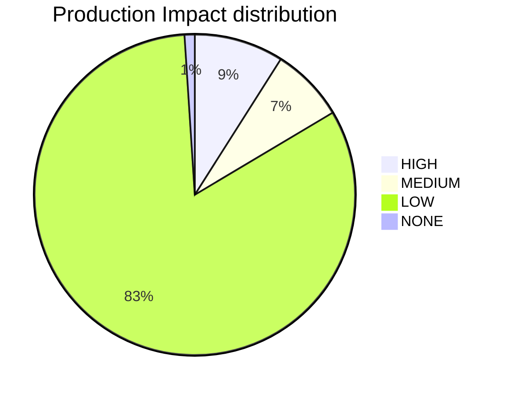
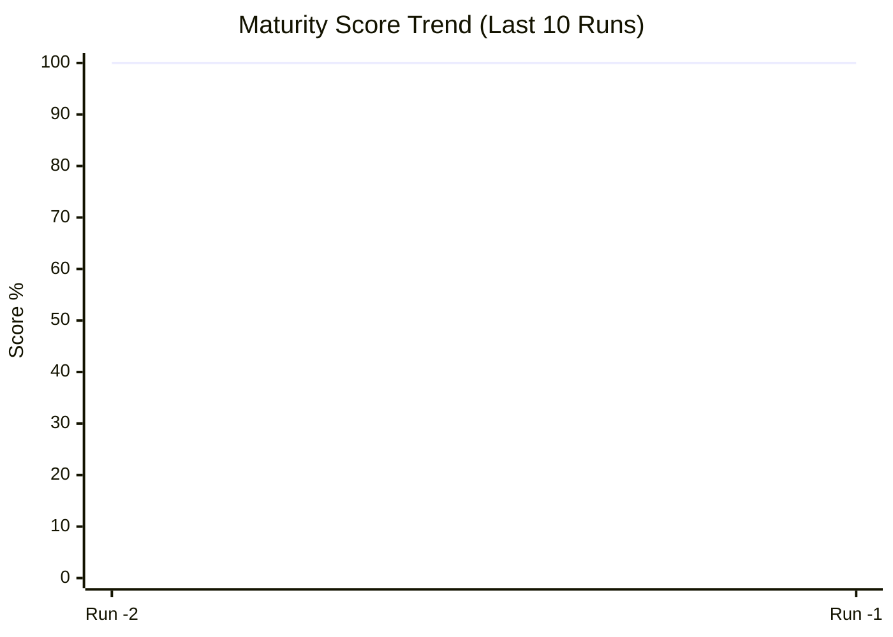
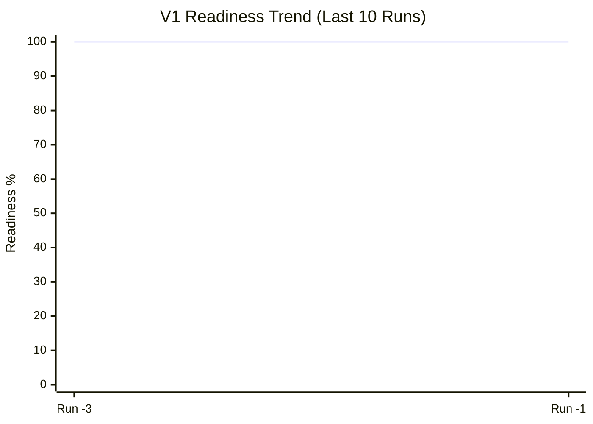
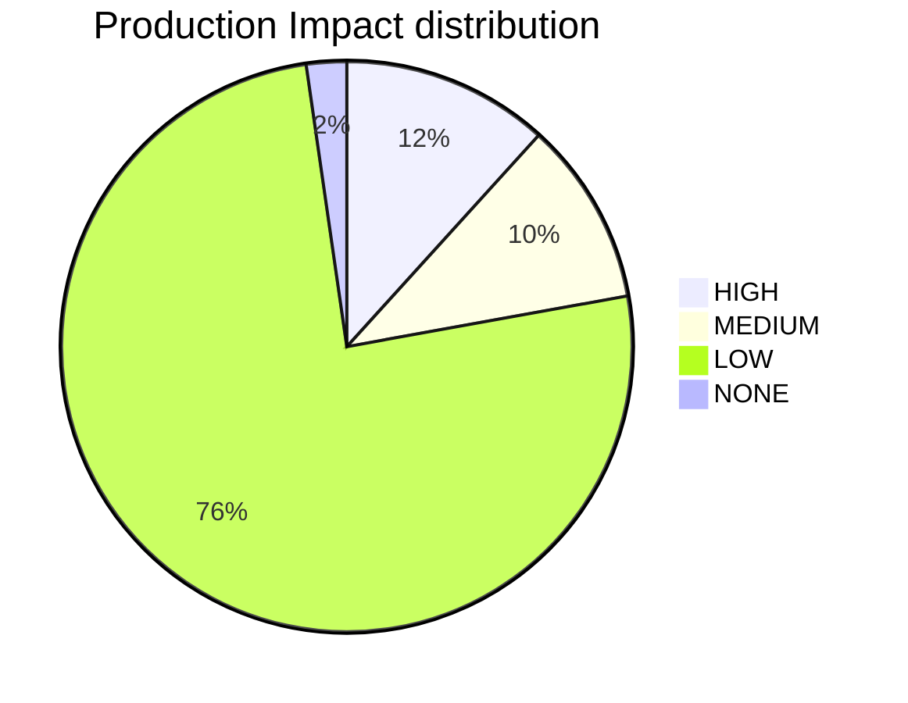

id: PLATFORM_HEALTH
title: Platform Health & Compliance Report
type: documentation
category: governance
status: active
owner: platform-team
version: '2026-01-06'
dependencies: []
risk_profile:
  production_impact: low
  security_risk: none
  coupling_risk: low
reliability:
  rollback_strategy: git-revert
  observability_tier: gold
lifecycle:
  supported_until: '2028-01-01'
  breaking_change: false
relates_to:
  - platform_health.py
---

# Platform Health Report
**Date Generated**: 2026-01-06 00:27:33
**Total Tracked Resources**: 374
**Metadata Compliance**: 99.2%

## Lifecycle Distribution
- **Active**: 362
- **Released**: 1
- **Planned**: 1
- **Draft**: 4
- **Deprecated**: 2
- **Accepted**: 4

## Risk Summary (Production Impact)
- **High**: 35
- **Medium**: 28
- **Low**: 308
- **None**: 1

## Top Categories
- **unknown**: 241
- **gitops**: 20
- **governance**: 16
- **modules**: 16
- **apps**: 11

## Operational Risks
- **Orphaned Files (No Owner)**: 0
- **Stale Files (Past Lifecycle)**: 0

## Closed-Loop Injection Coverage
> [!NOTE]
> **How it works**: This metric measures the percentage of 'Governance Sidecars' that have been successfully propagated into live deployment configurations (Helm values, ArgoCD manifests).
- **Coverage**: 100.0% (29/29)

---
## Audit Record: 2026-01-06 11:24:44
---
id: PLATFORM_HEALTH
title: Platform Health & Compliance Report
type: documentation
category: governance
status: active
owner: platform-team
version: '2026-01-06'
dependencies: []
risk_profile:
  production_impact: low
  security_risk: none
  coupling_risk: low
reliability:
  rollback_strategy: git-revert
  observability_tier: gold
lifecycle:
  supported_until: '2028-01-01'
  breaking_change: false
relates_to:
  - platform_health.py
---

# Platform Health Report
**Date Generated**: 2026-01-06 11:24:44
**Total Tracked Resources**: 383
**Metadata Compliance**: 98.7%

## Lifecycle Distribution
- **Active**: 366
- **Released**: 1
- **Planned**: 1
- **Draft**: 4
- **Deprecated**: 2
- **Accepted**: 7
- **Proposed**: 1
- **Approved**: 1

## Risk Summary (Production Impact)
- **High**: 35
- **Medium**: 28
- **Low**: 308
- **None**: 4

## Top Categories
- **unknown**: 244
- **gitops**: 20
- **modules**: 16
- **governance**: 15
- **apps**: 11

## Operational Risks
- **Orphaned Files (No Owner)**: 0
- **Stale Files (Past Lifecycle)**: 0

## Closed-Loop Injection Coverage
> [!NOTE]
> **How it works**: This metric measures the percentage of 'Governance Sidecars' that have been successfully propagated into live deployment configurations (Helm values, ArgoCD manifests).
- **Coverage**: 100.0% (29/29)

---
### Audit: 2026-01-06 15:53:57
---
id: PLATFORM_HEALTH
title: Platform Health & Compliance Report
type: documentation
category: governance
status: active
owner: platform-team
version: '2026-01-06'
relates_to:
  - platform_health.py
---

# Platform Health Command Center
**Generated**: `2026-01-06 15:53:57` | **Unified Maturity**: `100.0%`

## Knowledge Graph Vitality
| Metric | Count | Source |
| :--- | :--- | :--- |
| **Architecture Decisions** | 106 | [ADR Index](file:///Users/mikesablaze/goldenpath-idp-infra/docs/adrs/01_adr_index.md) |
| **Automation Scripts** | 25 | [Script Index](file:///Users/mikesablaze/goldenpath-idp-infra/scripts/index.md) |
| **CI Workflows** | 34 | [Workflow Index](file:///Users/mikesablaze/goldenpath-idp-infra/ci-workflows/CI_WORKFLOWS.md) |
| **Tracked Resources** | 391 | Repository Scan |

## Catalog Inventory
| Catalog | Entity Count |
| :--- | :--- |
| Ecr Catalog | 10 |

## Risk & Maturity Visualization


## Governance Maturity
- **Metadata Compliance**: `98.2%`
- **Risk-Weighted Score**: `100.0%`
- **Infrastructure Drift**: `100.0%` (via `compliance-report.json`)

## Injection Coverage
- **Sidecar Coverage**: `100.0%` (29/29)

## Operational Risks
- **Orphaned (No Owner)**: 0
- **Stale (Past Lifecycle)**: 0

---
### Audit: 2026-01-06 15:55:44
---
id: PLATFORM_HEALTH
title: Platform Health & Compliance Report
type: documentation
category: governance
status: active
owner: platform-team
version: '2026-01-06'
relates_to:
  - platform_health.py
---

# Platform Health Command Center
**Generated**: `2026-01-06 15:55:44` | **Unified Maturity**: `100.0%`

## Knowledge Graph Vitality
| Metric | Count | Source |
| :--- | :--- | :--- |
| **Architecture Decisions** | 106 | [ADR Index](file:///Users/mikesablaze/goldenpath-idp-infra/docs/adrs/01_adr_index.md) |
| **Automation Scripts** | 25 | [Script Index](file:///Users/mikesablaze/goldenpath-idp-infra/scripts/index.md) |
| **CI Workflows** | 34 | [Workflow Index](file:///Users/mikesablaze/goldenpath-idp-infra/ci-workflows/CI_WORKFLOWS.md) |
| **Tracked Resources** | 391 | Repository Scan |

## Catalog Inventory
| Catalog | Entity Count |
| :--- | :--- |
| Ecr | 10 |

## Risk & Maturity Visualization


## Governance Maturity
- **Metadata Compliance**: `98.2%`
- **Risk-Weighted Score**: `100.0%`
- **Infrastructure Drift**: `100.0%` (via `compliance-report.json`)

## Injection Coverage
- **Sidecar Coverage**: `100.0%` (29/29)

## Operational Risks
- **Orphaned (No Owner)**: 0
- **Stale (Past Lifecycle)**: 0

---
### Audit: 2026-01-06 15:58:02
---
id: PLATFORM_HEALTH
title: Platform Health & Compliance Report
type: documentation
category: governance
status: active
owner: platform-team
version: '2026-01-06'
relates_to:
  - platform_health.py
---

# Platform Health Command Center
**Generated**: `2026-01-06 15:58:02` | **Unified Maturity**: `100.0%`

## Governance Velocity (Historical Trend)


## Knowledge Graph Vitality
| Metric | Count | Source |
| :--- | :--- | :--- |
| **Architecture Decisions** | 106 | [ADR Index](file:///Users/mikesablaze/goldenpath-idp-infra/docs/adrs/01_adr_index.md) |
| **Automation Scripts** | 25 | [Script Index](file:///Users/mikesablaze/goldenpath-idp-infra/scripts/index.md) |
| **CI Workflows** | 34 | [Workflow Index](file:///Users/mikesablaze/goldenpath-idp-infra/ci-workflows/CI_WORKFLOWS.md) |
| **Tracked Resources** | 391 | Repository Scan |

## Catalog Inventory
| Catalog | Entity Count |
| :--- | :--- |
| Ecr | 10 |

## Risk & Maturity Visualization


## Governance Maturity
- **Metadata Compliance**: `98.2%`
- **Risk-Weighted Score**: `100.0%`
- **Infrastructure Drift**: `100.0%` (via `compliance-report.json`)

## Injection Coverage
- **Sidecar Coverage**: `100.0%` (29/29)

## Operational Risks
- **Orphaned (No Owner)**: 0
- **Stale (Past Lifecycle)**: 0

---
### Audit: 2026-01-06 16:09:37
---
id: PLATFORM_HEALTH
title: Platform Health & Compliance Report
type: documentation
category: governance
status: active
owner: platform-team
version: '2026-01-06'
relates_to:
  - platform_health.py
---

# Platform Health Command Center
**Generated**: `2026-01-06 16:09:37` | **V1 Readiness**: `79.6%` | **Overall Maturity**: `100.0%`

## V1 Platform Readiness Gate
> [!IMPORTANT]
> The platform is currently **79.6%** ready for V1 production rollout.

| Milestone | Status | Readiness |
| :--- | :--- | :--- |
| **Metadata Integrity** |  | 98.2% |
| **Injection Integrity** |  | 100.0% |
| **Architecture Maturity** |  | 0/106 Active |
| **Changelog Activity** |  | 70 Entries |

## Governance Velocity (Historical Trend)


## Knowledge Graph Vitality
| Metric | Count | Source |
| :--- | :--- | :--- |
| **Architecture Decisions** | 106 | [ADR Index](file:///Users/mikesablaze/goldenpath-idp-infra/docs/adrs/01_adr_index.md) |
| **Automation Scripts** | 25 | [Script Index](file:///Users/mikesablaze/goldenpath-idp-infra/scripts/index.md) |
| **CI Workflows** | 34 | [Workflow Index](file:///Users/mikesablaze/goldenpath-idp-infra/ci-workflows/CI_WORKFLOWS.md) |
| **Change Logs** | 70 | [Changelog Index](file:///Users/mikesablaze/goldenpath-idp-infra/docs/changelog/README.md) |
| **Tracked Resources** | 391 | Repository Scan |

## Catalog Inventory
| Catalog | Entity Count |
| :--- | :--- |
| Ecr | 10 |

## Risk & Maturity Visualization


## Governance Maturity
- **Metadata Compliance**: `98.2%`
- **Risk-Weighted Score**: `100.0%`
- **Infrastructure Drift**: `100.0%` (via `compliance-report.json`)

## Injection Coverage
- **Sidecar Coverage**: `100.0%` (29/29)

## Operational Risks
- **Orphaned (No Owner)**: 0
- **Stale (Past Lifecycle)**: 0

---
### Audit: 2026-01-06 16:10:08
---
id: PLATFORM_HEALTH
title: Platform Health & Compliance Report
type: documentation
category: governance
status: active
owner: platform-team
version: '2026-01-06'
relates_to:
  - platform_health.py
---

# Platform Health Command Center
**Generated**: `2026-01-06 16:10:08` | **V1 Readiness**: `98.4%` | **Overall Maturity**: `100.0%`

## V1 Platform Readiness Gate
> [!IMPORTANT]
> The platform is currently **98.4%** ready for V1 production rollout.

| Milestone | Status | Readiness |
| :--- | :--- | :--- |
| **Metadata Integrity** |  | 98.2% |
| **Injection Integrity** |  | 100.0% |
| **Architecture Maturity** |  | 100/106 Active |
| **Changelog Activity** |  | 70 Entries |

## Governance Velocity (Historical Trend)


## Knowledge Graph Vitality
| Metric | Count | Source |
| :--- | :--- | :--- |
| **Architecture Decisions** | 106 | [ADR Index](file:///Users/mikesablaze/goldenpath-idp-infra/docs/adrs/01_adr_index.md) |
| **Automation Scripts** | 25 | [Script Index](file:///Users/mikesablaze/goldenpath-idp-infra/scripts/index.md) |
| **CI Workflows** | 34 | [Workflow Index](file:///Users/mikesablaze/goldenpath-idp-infra/ci-workflows/CI_WORKFLOWS.md) |
| **Change Logs** | 70 | [Changelog Index](file:///Users/mikesablaze/goldenpath-idp-infra/docs/changelog/README.md) |
| **Tracked Resources** | 391 | Repository Scan |

## Catalog Inventory
| Catalog | Entity Count |
| :--- | :--- |
| Ecr | 10 |

## Risk & Maturity Visualization


## Governance Maturity
- **Metadata Compliance**: `98.2%`
- **Risk-Weighted Score**: `100.0%`
- **Infrastructure Drift**: `100.0%` (via `compliance-report.json`)

## Injection Coverage
- **Sidecar Coverage**: `100.0%` (29/29)

## Operational Risks
- **Orphaned (No Owner)**: 0
- **Stale (Past Lifecycle)**: 0

---
### Audit: 2026-01-06 16:13:13
---
id: PLATFORM_HEALTH
title: Platform Health & Compliance Report
type: documentation
category: governance
status: active
owner: platform-team
version: '2026-01-06'
relates_to:
  - platform_health.py
---

# Platform Health Command Center
**Generated**: `2026-01-06 16:13:13` | **V1 Readiness**: `98.4%` | **Overall Maturity**: `100.0%`

## V1 Platform Readiness Gate
> [!IMPORTANT]
> The platform is currently **98.4%** ready for V1 production rollout.

| Milestone | Status | Readiness |
| :--- | :--- | :--- |
| **Metadata Integrity** |  | 98.2% |
| **Injection Integrity** |  | 100.0% |
| **Architecture Maturity** |  | 100/106 Active |
| **Changelog Activity** |  | 70 Entries |

## Governance Velocity (Historical Trend)


## Knowledge Graph Vitality
| Metric | Count | Source |
| :--- | :--- | :--- |
| **Architecture Decisions** | 106 | [ADR Index](file:///Users/mikesablaze/goldenpath-idp-infra/docs/adrs/01_adr_index.md) |
| **Automation Scripts** | 25 | [Script Index](file:///Users/mikesablaze/goldenpath-idp-infra/scripts/index.md) |
| **CI Workflows** | 34 | [Workflow Index](file:///Users/mikesablaze/goldenpath-idp-infra/ci-workflows/CI_WORKFLOWS.md) |
| **Change Logs** | 70 | [Changelog Index](file:///Users/mikesablaze/goldenpath-idp-infra/docs/changelog/README.md) |
| **Tracked Resources** | 391 | Repository Scan |

## Catalog Inventory
| Catalog | Entity Count |
| :--- | :--- |
| Ecr | 10 |

## Risk & Maturity Visualization


## Governance Maturity
- **Metadata Compliance**: `98.2%`
- **Risk-Weighted Score**: `100.0%`
- **Infrastructure Drift**: `100.0%` (via `compliance-report.json`)

## Injection Coverage
- **Sidecar Coverage**: `100.0%` (29/29)

## Operational Risks
- **Orphaned (No Owner)**: 0
- **Stale (Past Lifecycle)**: 0

---
### Strategic Guidance
- **V1 Readiness Indicator**: A composite metric tracking Architecture (ADRs), Governance (Metadata/Injection), and Delivery (Changelogs). Target: 100%.
- **Visualizing Trends**: The `xychart-beta` is best viewed in GitHub/GitLab or VS Code with updated Mermaid support (v10.x+). It tracks our 'Readiness Velocity' across audit cycles.

---
### Audit: 2026-01-07 07:05:36
---
id: PLATFORM_HEALTH
title: Platform Health & Compliance Report
type: documentation
category: governance
status: active
owner: platform-team
version: '2026-01-07'
relates_to:
  - platform_health.py
---

# 🏥 Platform Health Command Center
**Generated**: `2026-01-07 07:05:36` | **V1 Readiness**: `61.7%` | **Mean Confidence**: `⭐ (1.0/5.0)`

## V1 Platform Readiness Gate
> [!IMPORTANT]
> The platform is currently **61.7%** ready for V1 production rollout.

| Milestone | Status | Readiness |
| :--- | :--- | :--- |
| **Metadata Integrity** | ✅ | 99.5% |
| **Injection Integrity** | ⚠️ | 0.0% |
| **Architecture Maturity** | 🚧 | 93/119 Active |
| **Changelog Activity** | ✅ | 84 Entries |

## 📈 Governance Velocity (Historical Trend)


## Knowledge Graph Vitality
| Metric | Count | Source |
| :--- | :--- | :--- |
| **Architecture Decisions** | 119 | [ADR Index](file:///Users/mikesablaze/goldenpath-idp-infra/docs/adrs/01_adr_index.md) |
| **Automation Scripts** | 31 | [Script Index](file:///Users/mikesablaze/goldenpath-idp-infra/scripts/index.md) |
| **CI Workflows** | 34 | [Workflow Index](file:///Users/mikesablaze/goldenpath-idp-infra/ci-workflows/CI_WORKFLOWS.md) |
| **Change Logs** | 84 | [Changelog Index](file:///Users/mikesablaze/goldenpath-idp-infra/docs/changelog/README.md) |
| **Tracked Resources** | 442 | Repository Scan |

## Catalog Inventory
| Catalog | Entity Count |
| :--- | :--- |
| Ecr | 10 |

## 🛡️ Risk & Maturity Visualization


## Governance Maturity
- **Metadata Compliance**: `99.5%`
- **Risk-Weighted Score**: `0.0%`

## Injection Coverage
- **Sidecar Coverage**: `0.0%` (0/0)

## Operational Risks
- **Orphaned (No Owner)**: 259
- **Stale (Past Lifecycle)**: 0

---
### Strategic Guidance
- **V1 Readiness Indicator**: A composite metric tracking Architecture (ADRs), Governance (Metadata/Injection), and Delivery (Changelogs). Target: 100%.
- **Visualizing Trends**: The `xychart-beta` is best viewed in GitHub/GitLab or VS Code with updated Mermaid support (v10.x+). It tracks our 'Readiness Velocity' across audit cycles.

---
### Audit: 2026-01-07 07:06:05
---
id: PLATFORM_HEALTH
title: Platform Health & Compliance Report
type: documentation
category: governance
status: active
owner: platform-team
version: '2026-01-07'
relates_to:
  - platform_health.py
---

# 🏥 Platform Health Command Center
**Generated**: `2026-01-07 07:06:05` | **V1 Readiness**: `61.7%` | **Mean Confidence**: `⭐ (1.0/5.0)`

## V1 Platform Readiness Gate
> [!IMPORTANT]
> The platform is currently **61.7%** ready for V1 production rollout.

| Milestone | Status | Readiness |
| :--- | :--- | :--- |
| **Metadata Integrity** | ✅ | 99.5% |
| **Injection Integrity** | ⚠️ | 0.0% |
| **Architecture Maturity** | 🚧 | 93/119 Active |
| **Changelog Activity** | ✅ | 84 Entries |

## 📈 Governance Velocity (Historical Trend)


## Knowledge Graph Vitality
| Metric | Count | Source |
| :--- | :--- | :--- |
| **Architecture Decisions** | 119 | [ADR Index](file:///Users/mikesablaze/goldenpath-idp-infra/docs/adrs/01_adr_index.md) |
| **Automation Scripts** | 31 | [Script Index](file:///Users/mikesablaze/goldenpath-idp-infra/scripts/index.md) |
| **CI Workflows** | 34 | [Workflow Index](file:///Users/mikesablaze/goldenpath-idp-infra/ci-workflows/CI_WORKFLOWS.md) |
| **Change Logs** | 84 | [Changelog Index](file:///Users/mikesablaze/goldenpath-idp-infra/docs/changelog/README.md) |
| **Tracked Resources** | 442 | Repository Scan |

## Catalog Inventory
| Catalog | Entity Count |
| :--- | :--- |
| Ecr | 10 |

## 🛡️ Risk & Maturity Visualization


## Governance Maturity
- **Metadata Compliance**: `99.5%`
- **Risk-Weighted Score**: `0.0%`

## Injection Coverage
- **Sidecar Coverage**: `0.0%` (0/0)

## Operational Risks
- **Orphaned (No Owner)**: 259
- **Stale (Past Lifecycle)**: 0

---
### Strategic Guidance
- **V1 Readiness Indicator**: A composite metric tracking Architecture (ADRs), Governance (Metadata/Injection), and Delivery (Changelogs). Target: 100%.
- **Visualizing Trends**: The `xychart-beta` is best viewed in GitHub/GitLab or VS Code with updated Mermaid support (v10.x+). It tracks our 'Readiness Velocity' across audit cycles.

---
### Audit: 2026-01-07 07:06:34
---
id: PLATFORM_HEALTH
title: Platform Health & Compliance Report
type: documentation
category: governance
status: active
owner: platform-team
version: '2026-01-07'
relates_to:
  - platform_health.py
---

# 🏥 Platform Health Command Center
**Generated**: `2026-01-07 07:06:34` | **V1 Readiness**: `61.7%` | **Mean Confidence**: `⭐ (1.3/5.0)`

## V1 Platform Readiness Gate
> [!IMPORTANT]
> The platform is currently **61.7%** ready for V1 production rollout.

| Milestone | Status | Readiness |
| :--- | :--- | :--- |
| **Metadata Integrity** | ✅ | 99.5% |
| **Injection Integrity** | ⚠️ | 0.0% |
| **Architecture Maturity** | 🚧 | 93/119 Active |
| **Changelog Activity** | ✅ | 84 Entries |

## 📈 Governance Velocity (Historical Trend)


## Knowledge Graph Vitality
| Metric | Count | Source |
| :--- | :--- | :--- |
| **Architecture Decisions** | 119 | [ADR Index](file:///Users/mikesablaze/goldenpath-idp-infra/docs/adrs/01_adr_index.md) |
| **Automation Scripts** | 31 | [Script Index](file:///Users/mikesablaze/goldenpath-idp-infra/scripts/index.md) |
| **CI Workflows** | 34 | [Workflow Index](file:///Users/mikesablaze/goldenpath-idp-infra/ci-workflows/CI_WORKFLOWS.md) |
| **Change Logs** | 84 | [Changelog Index](file:///Users/mikesablaze/goldenpath-idp-infra/docs/changelog/README.md) |
| **Tracked Resources** | 442 | Repository Scan |

## Catalog Inventory
| Catalog | Entity Count |
| :--- | :--- |
| Ecr | 10 |

## 🛡️ Risk & Maturity Visualization


## Governance Maturity
- **Metadata Compliance**: `99.5%`
- **Risk-Weighted Score**: `0.0%`

## Injection Coverage
- **Sidecar Coverage**: `0.0%` (0/0)

## Operational Risks
- **Orphaned (No Owner)**: 259
- **Stale (Past Lifecycle)**: 0

---
### Strategic Guidance
- **V1 Readiness Indicator**: A composite metric tracking Architecture (ADRs), Governance (Metadata/Injection), and Delivery (Changelogs). Target: 100%.
- **Visualizing Trends**: The `xychart-beta` is best viewed in GitHub/GitLab or VS Code with updated Mermaid support (v10.x+). It tracks our 'Readiness Velocity' across audit cycles.

---
### Audit: 2026-01-07 07:50:19
---
id: PLATFORM_HEALTH
title: Platform Health & Compliance Report
type: documentation
category: governance
status: active
owner: platform-team
version: '2026-01-07'
relates_to:
  - platform_health.py
---

# 🏥 Platform Health Command Center
**Generated**: `2026-01-07 07:50:19` | **V1 Readiness**: `61.7%` | **Mean Confidence**: `⭐ (1.3/5.0)` | **Realized Value**: `3.0 Hours`

## V1 Platform Readiness Gate
> [!IMPORTANT]
> The platform is currently **61.7%** ready for V1 production rollout.

| Milestone | Status | Readiness |
| :--- | :--- | :--- |
| **Metadata Integrity** | ✅ | 99.3% |
| **Injection Integrity** | ⚠️ | 0.0% |
| **Architecture Maturity** | 🚧 | 93/119 Active |
| **Changelog Activity** | ✅ | 84 Entries |

## 📈 Governance Velocity (Historical Trend)


## Knowledge Graph Vitality
| Metric | Count | Source |
| :--- | :--- | :--- |
| **Architecture Decisions** | 119 | [ADR Index](file:///Users/mikesablaze/goldenpath-idp-infra/docs/adrs/01_adr_index.md) |
| **Automation Scripts** | 31 | [Script Index](file:///Users/mikesablaze/goldenpath-idp-infra/scripts/index.md) |
| **CI Workflows** | 34 | [Workflow Index](file:///Users/mikesablaze/goldenpath-idp-infra/ci-workflows/CI_WORKFLOWS.md) |
| **Change Logs** | 84 | [Changelog Index](file:///Users/mikesablaze/goldenpath-idp-infra/docs/changelog/README.md) |
| **Tracked Resources** | 442 | Repository Scan |

## Catalog Inventory
| Catalog | Entity Count |
| :--- | :--- |
| Ecr | 10 |

## 🛡️ Risk & Maturity Visualization


## Governance Maturity
- **Metadata Compliance**: `99.3%`
- **Risk-Weighted Score**: `0.0%`

## Injection Coverage
- **Sidecar Coverage**: `0.0%` (0/0)

## 💎 Project Realized Value (Heartbeat)
> [!TIP]
> Total realized value reclaimed through automation heartbeats: **3.0 hours**.
- **ROI Ledger**: [.goldenpath/value_ledger.json](file:///Users/mikesablaze/goldenpath-idp-infra/.goldenpath/value_ledger.json)

## Operational Risks
- **Orphaned (No Owner)**: 259
- **Stale (Past Lifecycle)**: 0

---
### Strategic Guidance
- **V1 Readiness Indicator**: A composite metric tracking Architecture (ADRs), Governance (Metadata/Injection), and Delivery (Changelogs). Target: 100%.
- **Visualizing Trends**: The `xychart-beta` is best viewed in GitHub/GitLab or VS Code with updated Mermaid support (v10.x+). It tracks our 'Readiness Velocity' across audit cycles.

---
### Audit: 2026-01-07 07:53:10
---
id: PLATFORM_HEALTH
title: Platform Health & Compliance Report
type: documentation
category: governance
status: active
owner: platform-team
version: '2026-01-07'
relates_to:
  - platform_health.py
---

# 🏥 Platform Health Command Center
**Generated**: `2026-01-07 07:53:10` | **V1 Readiness**: `61.7%` | **Mean Confidence**: `⭐ (1.3/5.0)`
**Realized Value**: `3.0 Hours` | **Infra Run Rate**: `$1,250.00 USD/mo`

## V1 Platform Readiness Gate
> [!IMPORTANT]
> The platform is currently **61.7%** ready for V1 production rollout.

| Milestone | Status | Readiness |
| :--- | :--- | :--- |
| **Metadata Integrity** | ✅ | 99.3% |
| **Injection Integrity** | ⚠️ | 0.0% |
| **Architecture Maturity** | 🚧 | 93/119 Active |
| **Changelog Activity** | ✅ | 84 Entries |

## 📈 Governance Velocity (Historical Trend)


## Knowledge Graph Vitality
| Metric | Count | Source |
| :--- | :--- | :--- |
| **Architecture Decisions** | 119 | [ADR Index](file:///Users/mikesablaze/goldenpath-idp-infra/docs/adrs/01_adr_index.md) |
| **Automation Scripts** | 31 | [Script Index](file:///Users/mikesablaze/goldenpath-idp-infra/scripts/index.md) |
| **CI Workflows** | 34 | [Workflow Index](file:///Users/mikesablaze/goldenpath-idp-infra/ci-workflows/CI_WORKFLOWS.md) |
| **Change Logs** | 84 | [Changelog Index](file:///Users/mikesablaze/goldenpath-idp-infra/docs/changelog/README.md) |
| **Tracked Resources** | 442 | Repository Scan |

## Catalog Inventory
| Catalog | Entity Count |
| :--- | :--- |
| Ecr | 10 |

## 🛡️ Risk & Maturity Visualization


## Governance Maturity
- **Metadata Compliance**: `99.3%`
- **Risk-Weighted Score**: `0.0%`

## Injection Coverage
- **Sidecar Coverage**: `0.0%` (0/0)

## 💎 Project Realized Value (Heartbeat)
> [!TIP]
> Total realized value reclaimed through automation heartbeats: **3.0 hours**.
- **ROI Ledger**: [.goldenpath/value_ledger.json](file:///Users/mikesablaze/goldenpath-idp-infra/.goldenpath/value_ledger.json)

## Financial Governance (Cloud Cost)
> [!NOTE]
> Current monthly infrastructure run rate: **$1,250.00 USD**.
- **Estimated Annual**: `$15,000.00 USD`
- **Cost Ledger**: [.goldenpath/cost_ledger.json](file:///Users/mikesablaze/goldenpath-idp-infra/.goldenpath/cost_ledger.json)
- **Tooling**: Infracost (CI-integrated)

## Operational Risks
- **Orphaned (No Owner)**: 259
- **Stale (Past Lifecycle)**: 0

---
### Strategic Guidance
- **V1 Readiness Indicator**: A composite metric tracking Architecture (ADRs), Governance (Metadata/Injection), and Delivery (Changelogs). Target: 100%.
- **Visualizing Trends**: The `xychart-beta` is best viewed in GitHub/GitLab or VS Code with updated Mermaid support (v10.x+). It tracks our 'Readiness Velocity' across audit cycles.

---
### Audit: 2026-01-07 07:54:37
---
id: PLATFORM_HEALTH
title: Platform Health & Compliance Report
type: documentation
category: governance
status: active
owner: platform-team
version: '2026-01-07'
relates_to:
  - platform_health.py
---

# 🏥 Platform Health Command Center
**Generated**: `2026-01-07 07:54:37` | **V1 Readiness**: `61.7%` | **Mean Confidence**: `⭐ (1.3/5.0)`
**Realized Value**: `3.0 Hours` | **Infra Run Rate**: `$1,250.00 USD/mo`

## V1 Platform Readiness Gate
> [!IMPORTANT]
> The platform is currently **61.7%** ready for V1 production rollout.

| Milestone | Status | Readiness |
| :--- | :--- | :--- |
| **Metadata Integrity** | ✅ | 99.3% |
| **Injection Integrity** | ⚠️ | 0.0% |
| **Architecture Maturity** | 🚧 | 93/119 Active |
| **Changelog Activity** | ✅ | 86 Entries |

## 📈 Governance Velocity (Historical Trend)
```mermaid
xychart-beta
    title "V1 Readiness Trend (Last 10 Runs)"
    x-axis ["Run -3", "Run -1"]
    y-axis "Readiness %" 0 --> 100
    line [100.0, 100.0, 100.0]
```

## Knowledge Graph Vitality
| Metric | Count | Source |
| :--- | :--- | :--- |
| **Architecture Decisions** | 119 | [ADR Index](file:///Users/mikesablaze/goldenpath-idp-infra/docs/adrs/01_adr_index.md) |
| **Automation Scripts** | 31 | [Script Index](file:///Users/mikesablaze/goldenpath-idp-infra/scripts/index.md) |
| **CI Workflows** | 34 | [Workflow Index](file:///Users/mikesablaze/goldenpath-idp-infra/ci-workflows/CI_WORKFLOWS.md) |
| **Change Logs** | 86 | [Changelog Index](file:///Users/mikesablaze/goldenpath-idp-infra/docs/changelog/README.md) |
| **Tracked Resources** | 444 | Repository Scan |

## Catalog Inventory
| Catalog | Entity Count |
| :--- | :--- |
| Ecr | 10 |

## 🛡️ Risk & Maturity Visualization
```mermaid
pie title Production Impact distribution
    "HIGH" : 36
    "MEDIUM" : 32
    "LOW" : 232
    "NONE" : 7
```

## Governance Maturity
- **Metadata Compliance**: `99.3%`
- **Risk-Weighted Score**: `0.0%`

## Injection Coverage
- **Sidecar Coverage**: `0.0%` (0/0)

## 💎 Project Realized Value (Heartbeat)
> [!TIP]
> Total realized value reclaimed through automation heartbeats: **3.0 hours**.
- **ROI Ledger**: [.goldenpath/value_ledger.json](file:///Users/mikesablaze/goldenpath-idp-infra/.goldenpath/value_ledger.json)

## Financial Governance (Cloud Cost)
> [!NOTE]
> Current monthly infrastructure run rate: **$1,250.00 USD**.
- **Estimated Annual**: `$15,000.00 USD`
- **Cost Ledger**: [.goldenpath/cost_ledger.json](file:///Users/mikesablaze/goldenpath-idp-infra/.goldenpath/cost_ledger.json)
- **Tooling**: Infracost (CI-integrated)

## Operational Risks
- **Orphaned (No Owner)**: 259
- **Stale (Past Lifecycle)**: 0

---
### Strategic Guidance
- **V1 Readiness Indicator**: A composite metric tracking Architecture (ADRs), Governance (Metadata/Injection), and Delivery (Changelogs). Target: 100%.
- **Visualizing Trends**: The `xychart-beta` is best viewed in GitHub/GitLab or VS Code with updated Mermaid support (v10.x+). It tracks our 'Readiness Velocity' across audit cycles.

---
### Audit: 2026-01-07 07:57:10
---
id: PLATFORM_HEALTH
title: Platform Health & Compliance Report
type: documentation
category: governance
status: active
owner: platform-team
version: '2026-01-07'
relates_to:
  - platform_health.py
---

# 🏥 Platform Health Command Center
**Generated**: `2026-01-07 07:57:10` | **V1 Readiness**: `61.7%` | **Mean Confidence**: `⭐ (1.3/5.0)`
**Realized Value**: `3.0 Hours` | **Infra Run Rate**: `$1,250.00 USD/mo`

## V1 Platform Readiness Gate
> [!IMPORTANT]
> The platform is currently **61.7%** ready for V1 production rollout.

| Milestone | Status | Readiness |
| :--- | :--- | :--- |
| **Metadata Integrity** | ✅ | 99.3% |
| **Injection Integrity** | ⚠️ | 0.0% |
| **Architecture Maturity** | 🚧 | 93/119 Active |
| **Changelog Activity** | ✅ | 86 Entries |

## 📈 Governance Velocity (Historical Trend)
```mermaid
xychart-beta
    title "V1 Readiness Trend (Last 10 Runs)"
    x-axis ["Run -3", "Run -1"]
    y-axis "Readiness %" 0 --> 100
    line [100.0, 100.0, 100.0]
```

## Knowledge Graph Vitality
| Metric | Count | Source |
| :--- | :--- | :--- |
| **Architecture Decisions** | 119 | [ADR Index](file:///Users/mikesablaze/goldenpath-idp-infra/docs/adrs/01_adr_index.md) |
| **Automation Scripts** | 31 | [Script Index](file:///Users/mikesablaze/goldenpath-idp-infra/scripts/index.md) |
| **CI Workflows** | 34 | [Workflow Index](file:///Users/mikesablaze/goldenpath-idp-infra/ci-workflows/CI_WORKFLOWS.md) |
| **Change Logs** | 86 | [Changelog Index](file:///Users/mikesablaze/goldenpath-idp-infra/docs/changelog/README.md) |
| **Tracked Resources** | 444 | Repository Scan |

## Catalog Inventory
| Catalog | Entity Count |
| :--- | :--- |
| Ecr | 10 |

## 🛡️ Risk & Maturity Visualization
```mermaid
pie title Production Impact distribution
    "HIGH" : 36
    "MEDIUM" : 32
    "LOW" : 232
    "NONE" : 7
```

## Governance Maturity
- **Metadata Compliance**: `99.3%`
- **Risk-Weighted Score**: `0.0%`

## Injection Coverage
- **Sidecar Coverage**: `0.0%` (0/0)

## 💎 Project Realized Value (Heartbeat)
> [!TIP]
> Total realized value reclaimed through automation heartbeats: **3.0 hours**.
- **ROI Ledger**: [.goldenpath/value_ledger.json](file:///Users/mikesablaze/goldenpath-idp-infra/.goldenpath/value_ledger.json)

## Financial Governance (Cloud Cost)
> [!NOTE]
> Current monthly infrastructure run rate: **$1,250.00 USD**.
- **Estimated Annual**: `$15,000.00 USD`
- **Cost Ledger**: [.goldenpath/cost_ledger.json](file:///Users/mikesablaze/goldenpath-idp-infra/.goldenpath/cost_ledger.json)
- **Tooling**: Infracost (CI-integrated)

## Operational Risks
- **Orphaned (No Owner)**: 259
- **Stale (Past Lifecycle)**: 0

---
### Strategic Guidance
- **V1 Readiness Indicator**: A composite metric tracking Architecture (ADRs), Governance (Metadata/Injection), and Delivery (Changelogs). Target: 100%.
- **Visualizing Trends**: The `xychart-beta` is best viewed in GitHub/GitLab or VS Code with updated Mermaid support (v10.x+). It tracks our 'Readiness Velocity' across audit cycles.

---
### Audit: 2026-01-07 08:01:14
---
id: PLATFORM_HEALTH
title: Platform Health & Compliance Report
type: documentation
category: governance
status: active
owner: platform-team
version: '2026-01-07'
relates_to:
  - platform_health.py
---

# 🏥 Platform Health Command Center
**Generated**: `2026-01-07 08:01:14` | **V1 Readiness**: `83.2%` | **Mean Confidence**: `⭐ (1.3/5.0)`
**Realized Value**: `3.0 Hours` | **Infra Run Rate**: `$1,250.00 USD/mo`

## V1 Platform Readiness Gate
> [!IMPORTANT]
> The platform is currently **83.2%** ready for V1 production rollout.

| Milestone | Status | Readiness |
| :--- | :--- | :--- |
| **Metadata Integrity** | ✅ | 99.3% |
| **Injection Integrity** | ⚠️ | 86.0% |
| **Architecture Maturity** | 🚧 | 93/119 Active |
| **Changelog Activity** | ✅ | 86 Entries |

## 📈 Governance Velocity (Historical Trend)
```mermaid
xychart-beta
    title "V1 Readiness Trend (Last 10 Runs)"
    x-axis ["Run -3", "Run -1"]
    y-axis "Readiness %" 0 --> 100
    line [100.0, 100.0, 100.0]
```

## Knowledge Graph Vitality
| Metric | Count | Source |
| :--- | :--- | :--- |
| **Architecture Decisions** | 119 | [ADR Index](file:///Users/mikesablaze/goldenpath-idp-infra/docs/adrs/01_adr_index.md) |
| **Automation Scripts** | 31 | [Script Index](file:///Users/mikesablaze/goldenpath-idp-infra/scripts/index.md) |
| **CI Workflows** | 34 | [Workflow Index](file:///Users/mikesablaze/goldenpath-idp-infra/ci-workflows/CI_WORKFLOWS.md) |
| **Change Logs** | 86 | [Changelog Index](file:///Users/mikesablaze/goldenpath-idp-infra/docs/changelog/README.md) |
| **Tracked Resources** | 444 | Repository Scan |

## Catalog Inventory
| Catalog | Entity Count |
| :--- | :--- |
| Ecr | 10 |

## 🛡️ Risk & Maturity Visualization
```mermaid
pie title Production Impact distribution
    "HIGH" : 36
    "MEDIUM" : 32
    "LOW" : 232
    "NONE" : 7
```

## Governance Maturity
- **Metadata Compliance**: `99.3%`
- **Risk-Weighted Score**: `0.0%`

## Injection Coverage
- **Sidecar Coverage**: `86.0%` (86/100)

## 💎 Project Realized Value (Heartbeat)
> [!TIP]
> Total realized value reclaimed through automation heartbeats: **3.0 hours**.
- **ROI Ledger**: [.goldenpath/value_ledger.json](file:///Users/mikesablaze/goldenpath-idp-infra/.goldenpath/value_ledger.json)

## Financial Governance (Cloud Cost)
> [!NOTE]
> Current monthly infrastructure run rate: **$1,250.00 USD**.
- **Estimated Annual**: `$15,000.00 USD`
- **Cost Ledger**: [.goldenpath/cost_ledger.json](file:///Users/mikesablaze/goldenpath-idp-infra/.goldenpath/cost_ledger.json)
- **Tooling**: Infracost (CI-integrated)

## Operational Risks
- **Orphaned (No Owner)**: 259
- **Stale (Past Lifecycle)**: 0

---
### Strategic Guidance
- **V1 Readiness Indicator**: A composite metric tracking Architecture (ADRs), Governance (Metadata/Injection), and Delivery (Changelogs). Target: 100%.
- **Visualizing Trends**: The `xychart-beta` is best viewed in GitHub/GitLab or VS Code with updated Mermaid support (v10.x+). It tracks our 'Readiness Velocity' across audit cycles.

---
### Audit: 2026-01-07 08:01:41
---
id: PLATFORM_HEALTH
title: Platform Health & Compliance Report
type: documentation
category: governance
status: active
owner: platform-team
version: '2026-01-07'
relates_to:
  - platform_health.py
---

# 🏥 Platform Health Command Center
**Generated**: `2026-01-07 08:01:41` | **V1 Readiness**: `83.2%` | **Mean Confidence**: `⭐ (1.3/5.0)`
**Realized Value**: `3.0 Hours` | **Infra Run Rate**: `$1,250.00 USD/mo`

## V1 Platform Readiness Gate
> [!IMPORTANT]
> The platform is currently **83.2%** ready for V1 production rollout.

| Milestone | Status | Readiness |
| :--- | :--- | :--- |
| **Metadata Integrity** | ✅ | 99.3% |
| **Injection Integrity** | ⚠️ | 86.0% |
| **Architecture Maturity** | 🚧 | 93/119 Active |
| **Changelog Activity** | ✅ | 86 Entries |

## 📈 Governance Velocity (Historical Trend)
```mermaid
xychart-beta
    title "V1 Readiness Trend (Last 10 Runs)"
    x-axis ["Run -3", "Run -1"]
    y-axis "Readiness %" 0 --> 100
    line [100.0, 100.0, 100.0]
```

## Knowledge Graph Vitality
| Metric | Count | Source |
| :--- | :--- | :--- |
| **Architecture Decisions** | 119 | [ADR Index](file:///Users/mikesablaze/goldenpath-idp-infra/docs/adrs/01_adr_index.md) |
| **Automation Scripts** | 31 | [Script Index](file:///Users/mikesablaze/goldenpath-idp-infra/scripts/index.md) |
| **CI Workflows** | 34 | [Workflow Index](file:///Users/mikesablaze/goldenpath-idp-infra/ci-workflows/CI_WORKFLOWS.md) |
| **Change Logs** | 86 | [Changelog Index](file:///Users/mikesablaze/goldenpath-idp-infra/docs/changelog/README.md) |
| **Tracked Resources** | 444 | Repository Scan |

## Catalog Inventory
| Catalog | Entity Count |
| :--- | :--- |
| Ecr | 10 |

## 🛡️ Risk & Maturity Visualization
```mermaid
pie title Production Impact distribution
    "HIGH" : 36
    "MEDIUM" : 32
    "LOW" : 232
    "NONE" : 7
```

## Governance Maturity
- **Metadata Compliance**: `99.3%`
- **Risk-Weighted Score**: `0.0%`

## Injection Coverage
- **Sidecar Coverage**: `86.0%` (86/100)

## 💎 Project Realized Value (Heartbeat)
> [!TIP]
> Total realized value reclaimed through automation heartbeats: **3.0 hours**.
- **ROI Ledger**: [.goldenpath/value_ledger.json](file:///Users/mikesablaze/goldenpath-idp-infra/.goldenpath/value_ledger.json)

## Financial Governance (Cloud Cost)
> [!NOTE]
> Current monthly infrastructure run rate: **$1,250.00 USD**.
- **Estimated Annual**: `$15,000.00 USD`
- **Cost Ledger**: [.goldenpath/cost_ledger.json](file:///Users/mikesablaze/goldenpath-idp-infra/.goldenpath/cost_ledger.json)
- **Tooling**: Infracost (CI-integrated)

## Operational Risks
- **Orphaned (No Owner)**: 259
- **Stale (Past Lifecycle)**: 0

---
### Strategic Guidance
- **V1 Readiness Indicator**: A composite metric tracking Architecture (ADRs), Governance (Metadata/Injection), and Delivery (Changelogs). Target: 100%.
- **Visualizing Trends**: The `xychart-beta` is best viewed in GitHub/GitLab or VS Code with updated Mermaid support (v10.x+). It tracks our 'Readiness Velocity' across audit cycles.

---
### Audit: 2026-01-07 08:02:00
---
id: PLATFORM_HEALTH
title: Platform Health & Compliance Report
type: documentation
category: governance
status: active
owner: platform-team
version: '2026-01-07'
relates_to:
  - platform_health.py
---

# 🏥 Platform Health Command Center
**Generated**: `2026-01-07 08:02:00` | **V1 Readiness**: `83.2%` | **Mean Confidence**: `⭐ (1.3/5.0)`
**Realized Value**: `3.0 Hours` | **Infra Run Rate**: `$1,250.00 USD/mo`

## V1 Platform Readiness Gate
> [!IMPORTANT]
> The platform is currently **83.2%** ready for V1 production rollout.

| Milestone | Status | Readiness |
| :--- | :--- | :--- |
| **Metadata Integrity** | ✅ | 99.3% |
| **Injection Integrity** | ⚠️ | 86.0% |
| **Architecture Maturity** | 🚧 | 93/119 Active |
| **Changelog Activity** | ✅ | 86 Entries |

## 📈 Governance Velocity (Historical Trend)
```mermaid
xychart-beta
    title "V1 Readiness Trend (Last 10 Runs)"
    x-axis ["Run -3", "Run -1"]
    y-axis "Readiness %" 0 --> 100
    line [100.0, 100.0, 100.0]
```

## Knowledge Graph Vitality
| Metric | Count | Source |
| :--- | :--- | :--- |
| **Architecture Decisions** | 119 | [ADR Index](file:///Users/mikesablaze/goldenpath-idp-infra/docs/adrs/01_adr_index.md) |
| **Automation Scripts** | 31 | [Script Index](file:///Users/mikesablaze/goldenpath-idp-infra/scripts/index.md) |
| **CI Workflows** | 34 | [Workflow Index](file:///Users/mikesablaze/goldenpath-idp-infra/ci-workflows/CI_WORKFLOWS.md) |
| **Change Logs** | 86 | [Changelog Index](file:///Users/mikesablaze/goldenpath-idp-infra/docs/changelog/README.md) |
| **Tracked Resources** | 444 | Repository Scan |

## Catalog Inventory
| Catalog | Entity Count |
| :--- | :--- |
| Ecr | 10 |

## 🛡️ Risk & Maturity Visualization
```mermaid
pie title Production Impact distribution
    "HIGH" : 36
    "MEDIUM" : 32
    "LOW" : 232
    "NONE" : 7
```

## Governance Maturity
- **Metadata Compliance**: `99.3%`
- **Risk-Weighted Score**: `0.0%`

## Injection Coverage
- **Sidecar Coverage**: `86.0%` (86/100)

## 💎 Project Realized Value (Heartbeat)
> [!TIP]
> Total realized value reclaimed through automation heartbeats: **3.0 hours**.
- **ROI Ledger**: [.goldenpath/value_ledger.json](file:///Users/mikesablaze/goldenpath-idp-infra/.goldenpath/value_ledger.json)

## Financial Governance (Cloud Cost)
> [!NOTE]
> Current monthly infrastructure run rate: **$1,250.00 USD**.
- **Estimated Annual**: `$15,000.00 USD`
- **Cost Ledger**: [.goldenpath/cost_ledger.json](file:///Users/mikesablaze/goldenpath-idp-infra/.goldenpath/cost_ledger.json)
- **Tooling**: Infracost (CI-integrated)

## Operational Risks
- **Orphaned (No Owner)**: 259
- **Stale (Past Lifecycle)**: 0

---
### Strategic Guidance
- **V1 Readiness Indicator**: A composite metric tracking Architecture (ADRs), Governance (Metadata/Injection), and Delivery (Changelogs). Target: 100%.
- **Visualizing Trends**: The `xychart-beta` is best viewed in GitHub/GitLab or VS Code with updated Mermaid support (v10.x+). It tracks our 'Readiness Velocity' across audit cycles.

---
### Audit: 2026-01-07 08:04:21
---
id: PLATFORM_HEALTH
title: Platform Health & Compliance Report
type: documentation
category: governance
status: active
owner: platform-team
version: '2026-01-07'
relates_to:
  - platform_health.py
---

# 🏥 Platform Health Command Center
**Generated**: `2026-01-07 08:04:21` | **V1 Readiness**: `92.0%` | **Mean Confidence**: `⭐ (1.1/5.0)`
**Realized Value**: `3.0 Hours` | **Infra Run Rate**: `$1,250.00 USD/mo`

## V1 Platform Readiness Gate
> [!IMPORTANT]
> The platform is currently **92.0%** ready for V1 production rollout.

| Milestone | Status | Readiness |
| :--- | :--- | :--- |
| **Metadata Integrity** | ✅ | 99.3% |
| **Injection Integrity** | ⚠️ | 86.0% |
| **Architecture Maturity** | 🚧 | 93/119 Active |
| **Changelog Activity** | ✅ | 86 Entries |

## 📈 Governance Velocity (Historical Trend)
```mermaid
xychart-beta
    title "V1 Readiness Trend (Last 10 Runs)"
    x-axis ["Run -3", "Run -1"]
    y-axis "Readiness %" 0 --> 100
    line [100.0, 100.0, 100.0]
```

## Knowledge Graph Vitality
| Metric | Count | Source |
| :--- | :--- | :--- |
| **Architecture Decisions** | 119 | [ADR Index](file:///Users/mikesablaze/goldenpath-idp-infra/docs/adrs/01_adr_index.md) |
| **Automation Scripts** | 31 | [Script Index](file:///Users/mikesablaze/goldenpath-idp-infra/scripts/index.md) |
| **CI Workflows** | 34 | [Workflow Index](file:///Users/mikesablaze/goldenpath-idp-infra/ci-workflows/CI_WORKFLOWS.md) |
| **Change Logs** | 86 | [Changelog Index](file:///Users/mikesablaze/goldenpath-idp-infra/docs/changelog/README.md) |
| **Tracked Resources** | 444 | Repository Scan |

## Catalog Inventory
| Catalog | Entity Count |
| :--- | :--- |
| Ecr | 10 |

## 🛡️ Risk & Maturity Visualization
```mermaid
pie title Production Impact distribution
    "HIGH" : 36
    "MEDIUM" : 32
    "LOW" : 359
    "NONE" : 17
```

## Governance Maturity
- **Metadata Compliance**: `99.3%`
- **Risk-Weighted Score**: `100.0%`

## Injection Coverage
- **Sidecar Coverage**: `86.0%` (86/100)

## 💎 Project Realized Value (Heartbeat)
> [!TIP]
> Total realized value reclaimed through automation heartbeats: **3.0 hours**.
- **ROI Ledger**: [.goldenpath/value_ledger.json](file:///Users/mikesablaze/goldenpath-idp-infra/.goldenpath/value_ledger.json)

## Financial Governance (Cloud Cost)
> [!NOTE]
> Current monthly infrastructure run rate: **$1,250.00 USD**.
- **Estimated Annual**: `$15,000.00 USD`
- **Cost Ledger**: [.goldenpath/cost_ledger.json](file:///Users/mikesablaze/goldenpath-idp-infra/.goldenpath/cost_ledger.json)
- **Tooling**: Infracost (CI-integrated)

## Operational Risks
- **Orphaned (No Owner)**: 0
- **Stale (Past Lifecycle)**: 0

---
### Strategic Guidance
- **V1 Readiness Indicator**: A composite metric tracking Architecture (ADRs), Governance (Metadata/Injection), and Delivery (Changelogs). Target: 100%.
- **Visualizing Trends**: The `xychart-beta` is best viewed in GitHub/GitLab or VS Code with updated Mermaid support (v10.x+). It tracks our 'Readiness Velocity' across audit cycles.

---
### Audit: 2026-01-07 08:12:15
---
id: PLATFORM_HEALTH
title: Platform Health & Compliance Report
type: documentation
category: governance
status: active
owner: platform-team
version: '2026-01-07'
relates_to:
  - platform_health.py
---

# 🏥 Platform Health Command Center
**Generated**: `2026-01-07 08:12:15` | **V1 Readiness**: `92.0%` | **Mean Confidence**: `⭐ (1.1/5.0)`
**Realized Value**: `3.0 Hours` | **Infra Run Rate**: `$1,250.00 USD/mo`

## V1 Platform Readiness Gate
> [!IMPORTANT]
> The platform is currently **92.0%** ready for V1 production rollout.

| Milestone | Status | Readiness |
| :--- | :--- | :--- |
| **Metadata Integrity** | ✅ | 99.3% |
| **Injection Integrity** | ⚠️ | 86.0% |
| **Architecture Maturity** | 🚧 | 93/119 Active |
| **Changelog Activity** | ✅ | 86 Entries |

## 📈 Governance Velocity (Historical Trend)
```mermaid
xychart-beta
    title "V1 Readiness Trend (Last 10 Runs)"
    x-axis ["Run -3", "Run -1"]
    y-axis "Readiness %" 0 --> 100
    line [100.0, 100.0, 100.0]
```

## Knowledge Graph Vitality
| Metric | Count | Source |
| :--- | :--- | :--- |
| **Architecture Decisions** | 119 | [ADR Index](file:///Users/mikesablaze/goldenpath-idp-infra/docs/adrs/01_adr_index.md) |
| **Automation Scripts** | 31 | [Script Index](file:///Users/mikesablaze/goldenpath-idp-infra/scripts/index.md) |
| **CI Workflows** | 34 | [Workflow Index](file:///Users/mikesablaze/goldenpath-idp-infra/ci-workflows/CI_WORKFLOWS.md) |
| **Change Logs** | 86 | [Changelog Index](file:///Users/mikesablaze/goldenpath-idp-infra/docs/changelog/README.md) |
| **Tracked Resources** | 444 | Repository Scan |

## Catalog Inventory
| Catalog | Entity Count |
| :--- | :--- |
| Ecr Registry | 1 |
| Ecr Repositories | 10 |

## 🛡️ Risk & Maturity Visualization
```mermaid
pie title Production Impact distribution
    "HIGH" : 36
    "MEDIUM" : 32
    "LOW" : 359
    "NONE" : 17
```

## Governance Maturity
- **Metadata Compliance**: `99.3%`
- **Risk-Weighted Score**: `100.0%`

## Injection Coverage
- **Sidecar Coverage**: `86.0%` (86/100)

## 💎 Project Realized Value (Heartbeat)
> [!TIP]
> Total realized value reclaimed through automation heartbeats: **3.0 hours**.
- **ROI Ledger**: [.goldenpath/value_ledger.json](file:///Users/mikesablaze/goldenpath-idp-infra/.goldenpath/value_ledger.json)

## Financial Governance (Cloud Cost)
> [!NOTE]
> Current monthly infrastructure run rate: **$1,250.00 USD**.
- **Estimated Annual**: `$15,000.00 USD`
- **Cost Ledger**: [.goldenpath/cost_ledger.json](file:///Users/mikesablaze/goldenpath-idp-infra/.goldenpath/cost_ledger.json)
- **Tooling**: Infracost (CI-integrated)

## Operational Risks
- **Orphaned (No Owner)**: 0
- **Stale (Past Lifecycle)**: 0

---
### Strategic Guidance
- **V1 Readiness Indicator**: A composite metric tracking Architecture (ADRs), Governance (Metadata/Injection), and Delivery (Changelogs). Target: 100%.
- **Visualizing Trends**: The `xychart-beta` is best viewed in GitHub/GitLab or VS Code with updated Mermaid support (v10.x+). It tracks our 'Readiness Velocity' across audit cycles.

---
### Audit: 2026-01-07 08:28:09
---
id: PLATFORM_HEALTH
title: Platform Health & Compliance Report
type: documentation
category: governance
status: active
owner: platform-team
version: '2026-01-07'
relates_to:
  - platform_health.py
---

# 🏥 Platform Health Command Center
**Generated**: `2026-01-07 08:28:09` | **V1 Readiness**: `92.0%` | **Mean Confidence**: `⭐ (1.1/5.0)`
**Realized Value**: `4.0 Hours` | **Infra Run Rate**: `$1,250.00 USD/mo`

## V1 Platform Readiness Gate
> [!IMPORTANT]
> The platform is currently **92.0%** ready for V1 production rollout.

| Milestone | Status | Readiness |
| :--- | :--- | :--- |
| **Metadata Integrity** | ✅ | 99.3% |
| **Injection Integrity** | ⚠️ | 86.0% |
| **Architecture Maturity** | 🚧 | 93/119 Active |
| **Changelog Activity** | ✅ | 86 Entries |

## 📈 Governance Velocity (Historical Trend)
```mermaid
xychart-beta
    title "V1 Readiness Trend (Last 10 Runs)"
    x-axis ["Run -3", "Run -1"]
    y-axis "Readiness %" 0 --> 100
    line [100.0, 100.0, 100.0]
```

## Knowledge Graph Vitality
| Metric | Count | Source |
| :--- | :--- | :--- |
| **Architecture Decisions** | 119 | [ADR Index](file:///Users/mikesablaze/goldenpath-idp-infra/docs/adrs/01_adr_index.md) |
| **Automation Scripts** | 31 | [Script Index](file:///Users/mikesablaze/goldenpath-idp-infra/scripts/index.md) |
| **CI Workflows** | 34 | [Workflow Index](file:///Users/mikesablaze/goldenpath-idp-infra/ci-workflows/CI_WORKFLOWS.md) |
| **Change Logs** | 86 | [Changelog Index](file:///Users/mikesablaze/goldenpath-idp-infra/docs/changelog/README.md) |
| **Tracked Resources** | 444 | Repository Scan |

## Catalog Inventory
| Catalog | Entity Count |
| :--- | :--- |
| Ecr Registry | 1 |
| Ecr Repositories | 10 |

## 🛡️ Risk & Maturity Visualization
```mermaid
pie title Production Impact distribution
    "HIGH" : 36
    "MEDIUM" : 32
    "LOW" : 359
    "NONE" : 17
```

## Governance Maturity
- **Metadata Compliance**: `99.3%`
- **Risk-Weighted Score**: `100.0%`

## Injection Coverage
- **Sidecar Coverage**: `86.0%` (86/100)

## 💎 Project Realized Value (Heartbeat)
> [!TIP]
> Total realized value reclaimed through automation heartbeats: **4.0 hours**.
- **ROI Ledger**: [.goldenpath/value_ledger.json](file:///Users/mikesablaze/goldenpath-idp-infra/.goldenpath/value_ledger.json)

## Financial Governance (Cloud Cost)
> [!NOTE]
> Current monthly infrastructure run rate: **$1,250.00 USD**.
- **Estimated Annual**: `$15,000.00 USD`
- **Cost Ledger**: [.goldenpath/cost_ledger.json](file:///Users/mikesablaze/goldenpath-idp-infra/.goldenpath/cost_ledger.json)
- **Tooling**: Infracost (CI-integrated)

## Operational Risks
- **Orphaned (No Owner)**: 0
- **Stale (Past Lifecycle)**: 0

---
### Strategic Guidance
- **V1 Readiness Indicator**: A composite metric tracking Architecture (ADRs), Governance (Metadata/Injection), and Delivery (Changelogs). Target: 100%.
- **Visualizing Trends**: The `xychart-beta` is best viewed in GitHub/GitLab or VS Code with updated Mermaid support (v10.x+). It tracks our 'Readiness Velocity' across audit cycles.

---
### Audit: 2026-01-07 08:29:32
---
id: PLATFORM_HEALTH
title: Platform Health & Compliance Report
type: documentation
category: governance
status: active
owner: platform-team
version: '2026-01-07'
relates_to:
  - platform_health.py
---

# 🏥 Platform Health Command Center
**Generated**: `2026-01-07 08:29:32` | **V1 Readiness**: `95.5%` | **Mean Confidence**: `⭐ (1.1/5.0)`
**Realized Value**: `4.0 Hours` | **Infra Run Rate**: `$1,250.00 USD/mo`

## V1 Platform Readiness Gate
> [!IMPORTANT]
> The platform is currently **95.5%** ready for V1 production rollout.

| Milestone | Status | Readiness |
| :--- | :--- | :--- |
| **Metadata Integrity** | ✅ | 99.3% |
| **Injection Integrity** | ✅ | 100.0% |
| **Architecture Maturity** | 🚧 | 93/119 Active |
| **Changelog Activity** | ✅ | 86 Entries |

## 📈 Governance Velocity (Historical Trend)
```mermaid
xychart-beta
    title "V1 Readiness Trend (Last 10 Runs)"
    x-axis ["Run -3", "Run -1"]
    y-axis "Readiness %" 0 --> 100
    line [100.0, 100.0, 100.0]
```

## Knowledge Graph Vitality
| Metric | Count | Source |
| :--- | :--- | :--- |
| **Architecture Decisions** | 119 | [ADR Index](file:///Users/mikesablaze/goldenpath-idp-infra/docs/adrs/01_adr_index.md) |
| **Automation Scripts** | 31 | [Script Index](file:///Users/mikesablaze/goldenpath-idp-infra/scripts/index.md) |
| **CI Workflows** | 34 | [Workflow Index](file:///Users/mikesablaze/goldenpath-idp-infra/ci-workflows/CI_WORKFLOWS.md) |
| **Change Logs** | 86 | [Changelog Index](file:///Users/mikesablaze/goldenpath-idp-infra/docs/changelog/README.md) |
| **Tracked Resources** | 444 | Repository Scan |

## Catalog Inventory
| Catalog | Entity Count |
| :--- | :--- |
| Ecr Registry | 1 |
| Ecr Repositories | 10 |

## 🛡️ Risk & Maturity Visualization
```mermaid
pie title Production Impact distribution
    "HIGH" : 36
    "MEDIUM" : 32
    "LOW" : 359
    "NONE" : 17
```

## Governance Maturity
- **Metadata Compliance**: `99.3%`
- **Risk-Weighted Score**: `100.0%`

## Injection Coverage
- **Sidecar Coverage**: `100.0%` (32/32)

## 💎 Project Realized Value (Heartbeat)
> [!TIP]
> Total realized value reclaimed through automation heartbeats: **4.0 hours**.
- **ROI Ledger**: [.goldenpath/value_ledger.json](file:///Users/mikesablaze/goldenpath-idp-infra/.goldenpath/value_ledger.json)

## Financial Governance (Cloud Cost)
> [!NOTE]
> Current monthly infrastructure run rate: **$1,250.00 USD**.
- **Estimated Annual**: `$15,000.00 USD`
- **Cost Ledger**: [.goldenpath/cost_ledger.json](file:///Users/mikesablaze/goldenpath-idp-infra/.goldenpath/cost_ledger.json)
- **Tooling**: Infracost (CI-integrated)

## Operational Risks
- **Orphaned (No Owner)**: 0
- **Stale (Past Lifecycle)**: 0

---
### Strategic Guidance
- **V1 Readiness Indicator**: A composite metric tracking Architecture (ADRs), Governance (Metadata/Injection), and Delivery (Changelogs). Target: 100%.
- **Visualizing Trends**: The `xychart-beta` is best viewed in GitHub/GitLab or VS Code with updated Mermaid support (v10.x+). It tracks our 'Readiness Velocity' across audit cycles.

---
### Audit: 2026-01-07 09:35:26
---
id: PLATFORM_HEALTH
title: Platform Health & Compliance Report
type: documentation
category: governance
status: active
owner: platform-team
version: '2026-01-07'
relates_to:
  - platform_health.py
---

# 🏥 Platform Health Command Center
**Generated**: `2026-01-07 09:35:26` | **V1 Readiness**: `94.9%` | **Mean Confidence**: `⭐ (1.2/5.0)`
**Realized Value**: `4.4 Hours` | **Infra Run Rate**: `$1,250.00 USD/mo`

## V1 Platform Readiness Gate
> [!IMPORTANT]
> The platform is currently **94.9%** ready for V1 production rollout.

| Milestone | Status | Readiness |
| :--- | :--- | :--- |
| **Metadata Integrity** | ✅ | 97.3% |
| **Injection Integrity** | ✅ | 100.0% |
| **Architecture Maturity** | 🚧 | 93/119 Active |
| **Changelog Activity** | ✅ | 86 Entries |

## 📈 Governance Velocity (Historical Trend)
```mermaid
xychart-beta
    title "V1 Readiness Trend (Last 10 Runs)"
    x-axis ["Run -3", "Run -1"]
    y-axis "Readiness %" 0 --> 100
    line [100.0, 100.0, 100.0]
```

## Knowledge Graph Vitality
| Metric | Count | Source |
| :--- | :--- | :--- |
| **Architecture Decisions** | 119 | [ADR Index](file:///Users/mikesablaze/goldenpath-idp-infra/docs/adrs/01_adr_index.md) |
| **Automation Scripts** | 31 | [Script Index](file:///Users/mikesablaze/goldenpath-idp-infra/scripts/index.md) |
| **CI Workflows** | 0 | [Workflow Index](file:///Users/mikesablaze/goldenpath-idp-infra/ci-workflows/CI_WORKFLOWS.md) |
| **Change Logs** | 86 | [Changelog Index](file:///Users/mikesablaze/goldenpath-idp-infra/docs/changelog/README.md) |
| **Tracked Resources** | 441 | Repository Scan |

## Catalog Inventory
| Catalog | Entity Count |
| :--- | :--- |

## 🛡️ Risk & Maturity Visualization
```mermaid
pie title Production Impact distribution
    "HIGH" : 36
    "MEDIUM" : 32
    "LOW" : 356
    "NONE" : 16
```

## Governance Maturity
- **Metadata Compliance**: `97.3%`
- **Risk-Weighted Score**: `100.0%`

## Injection Coverage
- **Sidecar Coverage**: `100.0%` (32/32)

## 💎 Project Realized Value (Heartbeat)
> [!TIP]
> Total realized value reclaimed through automation heartbeats: **4.4 hours**.
- **ROI Ledger**: [.goldenpath/value_ledger.json](file:///Users/mikesablaze/goldenpath-idp-infra/.goldenpath/value_ledger.json)

## Financial Governance (Cloud Cost)
> [!NOTE]
> Current monthly infrastructure run rate: **$1,250.00 USD**.
- **Estimated Annual**: `$15,000.00 USD`
- **Cost Ledger**: [.goldenpath/cost_ledger.json](file:///Users/mikesablaze/goldenpath-idp-infra/.goldenpath/cost_ledger.json)
- **Tooling**: Infracost (CI-integrated)

## Operational Risks
- **Orphaned (No Owner)**: 0
- **Stale (Past Lifecycle)**: 0

---
### Strategic Guidance
- **V1 Readiness Indicator**: A composite metric tracking Architecture (ADRs), Governance (Metadata/Injection), and Delivery (Changelogs). Target: 100%.
- **Visualizing Trends**: The `xychart-beta` is best viewed in GitHub/GitLab or VS Code with updated Mermaid support (v10.x+). It tracks our 'Readiness Velocity' across audit cycles.
