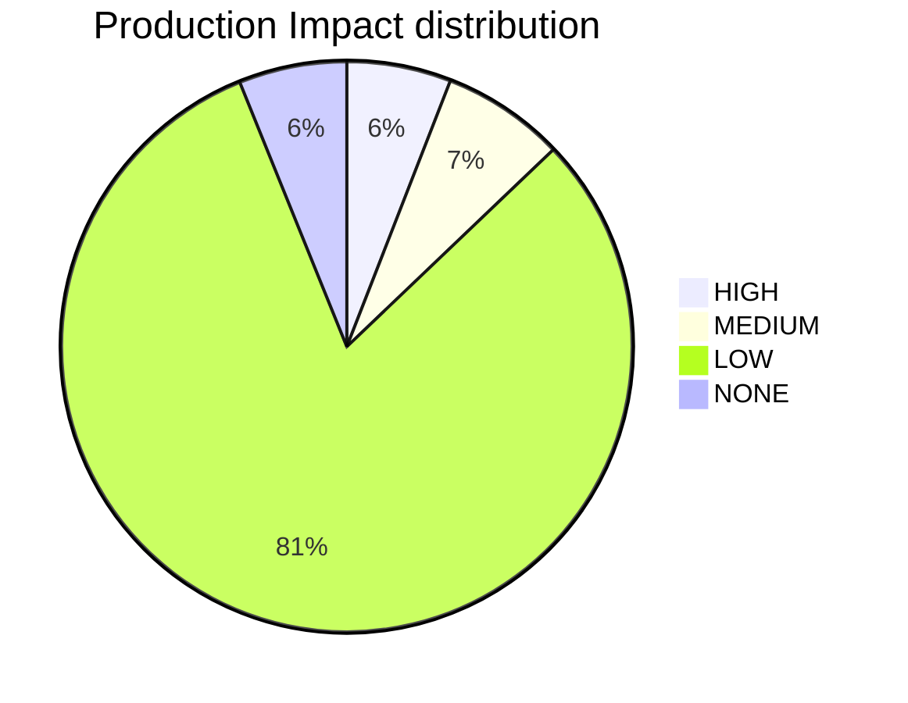

# Platform Health Audit Log

Last updated: `2026-01-10 00:24:36`

- This file keeps only the latest snapshot.
- Full history can be regenerated from source data if needed.

## Latest Snapshot

---
id: PLATFORM_HEALTH
title: Platform Health & Compliance Report
type: documentation
category: governance
status: active
owner: platform-team
version: '2026-01-10'
relates_to:
  - platform_health.py
---

## 🏥 Platform Health Command Center

**Generated**: `2026-01-10 00:24:36` | **V1 Readiness**: `94.1%` | **Mean Confidence**: `⭐ (1.2/5.0)`

**Realized Value**: `20.4 Hours` | **Infra Run Rate**: `$1,250.00 USD/mo`

## V1 Platform Readiness Gate

> [!IMPORTANT]
> The platform is currently **94.1%** ready for V1 production rollout.

| Milestone | Status | Readiness |
| :--- | :--- | :--- |
| **Metadata Integrity** | ⚠️ | 93.7% |
| **Injection Integrity** | ✅ | 100.0% |
| **Architecture Maturity** | 🚧 | 98/125 Active |
| **Changelog Activity** | ✅ | 99 Entries |

## Knowledge Graph Vitality

| Metric | Count | Source |
| :--- | :--- | :--- |
| **Architecture Decisions** | 125 | [ADR Index](file:///Users/mikesablaze/goldenpath-idp-infra/docs/adrs/01_adr_index.md) |
| **Automation Scripts** | 33 | [Script Index](file:///Users/mikesablaze/goldenpath-idp-infra/scripts/index.md) |
| **CI Workflows** | 35 | [Workflow Index](file:///Users/mikesablaze/goldenpath-idp-infra/ci-workflows/CI_WORKFLOWS.md) |
| **Change Logs** | 99 | [Changelog Index](file:///Users/mikesablaze/goldenpath-idp-infra/docs/changelog/README.md) |
| **Tracked Resources** | 477 | Repository Scan |

## Catalog Inventory

| Catalog | Entity Count |
| :--- | :--- |
| Ecr Registry | 1 |
| Ecr Repositories | 11 |
| IDP Apis | 9 |
| IDP Components | 17 |
| IDP Domains | 3 |
| IDP Resources | 2 |
| IDP Systems | 4 |

## AWS Inventory Snapshot

- **Last run**: `2026-01-09T23:55:30Z`
- **Accounts**: `REDACTED`
- **Regions**: `eu-west-2`
- **Total resources**: `33`
- **Tagged**: `31` | **Untagged**: `2` | **Tag violations**: `30`
- **Report**: [`reports/aws-inventory/aws-inventory-2026-01-09.md`](file://reports/aws-inventory/aws-inventory-2026-01-09.md)

## 🛡️ Risk & Maturity Visualization

## Governance Maturity

- **Metadata Compliance**: `93.7%`
- **Risk-Weighted Score**: `100.0%`

## Injection Coverage

- **Sidecar Coverage**: `100.0%` (32/32)

## Project Realized Value (Heartbeat)

> [!TIP]
> Total realized value reclaimed through automation heartbeats: **20.4 hours**.

- **ROI Ledger**: [.goldenpath/value_ledger.json](file://.goldenpath/value_ledger.json)

## Financial Governance (Cloud Cost)

> [!NOTE]
> Current monthly infrastructure run rate: **$1,250.00 USD**.

- **Estimated Annual**: `$15,000.00 USD`
- **Cost Ledger**: [.goldenpath/cost_ledger.json](file://.goldenpath/cost_ledger.json)
- **Tooling**: Infracost (CI-integrated)

## Operational Risks

- **Orphaned (No Owner)**: 0
- **Stale (Past Lifecycle)**: 0

---

### Strategic Guidance

- **V1 Readiness Indicator**: A composite metric tracking Architecture (ADRs), Governance (Metadata/Injection), and Delivery (Changelogs). Target: 100%.
- **Visualizing Trends**: The `xychart-beta` is best viewed in GitHub/GitLab or VS Code with updated Mermaid support (v10.x+). It tracks our 'Readiness Velocity' across audit cycles.