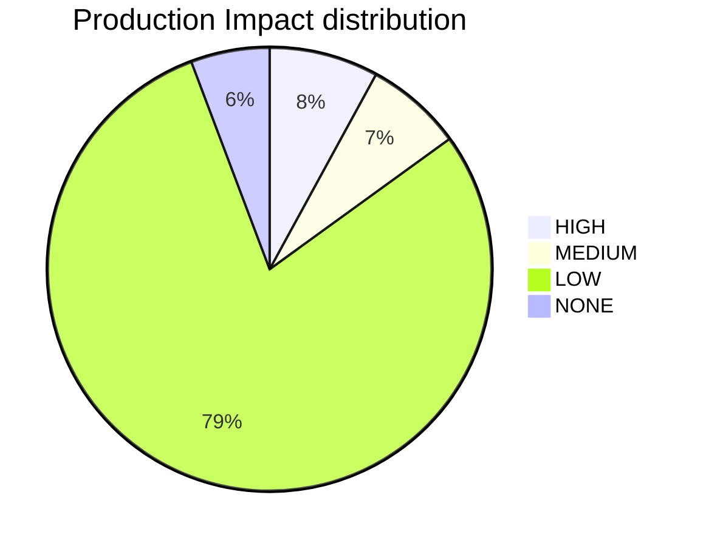

# Platform Health Audit Log

---
### Audit: 2026-01-08 02:20:56
---
id: PLATFORM_HEALTH
title: Platform Health & Compliance Report
type: documentation
category: governance
status: active
owner: platform-team
version: '2026-01-08'
relates_to:
  - platform_health.py
---

# 🏥 Platform Health Command Center
**Generated**: `2026-01-08 02:20:56` | **V1 Readiness**: `95.5%` | **Mean Confidence**: `⭐ (1.2/5.0)`
**Realized Value**: `4.4 Hours` | **Infra Run Rate**: `$1,250.00 USD/mo`

## V1 Platform Readiness Gate

> [!IMPORTANT]
> The platform is currently **95.5%** ready for V1 production rollout.

| Milestone | Status | Readiness |
| :--- | :--- | :--- |
| **Metadata Integrity** | ✅ | 99.6% |
| **Injection Integrity** | ✅ | 100.0% |
| **Architecture Maturity** | 🚧 | 93/119 Active |
| **Changelog Activity** | ✅ | 86 Entries |

## Knowledge Graph Vitality

| Metric | Count | Source |
| :--- | :--- | :--- |
| **Architecture Decisions** | 119 | [ADR Index](file:///Users/mikesablaze/goldenpath-idp-infra/docs/adrs/01_adr_index.md) |
| **Automation Scripts** | 33 | [Script Index](file:///Users/mikesablaze/goldenpath-idp-infra/scripts/index.md) |
| **CI Workflows** | 0 | [Workflow Index](file:///Users/mikesablaze/goldenpath-idp-infra/ci-workflows/CI_WORKFLOWS.md) |
| **Change Logs** | 86 | [Changelog Index](file:///Users/mikesablaze/goldenpath-idp-infra/docs/changelog/README.md) |
| **Tracked Resources** | 454 | Repository Scan |

## Catalog Inventory

| Catalog | Entity Count |
| :--- | :--- |

## 🛡️ Risk & Maturity Visualization

## Governance Maturity

- **Metadata Compliance**: `99.6%`
- **Risk-Weighted Score**: `100.0%`

## Injection Coverage

- **Sidecar Coverage**: `100.0%` (32/32)

## Project Realized Value (Heartbeat)

> [!TIP]
> Total realized value reclaimed through automation heartbeats: **4.4 hours**.

- **ROI Ledger**: [.goldenpath/value_ledger.json](file://.goldenpath/value_ledger.json)

## Financial Governance (Cloud Cost)

> [!NOTE]
> Current monthly infrastructure run rate: **$1,250.00 USD**.

- **Estimated Annual**: `$15,000.00 USD`
- **Cost Ledger**: [.goldenpath/cost_ledger.json](file://.goldenpath/cost_ledger.json)
- **Tooling**: Infracost (CI-integrated)

## Operational Risks

- **Orphaned (No Owner)**: 0
- **Stale (Past Lifecycle)**: 0

---
### Strategic Guidance
- **V1 Readiness Indicator**: A composite metric tracking Architecture (ADRs), Governance (Metadata/Injection), and Delivery (Changelogs). Target: 100%.
- **Visualizing Trends**: The `xychart-beta` is best viewed in GitHub/GitLab or VS Code with updated Mermaid support (v10.x+). It tracks our 'Readiness Velocity' across audit cycles.

---
### Audit: 2026-01-08 02:22:43
---
id: PLATFORM_HEALTH
title: Platform Health & Compliance Report
type: documentation
category: governance
status: active
owner: platform-team
version: '2026-01-08'
relates_to:
  - platform_health.py
---

# 🏥 Platform Health Command Center
**Generated**: `2026-01-08 02:22:43` | **V1 Readiness**: `95.5%` | **Mean Confidence**: `⭐ (1.2/5.0)`
**Realized Value**: `5.4 Hours` | **Infra Run Rate**: `$1,250.00 USD/mo`

## V1 Platform Readiness Gate

> [!IMPORTANT]
> The platform is currently **95.5%** ready for V1 production rollout.

| Milestone | Status | Readiness |
| :--- | :--- | :--- |
| **Metadata Integrity** | ✅ | 99.6% |
| **Injection Integrity** | ✅ | 100.0% |
| **Architecture Maturity** | 🚧 | 93/119 Active |
| **Changelog Activity** | ✅ | 86 Entries |

## Knowledge Graph Vitality

| Metric | Count | Source |
| :--- | :--- | :--- |
| **Architecture Decisions** | 119 | [ADR Index](file:///Users/mikesablaze/goldenpath-idp-infra/docs/adrs/01_adr_index.md) |
| **Automation Scripts** | 33 | [Script Index](file:///Users/mikesablaze/goldenpath-idp-infra/scripts/index.md) |
| **CI Workflows** | 0 | [Workflow Index](file:///Users/mikesablaze/goldenpath-idp-infra/ci-workflows/CI_WORKFLOWS.md) |
| **Change Logs** | 86 | [Changelog Index](file:///Users/mikesablaze/goldenpath-idp-infra/docs/changelog/README.md) |
| **Tracked Resources** | 454 | Repository Scan |

## Catalog Inventory

| Catalog | Entity Count |
| :--- | :--- |

## 🛡️ Risk & Maturity Visualization

## Governance Maturity

- **Metadata Compliance**: `99.6%`
- **Risk-Weighted Score**: `100.0%`

## Injection Coverage

- **Sidecar Coverage**: `100.0%` (32/32)

## Project Realized Value (Heartbeat)

> [!TIP]
> Total realized value reclaimed through automation heartbeats: **5.4 hours**.

- **ROI Ledger**: [.goldenpath/value_ledger.json](file://.goldenpath/value_ledger.json)

## Financial Governance (Cloud Cost)

> [!NOTE]
> Current monthly infrastructure run rate: **$1,250.00 USD**.

- **Estimated Annual**: `$15,000.00 USD`
- **Cost Ledger**: [.goldenpath/cost_ledger.json](file://.goldenpath/cost_ledger.json)
- **Tooling**: Infracost (CI-integrated)

## Operational Risks

- **Orphaned (No Owner)**: 0
- **Stale (Past Lifecycle)**: 0

---
### Strategic Guidance
- **V1 Readiness Indicator**: A composite metric tracking Architecture (ADRs), Governance (Metadata/Injection), and Delivery (Changelogs). Target: 100%.
- **Visualizing Trends**: The `xychart-beta` is best viewed in GitHub/GitLab or VS Code with updated Mermaid support (v10.x+). It tracks our 'Readiness Velocity' across audit cycles.

---
### Audit: 2026-01-08 02:23:12
---
id: PLATFORM_HEALTH
title: Platform Health & Compliance Report
type: documentation
category: governance
status: active
owner: platform-team
version: '2026-01-08'
relates_to:
  - platform_health.py
---

# 🏥 Platform Health Command Center
**Generated**: `2026-01-08 02:23:12` | **V1 Readiness**: `95.4%` | **Mean Confidence**: `⭐ (1.2/5.0)`
**Realized Value**: `5.4 Hours` | **Infra Run Rate**: `$1,250.00 USD/mo`

## V1 Platform Readiness Gate

> [!IMPORTANT]
> The platform is currently **95.4%** ready for V1 production rollout.

| Milestone | Status | Readiness |
| :--- | :--- | :--- |
| **Metadata Integrity** | ✅ | 99.6% |
| **Injection Integrity** | ✅ | 100.0% |
| **Architecture Maturity** | 🚧 | 93/120 Active |
| **Changelog Activity** | ✅ | 86 Entries |

## Knowledge Graph Vitality

| Metric | Count | Source |
| :--- | :--- | :--- |
| **Architecture Decisions** | 120 | [ADR Index](file:///Users/mikesablaze/goldenpath-idp-infra/docs/adrs/01_adr_index.md) |
| **Automation Scripts** | 33 | [Script Index](file:///Users/mikesablaze/goldenpath-idp-infra/scripts/index.md) |
| **CI Workflows** | 35 | [Workflow Index](file:///Users/mikesablaze/goldenpath-idp-infra/ci-workflows/CI_WORKFLOWS.md) |
| **Change Logs** | 86 | [Changelog Index](file:///Users/mikesablaze/goldenpath-idp-infra/docs/changelog/README.md) |
| **Tracked Resources** | 455 | Repository Scan |

## Catalog Inventory

| Catalog | Entity Count |
| :--- | :--- |

## 🛡️ Risk & Maturity Visualization

## Governance Maturity

- **Metadata Compliance**: `99.6%`
- **Risk-Weighted Score**: `100.0%`

## Injection Coverage

- **Sidecar Coverage**: `100.0%` (32/32)

## Project Realized Value (Heartbeat)

> [!TIP]
> Total realized value reclaimed through automation heartbeats: **5.4 hours**.

- **ROI Ledger**: [.goldenpath/value_ledger.json](file://.goldenpath/value_ledger.json)

## Financial Governance (Cloud Cost)

> [!NOTE]
> Current monthly infrastructure run rate: **$1,250.00 USD**.

- **Estimated Annual**: `$15,000.00 USD`
- **Cost Ledger**: [.goldenpath/cost_ledger.json](file://.goldenpath/cost_ledger.json)
- **Tooling**: Infracost (CI-integrated)

## Operational Risks

- **Orphaned (No Owner)**: 0
- **Stale (Past Lifecycle)**: 0

---
### Strategic Guidance
- **V1 Readiness Indicator**: A composite metric tracking Architecture (ADRs), Governance (Metadata/Injection), and Delivery (Changelogs). Target: 100%.
- **Visualizing Trends**: The `xychart-beta` is best viewed in GitHub/GitLab or VS Code with updated Mermaid support (v10.x+). It tracks our 'Readiness Velocity' across audit cycles.

---
### Audit: 2026-01-08 02:31:44
---
id: PLATFORM_HEALTH
title: Platform Health & Compliance Report
type: documentation
category: governance
status: active
owner: platform-team
version: '2026-01-08'
relates_to:
  - platform_health.py
---

# 🏥 Platform Health Command Center
**Generated**: `2026-01-08 02:31:44` | **V1 Readiness**: `95.4%` | **Mean Confidence**: `⭐ (1.2/5.0)`
**Realized Value**: `5.4 Hours` | **Infra Run Rate**: `$1,250.00 USD/mo`

## V1 Platform Readiness Gate

> [!IMPORTANT]
> The platform is currently **95.4%** ready for V1 production rollout.

| Milestone | Status | Readiness |
| :--- | :--- | :--- |
| **Metadata Integrity** | ✅ | 99.6% |
| **Injection Integrity** | ✅ | 100.0% |
| **Architecture Maturity** | 🚧 | 93/120 Active |
| **Changelog Activity** | ✅ | 86 Entries |

## Knowledge Graph Vitality

| Metric | Count | Source |
| :--- | :--- | :--- |
| **Architecture Decisions** | 120 | [ADR Index](file:///Users/mikesablaze/goldenpath-idp-infra/docs/adrs/01_adr_index.md) |
| **Automation Scripts** | 33 | [Script Index](file:///Users/mikesablaze/goldenpath-idp-infra/scripts/index.md) |
| **CI Workflows** | 35 | [Workflow Index](file:///Users/mikesablaze/goldenpath-idp-infra/ci-workflows/CI_WORKFLOWS.md) |
| **Change Logs** | 86 | [Changelog Index](file:///Users/mikesablaze/goldenpath-idp-infra/docs/changelog/README.md) |
| **Tracked Resources** | 455 | Repository Scan |

## Catalog Inventory

| Catalog | Entity Count |
| :--- | :--- |

## 🛡️ Risk & Maturity Visualization

## Governance Maturity

- **Metadata Compliance**: `99.6%`
- **Risk-Weighted Score**: `100.0%`

## Injection Coverage

- **Sidecar Coverage**: `100.0%` (32/32)

## Project Realized Value (Heartbeat)

> [!TIP]
> Total realized value reclaimed through automation heartbeats: **5.4 hours**.

- **ROI Ledger**: [.goldenpath/value_ledger.json](file://.goldenpath/value_ledger.json)

## Financial Governance (Cloud Cost)

> [!NOTE]
> Current monthly infrastructure run rate: **$1,250.00 USD**.

- **Estimated Annual**: `$15,000.00 USD`
- **Cost Ledger**: [.goldenpath/cost_ledger.json](file://.goldenpath/cost_ledger.json)
- **Tooling**: Infracost (CI-integrated)

## Operational Risks

- **Orphaned (No Owner)**: 0
- **Stale (Past Lifecycle)**: 0

---
### Strategic Guidance
- **V1 Readiness Indicator**: A composite metric tracking Architecture (ADRs), Governance (Metadata/Injection), and Delivery (Changelogs). Target: 100%.
- **Visualizing Trends**: The `xychart-beta` is best viewed in GitHub/GitLab or VS Code with updated Mermaid support (v10.x+). It tracks our 'Readiness Velocity' across audit cycles.

---
### Audit: 2026-01-08 02:32:14
---
id: PLATFORM_HEALTH
title: Platform Health & Compliance Report
type: documentation
category: governance
status: active
owner: platform-team
version: '2026-01-08'
relates_to:
  - platform_health.py
---

# 🏥 Platform Health Command Center
**Generated**: `2026-01-08 02:32:14` | **V1 Readiness**: `95.4%` | **Mean Confidence**: `⭐ (1.2/5.0)`
**Realized Value**: `5.4 Hours` | **Infra Run Rate**: `$1,250.00 USD/mo`

## V1 Platform Readiness Gate

> [!IMPORTANT]
> The platform is currently **95.4%** ready for V1 production rollout.

| Milestone | Status | Readiness |
| :--- | :--- | :--- |
| **Metadata Integrity** | ✅ | 99.8% |
| **Injection Integrity** | ✅ | 100.0% |
| **Architecture Maturity** | 🚧 | 93/120 Active |
| **Changelog Activity** | ✅ | 86 Entries |

## Knowledge Graph Vitality

| Metric | Count | Source |
| :--- | :--- | :--- |
| **Architecture Decisions** | 120 | [ADR Index](file:///Users/mikesablaze/goldenpath-idp-infra/docs/adrs/01_adr_index.md) |
| **Automation Scripts** | 33 | [Script Index](file:///Users/mikesablaze/goldenpath-idp-infra/scripts/index.md) |
| **CI Workflows** | 35 | [Workflow Index](file:///Users/mikesablaze/goldenpath-idp-infra/ci-workflows/CI_WORKFLOWS.md) |
| **Change Logs** | 86 | [Changelog Index](file:///Users/mikesablaze/goldenpath-idp-infra/docs/changelog/README.md) |
| **Tracked Resources** | 456 | Repository Scan |

## Catalog Inventory

| Catalog | Entity Count |
| :--- | :--- |

## 🛡️ Risk & Maturity Visualization

## Governance Maturity

- **Metadata Compliance**: `99.8%`
- **Risk-Weighted Score**: `100.0%`

## Injection Coverage

- **Sidecar Coverage**: `100.0%` (32/32)

## Project Realized Value (Heartbeat)

> [!TIP]
> Total realized value reclaimed through automation heartbeats: **5.4 hours**.

- **ROI Ledger**: [.goldenpath/value_ledger.json](file://.goldenpath/value_ledger.json)

## Financial Governance (Cloud Cost)

> [!NOTE]
> Current monthly infrastructure run rate: **$1,250.00 USD**.

- **Estimated Annual**: `$15,000.00 USD`
- **Cost Ledger**: [.goldenpath/cost_ledger.json](file://.goldenpath/cost_ledger.json)
- **Tooling**: Infracost (CI-integrated)

## Operational Risks

- **Orphaned (No Owner)**: 0
- **Stale (Past Lifecycle)**: 0

---
### Strategic Guidance
- **V1 Readiness Indicator**: A composite metric tracking Architecture (ADRs), Governance (Metadata/Injection), and Delivery (Changelogs). Target: 100%.
- **Visualizing Trends**: The `xychart-beta` is best viewed in GitHub/GitLab or VS Code with updated Mermaid support (v10.x+). It tracks our 'Readiness Velocity' across audit cycles.

---
### Audit: 2026-01-08 02:32:32
---
id: PLATFORM_HEALTH
title: Platform Health & Compliance Report
type: documentation
category: governance
status: active
owner: platform-team
version: '2026-01-08'
relates_to:
  - platform_health.py
---

# 🏥 Platform Health Command Center
**Generated**: `2026-01-08 02:32:32` | **V1 Readiness**: `95.4%` | **Mean Confidence**: `⭐ (1.2/5.0)`
**Realized Value**: `5.4 Hours` | **Infra Run Rate**: `$1,250.00 USD/mo`

## V1 Platform Readiness Gate

> [!IMPORTANT]
> The platform is currently **95.4%** ready for V1 production rollout.

| Milestone | Status | Readiness |
| :--- | :--- | :--- |
| **Metadata Integrity** | ✅ | 99.8% |
| **Injection Integrity** | ✅ | 100.0% |
| **Architecture Maturity** | 🚧 | 93/120 Active |
| **Changelog Activity** | ✅ | 86 Entries |

## Knowledge Graph Vitality

| Metric | Count | Source |
| :--- | :--- | :--- |
| **Architecture Decisions** | 120 | [ADR Index](file:///Users/mikesablaze/goldenpath-idp-infra/docs/adrs/01_adr_index.md) |
| **Automation Scripts** | 33 | [Script Index](file:///Users/mikesablaze/goldenpath-idp-infra/scripts/index.md) |
| **CI Workflows** | 35 | [Workflow Index](file:///Users/mikesablaze/goldenpath-idp-infra/ci-workflows/CI_WORKFLOWS.md) |
| **Change Logs** | 86 | [Changelog Index](file:///Users/mikesablaze/goldenpath-idp-infra/docs/changelog/README.md) |
| **Tracked Resources** | 456 | Repository Scan |

## Catalog Inventory

| Catalog | Entity Count |
| :--- | :--- |

## 🛡️ Risk & Maturity Visualization

## Governance Maturity

- **Metadata Compliance**: `99.8%`
- **Risk-Weighted Score**: `100.0%`

## Injection Coverage

- **Sidecar Coverage**: `100.0%` (32/32)

## Project Realized Value (Heartbeat)

> [!TIP]
> Total realized value reclaimed through automation heartbeats: **5.4 hours**.

- **ROI Ledger**: [.goldenpath/value_ledger.json](file://.goldenpath/value_ledger.json)

## Financial Governance (Cloud Cost)

> [!NOTE]
> Current monthly infrastructure run rate: **$1,250.00 USD**.

- **Estimated Annual**: `$15,000.00 USD`
- **Cost Ledger**: [.goldenpath/cost_ledger.json](file://.goldenpath/cost_ledger.json)
- **Tooling**: Infracost (CI-integrated)

## Operational Risks

- **Orphaned (No Owner)**: 0
- **Stale (Past Lifecycle)**: 0

---
### Strategic Guidance
- **V1 Readiness Indicator**: A composite metric tracking Architecture (ADRs), Governance (Metadata/Injection), and Delivery (Changelogs). Target: 100%.
- **Visualizing Trends**: The `xychart-beta` is best viewed in GitHub/GitLab or VS Code with updated Mermaid support (v10.x+). It tracks our 'Readiness Velocity' across audit cycles.

---
### Audit: 2026-01-08 02:33:35
---
id: PLATFORM_HEALTH
title: Platform Health & Compliance Report
type: documentation
category: governance
status: active
owner: platform-team
version: '2026-01-08'
relates_to:
  - platform_health.py
---

# 🏥 Platform Health Command Center
**Generated**: `2026-01-08 02:33:35` | **V1 Readiness**: `95.4%` | **Mean Confidence**: `⭐ (1.2/5.0)`
**Realized Value**: `5.4 Hours` | **Infra Run Rate**: `$1,250.00 USD/mo`

## V1 Platform Readiness Gate

> [!IMPORTANT]
> The platform is currently **95.4%** ready for V1 production rollout.

| Milestone | Status | Readiness |
| :--- | :--- | :--- |
| **Metadata Integrity** | ✅ | 99.8% |
| **Injection Integrity** | ✅ | 100.0% |
| **Architecture Maturity** | 🚧 | 93/120 Active |
| **Changelog Activity** | ✅ | 86 Entries |

## Knowledge Graph Vitality

| Metric | Count | Source |
| :--- | :--- | :--- |
| **Architecture Decisions** | 120 | [ADR Index](file:///Users/mikesablaze/goldenpath-idp-infra/docs/adrs/01_adr_index.md) |
| **Automation Scripts** | 33 | [Script Index](file:///Users/mikesablaze/goldenpath-idp-infra/scripts/index.md) |
| **CI Workflows** | 35 | [Workflow Index](file:///Users/mikesablaze/goldenpath-idp-infra/ci-workflows/CI_WORKFLOWS.md) |
| **Change Logs** | 86 | [Changelog Index](file:///Users/mikesablaze/goldenpath-idp-infra/docs/changelog/README.md) |
| **Tracked Resources** | 456 | Repository Scan |

## Catalog Inventory

| Catalog | Entity Count |
| :--- | :--- |

## 🛡️ Risk & Maturity Visualization

## Governance Maturity

- **Metadata Compliance**: `99.8%`
- **Risk-Weighted Score**: `100.0%`

## Injection Coverage

- **Sidecar Coverage**: `100.0%` (32/32)

## Project Realized Value (Heartbeat)

> [!TIP]
> Total realized value reclaimed through automation heartbeats: **5.4 hours**.

- **ROI Ledger**: [.goldenpath/value_ledger.json](file://.goldenpath/value_ledger.json)

## Financial Governance (Cloud Cost)

> [!NOTE]
> Current monthly infrastructure run rate: **$1,250.00 USD**.

- **Estimated Annual**: `$15,000.00 USD`
- **Cost Ledger**: [.goldenpath/cost_ledger.json](file://.goldenpath/cost_ledger.json)
- **Tooling**: Infracost (CI-integrated)

## Operational Risks

- **Orphaned (No Owner)**: 0
- **Stale (Past Lifecycle)**: 0

---
### Strategic Guidance
- **V1 Readiness Indicator**: A composite metric tracking Architecture (ADRs), Governance (Metadata/Injection), and Delivery (Changelogs). Target: 100%.
- **Visualizing Trends**: The `xychart-beta` is best viewed in GitHub/GitLab or VS Code with updated Mermaid support (v10.x+). It tracks our 'Readiness Velocity' across audit cycles.

---
### Audit: 2026-01-08 02:34:01
---
id: PLATFORM_HEALTH
title: Platform Health & Compliance Report
type: documentation
category: governance
status: active
owner: platform-team
version: '2026-01-08'
relates_to:
  - platform_health.py
---

# 🏥 Platform Health Command Center
**Generated**: `2026-01-08 02:34:01` | **V1 Readiness**: `95.4%` | **Mean Confidence**: `⭐ (1.2/5.0)`
**Realized Value**: `5.4 Hours` | **Infra Run Rate**: `$1,250.00 USD/mo`

## V1 Platform Readiness Gate

> [!IMPORTANT]
> The platform is currently **95.4%** ready for V1 production rollout.

| Milestone | Status | Readiness |
| :--- | :--- | :--- |
| **Metadata Integrity** | ✅ | 99.8% |
| **Injection Integrity** | ✅ | 100.0% |
| **Architecture Maturity** | 🚧 | 93/120 Active |
| **Changelog Activity** | ✅ | 86 Entries |

## Knowledge Graph Vitality

| Metric | Count | Source |
| :--- | :--- | :--- |
| **Architecture Decisions** | 120 | [ADR Index](file:///Users/mikesablaze/goldenpath-idp-infra/docs/adrs/01_adr_index.md) |
| **Automation Scripts** | 33 | [Script Index](file:///Users/mikesablaze/goldenpath-idp-infra/scripts/index.md) |
| **CI Workflows** | 35 | [Workflow Index](file:///Users/mikesablaze/goldenpath-idp-infra/ci-workflows/CI_WORKFLOWS.md) |
| **Change Logs** | 86 | [Changelog Index](file:///Users/mikesablaze/goldenpath-idp-infra/docs/changelog/README.md) |
| **Tracked Resources** | 456 | Repository Scan |

## Catalog Inventory

| Catalog | Entity Count |
| :--- | :--- |

## 🛡️ Risk & Maturity Visualization

## Governance Maturity

- **Metadata Compliance**: `99.8%`
- **Risk-Weighted Score**: `100.0%`

## Injection Coverage

- **Sidecar Coverage**: `100.0%` (32/32)

## Project Realized Value (Heartbeat)

> [!TIP]
> Total realized value reclaimed through automation heartbeats: **5.4 hours**.

- **ROI Ledger**: [.goldenpath/value_ledger.json](file://.goldenpath/value_ledger.json)

## Financial Governance (Cloud Cost)

> [!NOTE]
> Current monthly infrastructure run rate: **$1,250.00 USD**.

- **Estimated Annual**: `$15,000.00 USD`
- **Cost Ledger**: [.goldenpath/cost_ledger.json](file://.goldenpath/cost_ledger.json)
- **Tooling**: Infracost (CI-integrated)

## Operational Risks

- **Orphaned (No Owner)**: 0
- **Stale (Past Lifecycle)**: 0

---
### Strategic Guidance
- **V1 Readiness Indicator**: A composite metric tracking Architecture (ADRs), Governance (Metadata/Injection), and Delivery (Changelogs). Target: 100%.
- **Visualizing Trends**: The `xychart-beta` is best viewed in GitHub/GitLab or VS Code with updated Mermaid support (v10.x+). It tracks our 'Readiness Velocity' across audit cycles.

---
### Audit: 2026-01-08 02:34:22
---
id: PLATFORM_HEALTH
title: Platform Health & Compliance Report
type: documentation
category: governance
status: active
owner: platform-team
version: '2026-01-08'
relates_to:
  - platform_health.py
---

# 🏥 Platform Health Command Center
**Generated**: `2026-01-08 02:34:22` | **V1 Readiness**: `95.4%` | **Mean Confidence**: `⭐ (1.2/5.0)`
**Realized Value**: `5.4 Hours` | **Infra Run Rate**: `$1,250.00 USD/mo`

## V1 Platform Readiness Gate

> [!IMPORTANT]
> The platform is currently **95.4%** ready for V1 production rollout.

| Milestone | Status | Readiness |
| :--- | :--- | :--- |
| **Metadata Integrity** | ✅ | 99.8% |
| **Injection Integrity** | ✅ | 100.0% |
| **Architecture Maturity** | 🚧 | 93/120 Active |
| **Changelog Activity** | ✅ | 86 Entries |

## Knowledge Graph Vitality

| Metric | Count | Source |
| :--- | :--- | :--- |
| **Architecture Decisions** | 120 | [ADR Index](file:///Users/mikesablaze/goldenpath-idp-infra/docs/adrs/01_adr_index.md) |
| **Automation Scripts** | 33 | [Script Index](file:///Users/mikesablaze/goldenpath-idp-infra/scripts/index.md) |
| **CI Workflows** | 35 | [Workflow Index](file:///Users/mikesablaze/goldenpath-idp-infra/ci-workflows/CI_WORKFLOWS.md) |
| **Change Logs** | 86 | [Changelog Index](file:///Users/mikesablaze/goldenpath-idp-infra/docs/changelog/README.md) |
| **Tracked Resources** | 456 | Repository Scan |

## Catalog Inventory

| Catalog | Entity Count |
| :--- | :--- |

## 🛡️ Risk & Maturity Visualization

## Governance Maturity

- **Metadata Compliance**: `99.8%`
- **Risk-Weighted Score**: `100.0%`

## Injection Coverage

- **Sidecar Coverage**: `100.0%` (32/32)

## Project Realized Value (Heartbeat)

> [!TIP]
> Total realized value reclaimed through automation heartbeats: **5.4 hours**.

- **ROI Ledger**: [.goldenpath/value_ledger.json](file://.goldenpath/value_ledger.json)

## Financial Governance (Cloud Cost)

> [!NOTE]
> Current monthly infrastructure run rate: **$1,250.00 USD**.

- **Estimated Annual**: `$15,000.00 USD`
- **Cost Ledger**: [.goldenpath/cost_ledger.json](file://.goldenpath/cost_ledger.json)
- **Tooling**: Infracost (CI-integrated)

## Operational Risks

- **Orphaned (No Owner)**: 0
- **Stale (Past Lifecycle)**: 0

---
### Strategic Guidance
- **V1 Readiness Indicator**: A composite metric tracking Architecture (ADRs), Governance (Metadata/Injection), and Delivery (Changelogs). Target: 100%.
- **Visualizing Trends**: The `xychart-beta` is best viewed in GitHub/GitLab or VS Code with updated Mermaid support (v10.x+). It tracks our 'Readiness Velocity' across audit cycles.
