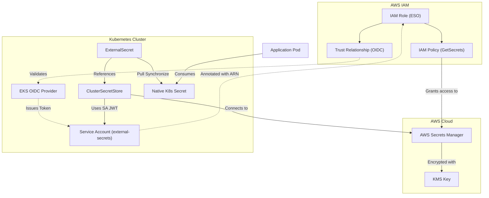

# Secret Management Strategy

This document outlines the strategy for managing sensitive information within the Golden Path platform, ensuring security, auditability, and consistent governance across all environments.

## Core Philosophy: Single Source of Truth

The platform adopts **AWS Secrets Manager** as the authoritative "Source of Truth" for all secret material. This approach provides several key benefits:

- **Centralized Governance**: A single location for managing, rotating, and auditing secret access.
- **Enhanced Security**: Secrets are encrypted at rest using AWS KMS and are never stored in plain text within the version control system.
- **Audit Logging**: Every access attempt to a secret in AWS Secrets Manager is recorded in AWS CloudTrail.

## The Kubernetes Bridge: External Secrets Operator (ESO)

To bridge the gap between AWS and Kubernetes securely, we utilize the **External Secrets Operator (ESO)**.

### Relationship Diagram

### Components & Identity Federation

1.  **EKS OIDC Provider**: Acts as the identity issuer for the Kubernetes cluster.
2.  **IAM Role for Service Accounts (IRSA)**:
    -   **Trust Policy**: Specifically configured to trust the EKS OIDC provider and allow the `external-secrets` Service Account (in its specific namespace) to assume the role via `sts:AssumeRoleWithWebIdentity`.
    -   **Permissions Policy**: Granting `secretsmanager:Get*` and `secretsmanager:Describe*` permissions.
3.  **Kubernetes Service Account**: Annotated with `eks.amazonaws.com/role-arn: <iam-role-arn>`.
4.  **EKS Pod Identity Webhook**: Intercepts Pod creation and injects the `AWS_ROLE_ARN` and `AWS_WEB_IDENTITY_TOKEN_FILE` environment variables, enabling the AWS SDK inside ESO to authenticate seamlessly.
5.  **ClusterSecretStore**: Configured to use the Service Account's identity to authenticate against the AWS provider.

## Security Posture: "Pull-Only" Model

By default, the platform implements a **"Pull-Only"** synchronization model.

### Rational for "Pull-Only"
- **Reduced Blast Radius**: In the event of a cluster compromise, an attacker cannot delete or replace the authoritative secrets in AWS.
- **Unidirectional Flow**: Ensures a clear path of truth from AWS to the cluster.
- **Prevention of Secret Drift**: Discourages the creation of ungoverned secrets within the cluster that lack AWS-level auditing.

### When to use "Push"?
Direct pushing of secrets from Kubernetes to AWS is **disabled by default**. It is only authorized for specific, vetted automation workflows where the secret material originates within the cluster (e.g., certificates generated by `cert-manager`).

## Preventative Measures: Leak Protection

To ensure no secrets are accidentally committed to the source code:
- **Pre-commit Hooks**: `gitleaks` and `trufflehog` are used to scan staged changes for potential secret patterns.
- **CI Scanning**: Every PR is scanned to ensure no ungoverned secret material enters the codebase.
