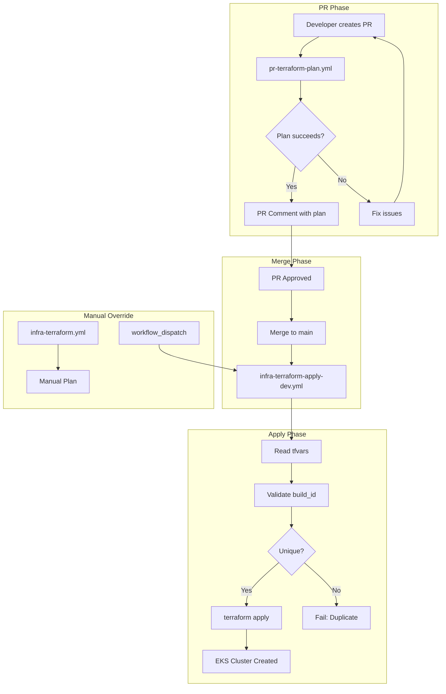

This guide explains the GitHub Actions workflow architecture for Terraform plan and apply operations.

## Overview

The CI system implements a PR-driven deployment model where:

1. Configuration changes are made via PR
2. Plan runs automatically on PR creation
3. Apply triggers automatically on merge to main

```text
┌─────────────────────────────────────────────────────────────────────────────┐
│                         CI/CD Pipeline Flow                                  │
└─────────────────────────────────────────────────────────────────────────────┘

  Developer                    GitHub                         AWS
     │                           │                              │
     │  1. Update tfvars         │                              │
     │  2. Create PR ──────────► │                              │
     │                           │                              │
     │                           │  pr-terraform-plan.yml       │
     │                           │  ├─ Fetch governance-registry│
     │                           │  ├─ terraform plan           │
     │                           │  └─ Comment on PR ◄──────────┤
     │                           │                              │
     │  3. Review plan output    │                              │
     │                           │                              │
     │  4. Approve & merge ────► │                              │
     │                           │                              │
     │                           │  infra-terraform-apply-dev   │
     │                           │  ├─ Read tfvars              │
     │                           │  ├─ Validate build_id        │
     │                           │  ├─ terraform apply ─────────┼──► EKS Cluster
     │                           │  └─ Record to registry       │
     │                           │                              │
```

## Workflow Architecture

### Active Workflows

```text
.github/workflows/
├── pr-terraform-plan.yml          # PR validation + plan comment
├── infra-terraform.yml            # Manual multi-env plan
├── infra-terraform-apply-dev.yml  # Dev apply (auto + manual)
├── infra-terraform-apply-test.yml
├── infra-terraform-apply-staging.yml
├── infra-terraform-apply-prod.yml
└── deprecated/                    # Archived workflows
```

### Workflow Relationships



## Workflow Details

### 1. PR Terraform Plan (`pr-terraform-plan.yml`)

**Trigger**: Pull request to `main` touching `.tf` or `.tfvars` files

**Purpose**: Validate changes and show plan before merge

```text
┌─────────────────────────────────────────────────────────────────┐
│                    pr-terraform-plan.yml                         │
├─────────────────────────────────────────────────────────────────┤
│                                                                  │
│  Trigger: pull_request (main)                                   │
│  Paths: **/*.tf, **/*.tfvars                                    │
│                                                                  │
│  ┌──────────────────────────────────────────────────────────┐  │
│  │ Steps                                                     │  │
│  ├──────────────────────────────────────────────────────────┤  │
│  │ 1. Checkout repo                                         │  │
│  │ 2. Fetch governance-registry branch                      │  │
│  │ 3. Configure AWS OIDC (read-only role)                   │  │
│  │ 4. Setup Terraform                                       │  │
│  │ 5. terraform fmt -check                                  │  │
│  │ 6. Resolve state key from tfvars                         │  │
│  │ 7. terraform init (backend)                              │  │
│  │ 8. terraform validate                                    │  │
│  │ 9. terraform plan -out=plan.tfplan                       │  │
│  │ 10. Render plan to text + JSON                           │  │
│  │ 11. Infracost breakdown (if API key set)                 │  │
│  │ 12. Comment on PR with:                                  │  │
│  │     ├─ Metadata table (lifecycle, build_id, state_key)   │  │
│  │     ├─ Plan summary (create/update/delete counts)        │  │
│  │     ├─ Full plan output (collapsible)                    │  │
│  │     └─ "Merging will trigger auto-apply" notice          │  │
│  └──────────────────────────────────────────────────────────┘  │
│                                                                  │
│  Permissions: contents:read, pull-requests:write, id-token:write│
│  IAM Role: TF_AWS_IAM_ROLE_DEV (read-only)                      │
│                                                                  │
└─────────────────────────────────────────────────────────────────┘
```

**PR Comment Format**:

```markdown
## Terraform plan (envs/dev)

| Parameter | Value |
|-----------|-------|
| Lifecycle | `ephemeral` |
| Build ID | `15-01-26-01` |
| State Key | `envs/dev/builds/15-01-26-01/terraform.tfstate` |

<details>
<summary>Plan summary</summary>
<pre>
create:  47
update:  0
delete:  0
replace: 0
read:    12
no_op:   0
</pre>
</details>

<details>
<summary>Full plan</summary>
<pre>
Terraform will perform the following actions:
...
</pre>
</details>

> Merging this PR will trigger auto-apply to dev.
```

### 2. Manual Plan (`infra-terraform.yml`)

**Trigger**: Manual workflow_dispatch only

**Purpose**: Run plans for any environment without creating a PR

```text
┌─────────────────────────────────────────────────────────────────┐
│                    infra-terraform.yml                           │
├─────────────────────────────────────────────────────────────────┤
│                                                                  │
│  Trigger: workflow_dispatch                                      │
│                                                                  │
│  Inputs:                                                         │
│  ├─ env: dev | test | staging | prod                            │
│  ├─ lifecycle: ephemeral | persistent                           │
│  ├─ build_id: DD-MM-YY-NN (for ephemeral)                       │
│  ├─ new_build: true | false                                     │
│  └─ require_state: true | false                                 │
│                                                                  │
│  Jobs:                                                           │
│  ┌──────────────────┐  ┌──────────────────┐  ┌───────────────┐ │
│  │ terraform-fmt    │  │ terraform-validate│  │ terraform-plan│ │
│  │ (check format)   │  │ (matrix: 13 dirs) │  │ (env-specific)│ │
│  └────────┬─────────┘  └────────┬─────────┘  └───────┬───────┘ │
│           │                      │                    │         │
│           └──────────────────────┴────────────────────┘         │
│                              │                                   │
│                              ▼                                   │
│                     needs: [fmt, validate]                       │
│                                                                  │
│  Validation Matrix:                                              │
│  ├─ . (root)                                                    │
│  ├─ envs/dev, envs/test, envs/staging, envs/prod               │
│  └─ modules/aws_compute, aws_eks, aws_iam, aws_nic, etc.       │
│                                                                  │
│  Features:                                                       │
│  ├─ Lockfile drift detection                                    │
│  ├─ Governance-registry fetch for build_id validation          │
│  └─ Python-based plan summary                                   │
│                                                                  │
└─────────────────────────────────────────────────────────────────┘
```

### 3. Dev Apply (`infra-terraform-apply-dev.yml`)

**Triggers**:

- Push to `main` (auto-apply on merge)
- Manual workflow_dispatch

**Purpose**: Apply infrastructure changes to dev environment

```text
┌─────────────────────────────────────────────────────────────────┐
│               infra-terraform-apply-dev.yml                      │
├─────────────────────────────────────────────────────────────────┤
│                                                                  │
│  Triggers:                                                       │
│  ├─ push to main (paths: envs/dev/**/*.tf, modules/**/*.tf)    │
│  └─ workflow_dispatch (manual with inputs)                      │
│                                                                  │
│  ┌──────────────────────────────────────────────────────────┐  │
│  │ Flow for Push (auto-apply)                                │  │
│  ├──────────────────────────────────────────────────────────┤  │
│  │                                                           │  │
│  │  ┌─────────────┐    ┌─────────────┐    ┌─────────────┐  │  │
│  │  │ Read tfvars │───►│  Validate   │───►│   Apply     │  │  │
│  │  │ lifecycle   │    │  build_id   │    │  terraform  │  │  │
│  │  │ build_id    │    │  uniqueness │    │             │  │  │
│  │  └─────────────┘    └─────────────┘    └─────────────┘  │  │
│  │                                                           │  │
│  │  Configuration comes FROM the merged PR tfvars,          │  │
│  │  not from manual inputs.                                  │  │
│  │                                                           │  │
│  └──────────────────────────────────────────────────────────┘  │
│                                                                  │
│  ┌──────────────────────────────────────────────────────────┐  │
│  │ Flow for Manual Dispatch                                  │  │
│  ├──────────────────────────────────────────────────────────┤  │
│  │                                                           │  │
│  │  Inputs:                                                  │  │
│  │  ├─ confirm_apply: "apply" (required)                    │  │
│  │  ├─ lifecycle: ephemeral | persistent                    │  │
│  │  ├─ build_id: DD-MM-YY-NN                                │  │
│  │  └─ new_build: true | false                              │  │
│  │                                                           │  │
│  │  Configuration comes FROM the workflow inputs,           │  │
│  │  not from tfvars.                                         │  │
│  │                                                           │  │
│  └──────────────────────────────────────────────────────────┘  │
│                                                                  │
│  Safeguards:                                                     │
│  ├─ Verify plan succeeded for this commit (PR or manual)       │
│  ├─ Governance-registry build_id uniqueness check              │
│  ├─ Build_id format validation (DD-MM-YY-NN)                   │
│  └─ Environment protection (requires approval)                 │
│                                                                  │
│  Permissions: contents:read, id-token:write, actions:read       │
│  IAM Role: TF_AWS_IAM_ROLE_DEV_APPLY (apply permissions)        │
│                                                                  │
└─────────────────────────────────────────────────────────────────┘
```

## Build ID Validation Flow

The build_id uniqueness check prevents state corruption by ensuring each ephemeral build uses a unique identifier.

```text
┌─────────────────────────────────────────────────────────────────┐
│                  Build ID Validation Flow                        │
└─────────────────────────────────────────────────────────────────┘

                    ┌──────────────────┐
                    │  CI Workflow     │
                    │  (plan or apply) │
                    └────────┬─────────┘
                             │
                             ▼
              ┌──────────────────────────────┐
              │ git fetch origin             │
              │ governance-registry:refs/... │
              └──────────────┬───────────────┘
                             │
                             ▼
              ┌──────────────────────────────┐
              │ Terraform data.external     │
              │ build_id_check              │
              └──────────────┬───────────────┘
                             │
                             ▼
              ┌──────────────────────────────┐
              │ git show origin/governance- │
              │ registry:...build_timings.csv│
              └──────────────┬───────────────┘
                             │
                    ┌────────┴────────┐
                    │                 │
                    ▼                 ▼
         ┌─────────────────┐ ┌─────────────────┐
         │ CSV available   │ │ CSV not found   │
         └────────┬────────┘ └────────┬────────┘
                  │                   │
                  ▼                   ▼
         ┌─────────────────┐ ┌─────────────────┐
         │ Search for      │ │ FAIL-CLOSED     │
         │ build_id match  │ │ Cannot verify   │
         └────────┬────────┘ │ uniqueness      │
                  │          └────────┬────────┘
         ┌────────┴────────┐          │
         │                 │          │
         ▼                 ▼          ▼
┌─────────────┐   ┌─────────────┐  ┌─────────────┐
│ Not found   │   │ Found       │  │ Precondition│
│ = Unique    │   │ = Duplicate │  │ fails       │
│ [PROCEED]   │   │ [BLOCK]     │  │ [BLOCK]     │
└─────────────┘   └─────────────┘  └─────────────┘
```

### Fail-Closed Behavior

If the governance-registry cannot be read, the workflow **fails closed** (blocks apply) rather than allowing a potentially duplicate build_id.

```hcl
# In envs/dev/main.tf

# PRECONDITION 1: Registry must be available
precondition {
  condition = try(data.external.build_id_check[0].result.registry_available, "false") == "true"
  error_message = "Cannot verify build_id uniqueness - governance-registry not available"
}

# PRECONDITION 2: Build ID must not exist
precondition {
  condition = try(data.external.build_id_check[0].result.exists, "true") == "false"
  error_message = "Build ID already exists in governance registry"
}
```

## State Key Strategy

Each ephemeral build gets an isolated state file to prevent conflicts.

```text
S3 Bucket: goldenpath-idp-dev-bucket
│
├── envs/dev/terraform.tfstate                    # Persistent cluster
│
└── envs/dev/builds/
    ├── 14-01-26-01/terraform.tfstate            # Ephemeral build 01
    ├── 14-01-26-02/terraform.tfstate            # Ephemeral build 02
    ├── 14-01-26-03/terraform.tfstate            # Ephemeral build 03
    └── 15-01-26-01/terraform.tfstate            # Ephemeral build 04
```

**State key resolution logic** (in all workflows):

```bash
if [[ "${LIFECYCLE}" == "ephemeral" ]]; then
  STATE_KEY="envs/dev/builds/${BUILD_ID}/terraform.tfstate"
else
  STATE_KEY="envs/dev/terraform.tfstate"
fi
```

## Typical Usage Scenarios

### Scenario 1: New Ephemeral Cluster via PR

```bash
# 1. Update tfvars with new build config
cat > envs/dev/terraform.tfvars << EOF
cluster_lifecycle = "ephemeral"
build_id          = "15-01-26-01"
EOF

# 2. Create PR
git checkout -b feature/new-cluster
git add envs/dev/terraform.tfvars
git commit -m "feat: provision ephemeral cluster 15-01-26-01"
git push origin feature/new-cluster

# 3. Wait for pr-terraform-plan to run
# 4. Review plan in PR comment
# 5. Approve and merge PR
# 6. Apply triggers automatically
```

### Scenario 2: Manual Plan (No Apply)

```bash
# Use GitHub Actions UI to run infra-terraform.yml
# Inputs:
#   env: dev
#   lifecycle: ephemeral
#   build_id: 15-01-26-02
#   new_build: true
#   require_state: false
```

### Scenario 3: Manual Apply (Emergency)

```bash
# Use GitHub Actions UI to run infra-terraform-apply-dev.yml
# Inputs:
#   confirm_apply: apply
#   lifecycle: ephemeral
#   build_id: 15-01-26-02
#   new_build: true
```

## Troubleshooting

### Error: Governance registry not available

```text
Error: Cannot verify build_id uniqueness - governance-registry branch not available
```

**Cause**: The workflow couldn't fetch the governance-registry branch.

**Solution**:

1. Check if the branch exists: `git branch -r | grep governance-registry`
2. Ensure the workflow has `contents: read` permission
3. Verify the fetch step: `git fetch origin governance-registry:refs/remotes/origin/governance-registry`

### Error: Build ID already exists

```text
Error: Build ID 15-01-26-01 already exists for environment dev
```

**Cause**: The build_id was used in a previous deployment.

**Solution**:

1. Check existing builds: `git show origin/governance-registry:environments/development/latest/build_timings.csv`
2. Use next sequence number: `15-01-26-02`

### Error: No successful plan found

```text
Error: No successful dev plan run found for abc123
```

**Cause**: Apply requires a successful plan for the same commit.

**Solution**:

1. Run `infra-terraform.yml` manually with matching parameters
2. Or create a PR to trigger `pr-terraform-plan.yml`

### Error: lifecycle/build_id mismatch

```text
Error: build_id is only valid for lifecycle=ephemeral
```

**Cause**: Tried to set build_id with persistent lifecycle.

**Solution**: Either:

- Set `cluster_lifecycle = "ephemeral"` and provide build_id
- Or set `cluster_lifecycle = "persistent"` and remove build_id

## References

- [Seamless Build Bootstrap Deployment](SEAMLESS_BUILD_BOOTSTRAP_DEPLOYMENT.md)
- [CI Environment Contract](../../20-contracts/21_CI_ENVIRONMENT_CONTRACT.md)
- [ADR-0155: CI Governance Registry Fetch](../../adrs/ADR-0155-ci-governance-registry-fetch.md)
- [Deprecated Workflows](../../../.github/workflows/deprecated/README.md)
