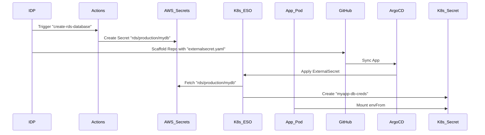

# How It Works: Backend App + RDS Request Flow

This document explains the "Golden Path" for provisioning a **Backend Application** that connects to a **Managed RDS Database**.

## The Composite Pattern
This is a "high-leverage" action. ONE request triggers TWO outcomes:
1.  **Infrastructure**: Triggers `create-rds-database.yml` to provision Postgres on the Platform RDS.
2.  **Application**: Scaffolds a new GitHub repo with code pre-wired to connect to that database.

## The Secret contract (Zero-Touch)
We use the **External Secrets Operator** (ESO) to bridge the gap between AWS and K8s.



## Parameters

| Field | Description | Example |
| :--- | :--- | :--- |
| **App Name** | Unique identifier for your service. | `user-service` |
| **Database Name** | Postgres DB Name. | `users_db` |
| **Username** | Postgres User. | `users_app_user` |

## Output Repository Structure

```bash
user-service/
├── deploy/
│   ├── base/
│   │   ├── deployment.yaml       # Mounts secret as env
│   │   ├── externalsecret.yaml   # Syncs AWS -> K8s
│   │   └── kustomization.yaml
├── app.py                        # Connects using os.environ['DB_HOST']
└── catalog-info.yaml             # Metadata
```
