# How It Works: Golden Path Templates Overview

This document provides a comprehensive overview of the three Golden Path templates available in the GoldenPath IDP. Each path is optimized for different workload characteristics, particularly around **state preservation**.

## Quick Reference: Choosing Your Path

| Path | Workload Type | State | Data Persistence | Use When |
|------|---------------|-------|------------------|----------|
| **Stateless App** | Deployment | None | No persistent data | APIs, web services, microservices |
| **Stateful App** | StatefulSet | Local PVC | Data survives pod restart | Caches, queues, search indices |
| **Backend + RDS** | Deployment + RDS | Managed DB | Data survives cluster deletion | Business-critical data, transactions |

## The Three Golden Paths

### 1. Stateless App (Deployment)

**Best for**: Standard web services, REST APIs, frontend applications.

**State Preservation**: None - pods are ephemeral and interchangeable.

**Key Characteristics**:

* Uses Kubernetes `Deployment` for workload management
* Pods can be killed/rescheduled without data loss
* Horizontal scaling is trivial (just increase replicas)
* No persistent storage attached

**When to Choose**:

* Your app stores data externally (database, S3, Redis)
* Your app is stateless by design (12-factor app)
* You need easy horizontal scaling
* Pod restarts don't lose important data

**Repository Created**: `github.com/{org}/{component_id}`

**Manifests Generated**:

```
deploy/
├── base/
│   ├── deployment.yaml    # Kubernetes Deployment
│   ├── service.yaml       # ClusterIP Service
│   └── kustomization.yaml
└── overlays/
    ├── dev/
    ├── test/
    ├── staging/
    └── prod/
```

See: [STATELESS_APP_REQUEST_FLOW.md](./STATELESS_APP_REQUEST_FLOW.md)

---

### 2. Stateful App (StatefulSet + PVC)

**Best for**: Caches (Redis), message queues (RabbitMQ), search indices (Elasticsearch).

**State Preservation**: Local to pod - data survives pod restart but NOT cluster deletion.

**Key Characteristics**:

* Uses Kubernetes `StatefulSet` for ordered, stable pod management
* Each pod gets its own Persistent Volume Claim (PVC)
* Pods have stable network identities (`pod-0`, `pod-1`, etc.)
* Headless Service for pod-to-pod communication
* Load-balancer Service for external access

**When to Choose**:

* Your app needs local disk storage that survives restarts
* You can tolerate data loss if the cluster is deleted
* Pod ordering matters (leader election, primary/replica)
* You need stable network identity for clustering

**Repository Created**: `github.com/{org}/{component_id}`

**Manifests Generated**:

```
deploy/
├── base/
│   ├── statefulset.yaml      # Kubernetes StatefulSet with volumeClaimTemplates
│   ├── service-headless.yaml # Headless Service (clusterIP: None)
│   └── kustomization.yaml
└── overlays/
    ├── dev/
    │   ├── service.yaml      # Load-balancer Service for external access
    │   ├── ingress.yaml
    │   └── kustomization.yaml
    ├── test/
    ├── staging/
    └── prod/
```

**Important**: StatefulSet creates PVCs via `volumeClaimTemplates`. These PVCs:

* Are provisioned automatically using the `gp3` StorageClass (AWS EBS)
* Are NOT deleted when the StatefulSet is deleted (data protection)
* Must be manually deleted if you want to reclaim storage

See: [STATEFUL_APP_REQUEST_FLOW.md](./STATEFUL_APP_REQUEST_FLOW.md)

---

### 3. Backend App + RDS (Deployment + Managed Database)

**Best for**: Applications requiring durable, transactional data storage.

**State Preservation**: Fully managed - data survives everything (pod restart, cluster deletion, AZ failure).

**Key Characteristics**:

* Uses Kubernetes `Deployment` for the application
* Uses AWS RDS (PostgreSQL) for data persistence
* Secrets managed via External Secrets Operator (ESO)
* Database survives independent of Kubernetes cluster

**When to Choose**:

* You have business-critical data that cannot be lost
* You need ACID transactions
* You need point-in-time recovery, automated backups
* You need to survive cluster rebuilds without data loss

**Repository Created**: `github.com/{org}/{component_id}`

**What Gets Provisioned**:

1. **GitHub Repository** with application code and manifests
2. **RDS Database** (or schema on shared platform RDS)
3. **AWS Secrets Manager** entry with credentials
4. **ExternalSecret** to sync credentials to Kubernetes

**Manifests Generated**:

```
deploy/
├── base/
│   ├── deployment.yaml       # App Deployment with envFrom secret
│   ├── service.yaml          # ClusterIP Service
│   ├── externalsecret.yaml   # ESO config to sync DB credentials
│   └── kustomization.yaml
└── overlays/
    ├── dev/
    ├── test/
    ├── staging/
    └── prod/
```

**Secret Flow**:

```
AWS Secrets Manager                 Kubernetes
┌─────────────────────┐            ┌──────────────────┐
│ goldenpath/{env}/{dbname}/postgres  │───ESO───▶  │ {app}-db-creds   │
│  - host             │            │  - DB_HOST       │
│  - port             │            │  - DB_PORT       │
│  - username         │            │  - DB_NAME       │
│  - password         │            │  - DB_USER       │
│  - dbname           │            │  - DB_PASSWORD   │
└─────────────────────┘            └──────────────────┘
                                          │
                                          ▼
                                   ┌──────────────────┐
                                   │ Pod (envFrom)    │
                                   │  os.environ[...] │
                                   └──────────────────┘
```

See: [BACKEND_APP_RDS_REQUEST_FLOW.md](./BACKEND_APP_RDS_REQUEST_FLOW.md)

---

## State Preservation Comparison

| Scenario | Stateless | Stateful (PVC) | Backend + RDS |
|----------|-----------|----------------|---------------|
| Pod restart | No data | Data preserved | Data preserved |
| Pod rescheduled | No data | Data preserved (same node) | Data preserved |
| Node failure | No data | Data lost (EBS single-AZ) | Data preserved (Multi-AZ) |
| Cluster deletion | No data | Data lost | **Data preserved** |
| AZ failure | No impact | Data lost | Data preserved (Multi-AZ) |
| Automated backups | N/A | Manual | Automated (RDS) |
| Point-in-time recovery | N/A | No | Yes (RDS) |

## Common Patterns

### Stateless + External State

Many applications use a Stateless App deployment but connect to external state stores:

```
┌─────────────────┐     ┌─────────────────┐
│ Stateless App   │────▶│ Redis (cache)   │  ← Stateful App
│ (Deployment)    │     └─────────────────┘
│                 │     ┌─────────────────┐
│                 │────▶│ RDS (database)  │  ← Backend + RDS
└─────────────────┘     └─────────────────┘
```

### Multi-Environment Deployment

All three Golden Paths support multiple environments via Kustomize overlays:

| Environment | Domain Pattern | TLS | LOG_LEVEL |
|-------------|----------------|-----|-----------|
| dev | `{app}.dev.goldenpathidp.io` | Optional | debug |
| test | `{app}.test.goldenpathidp.io` | Optional | debug |
| staging | `{app}.staging.goldenpathidp.io` | letsencrypt-staging | info |
| prod | `{app}.goldenpathidp.io` | letsencrypt-prod | warn |

## Scaffolding Process

All three Golden Paths follow the same scaffolding process:

```mermaid
sequenceDiagram
    participant Dev as Developer
    participant BS as Backstage
    participant GH as GitHub
    participant Argo as ArgoCD
    participant K8s as EKS

    Dev->>BS: 1. Fill Template Form
    BS->>BS: 2. Validate Parameters
    BS->>GH: 3. Create Repository
    BS->>GH: 4. Push Skeleton (variables replaced)
    BS->>BS: 5. Register in Catalog
    Dev->>GH: 6. Push Code Changes
    GH->>GH: 7. CI Pipeline (build, test, push)
    GH->>Argo: 8. Trigger Sync
    Argo->>K8s: 9. Deploy Manifests
    K8s->>K8s: 10. Create Pods, Services, Ingress
```



**Steps 1-5**: Happen automatically when you submit the Backstage form.

**Steps 6-10**: Happen on every code push via the CI/CD pipeline.

## Related Documentation

* [CONTRACT_DRIVEN_ARCHITECTURE.md](./CONTRACT_DRIVEN_ARCHITECTURE.md) - How contracts drive automation
* [ECR_REQUEST_FLOW.md](./ECR_REQUEST_FLOW.md) - Container registry provisioning
* [RDS_REQUEST_FLOW.md](./RDS_REQUEST_FLOW.md) - Database provisioning details
* [../ci-terraform/APP_BUILD_PIPELINE.md](../ci-terraform/APP_BUILD_PIPELINE.md) - CI/CD pipeline details
