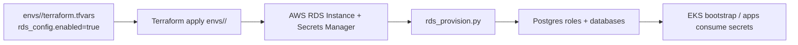
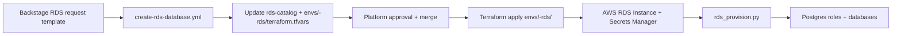

# How It Works: Dual-Mode RDS Automation (Coupled + Standalone)

The platform supports two RDS modes that intentionally coexist:

- **Coupled RDS**: Provisioned alongside EKS during cluster builds.
- **Standalone RDS**: Provisioned on request as a persistent, decoupled stack.

Both modes use the same RDS module and provisioning script. The difference is
*when* and *how* they are triggered.

## Mode Summary

| Mode | Terraform root | Trigger | Primary use case |
| --- | --- | --- | --- |
| Coupled | `envs/<env>/` | EKS build/deploy | Default platform builds |
| Standalone | `envs/<env>-rds/` | Backstage request + approval | Team-requested persistence |

## Canonical Enums (No Drift)

Source: `schemas/metadata/enums.yaml`

| Field | Enum key | Values | Mapping |
| --- | --- | --- | --- |
| size | rds.instance_sizes | small, medium, large, xlarge | `scripts/rds_request_parser.py` `SIZE_TO_INSTANCE` |
| engine | rds.engines | postgres | Schema default |
| request status | rds.request_status | pending, approved, provisioning, active, failed, decommissioning, decommissioned | Catalog state |
| environment | environments | dev, test, staging, prod, ephemeral | Request target |
| domain | domains | (enum list) | Cost/governance tagging |
| owner | owners | (enum list) | Approval ownership |
| risk | risk_profile_security_risk | none, low, medium, high, access | Risk classification |

### Size Tier Mapping

| Tier | Instance class |
| --- | --- |
| small | db.t3.micro |
| medium | db.t3.small |
| large | db.t3.medium |
| xlarge | db.r6g.large |

## Coupled Flow (EKS Build)



### Deploy Shortcut Note

`make deploy` runs apply + bootstrap today, but it does **not** insert the
`rds-provision-auto` step yet. When RDS is required for platform apps, run the
explicit three-step sequence:

```bash
make apply ENV=dev BUILD_ID=xx-xx-xx-xx
make rds-provision-auto ENV=dev BUILD_ID=xx-xx-xx-xx
make bootstrap ENV=dev BUILD_ID=xx-xx-xx-xx
```

## Standalone Flow (Self-Service Request)



### Contract-Driven Variant (Planned)

The request contract and parser already exist and can replace the direct
tfvars mutation when ready:

- Request schema: `schemas/requests/rds.schema.yaml`
- Parser: `scripts/rds_request_parser.py`
- Reference: `docs/85-how-it-works/self-service/CONTRACT_DRIVEN_ARCHITECTURE.md`

## Backstage Alignment (No Rework)

To avoid future rework, Backstage templates and workflows should:

1. Use enum-aligned inputs (size, environment, owner, domain, risk).
2. Pass the selected size tier to the request record or workflow.
3. Avoid hard-coded lists that drift from `schemas/metadata/enums.yaml`.

## Guardrails and Approvals

- Service class approvals for `databases-rds` are defined in
  `schemas/routing/service_class_approvals.yaml`.
- Non-dev provisioning requires explicit approval gates (`ALLOW_DB_PROVISION=true`).
- Size tiers above `medium` should require platform review.

## References

- `schemas/metadata/enums.yaml`
- `schemas/requests/rds.schema.yaml`
- `scripts/rds_request_parser.py`
- `scripts/rds_provision.py`
- `docs/85-how-it-works/self-service/RDS_REQUEST_FLOW.md`
