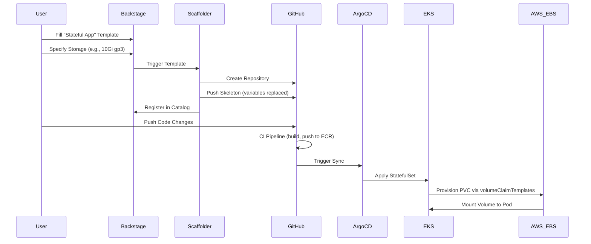

# How It Works: Stateful App Request Flow

This document explains the "Golden Path" for provisioning a new **Stateful Application** using `StatefulSet` and Persistent Volumes.

## Overview

See also: [GOLDEN_PATH_OVERVIEW.md](./GOLDEN_PATH_OVERVIEW.md) for a comparison of all three Golden Paths.

## When to Use This Path

### Use Stateful App For

* **Caches**: Redis, Memcached
* **Message Queues**: RabbitMQ, Kafka
* **Search Indices**: Elasticsearch, OpenSearch
* **File Storage**: MinIO, local uploads
* **Any workload needing local persistent storage**

### Do NOT Use For

* **Relational Databases** (Postgres/MySQL) holding critical business data
* **Data that must survive cluster deletion**
* **Data requiring automated backups and point-in-time recovery**

For these use cases, use the **Backend App + RDS** template instead.

## State Preservation Characteristics

| Scenario | Data Preserved? |
|----------|-----------------|
| Pod restart | Yes |
| Pod rescheduled (same node) | Yes |
| Node failure | **No** (EBS is single-AZ) |
| Cluster deletion | **No** |
| AZ failure | **No** |

**Key Insight**: StatefulSet PVCs use AWS EBS volumes which are **single Availability Zone**. If the AZ goes down or the cluster is deleted, data is lost.

## The Workflow



## Parameters

| Field | Description | Example |
|-------|-------------|---------|
| **Name** (`component_id`) | Unique identifier for your service | `my-redis` |
| **Description** | Human-readable purpose | "Session cache for user service" |
| **Owner** | Team responsible for this service | `platform-team` |
| **Environment** | Target environment | `dev` |
| **Replicas** | Number of pods | `1` |
| **Storage Size** | Size of persistent volume | `10Gi` |
| **Mount Path** | Where to mount in container | `/data` |
| **Port** | Application port | `6379` |

## Output Repository Structure

```bash
my-redis/
├── .github/
│   └── workflows/
│       └── delivery.yml          # Thin Caller CI/CD pipeline
├── deploy/
│   ├── base/
│   │   ├── statefulset.yaml      # K8s StatefulSet with volumeClaimTemplates
│   │   ├── service-headless.yaml # Headless Service (clusterIP: None)
│   │   └── kustomization.yaml    # Base Kustomize config
│   └── overlays/
│       ├── dev/
│       │   ├── service.yaml      # Load-balancer Service for external access
│       │   ├── ingress.yaml      # Kong Ingress route
│       │   └── kustomization.yaml
│       ├── test/
│       ├── staging/
│       └── prod/
├── app.py                        # Application source code
├── Dockerfile                    # Container definition
├── catalog-info.yaml             # Backstage metadata
└── README.md                     # Generated documentation
```

## Key Manifests Explained

### StatefulSet (base/statefulset.yaml)

```yaml
apiVersion: apps/v1
kind: StatefulSet
metadata:
  name: my-redis
spec:
  serviceName: my-redis        # Links to headless service
  replicas: 1
  selector:
    matchLabels:
      app: my-redis
  template:
    spec:
      containers:
        - name: my-redis
          image: my-redis:latest
          volumeMounts:
            - name: data
              mountPath: /data
  volumeClaimTemplates:        # PVC created per pod
    - metadata:
        name: data
      spec:
        accessModes: ["ReadWriteOnce"]
        storageClassName: gp3
        resources:
          requests:
            storage: 10Gi
```

**Key Points**:

* `volumeClaimTemplates` creates a PVC for each pod (e.g., `data-my-redis-0`)
* PVCs are NOT deleted when StatefulSet is deleted (data protection)
* `serviceName` must match the headless service name

### Headless Service (base/service-headless.yaml)

```yaml
apiVersion: v1
kind: Service
metadata:
  name: my-redis
spec:
  clusterIP: None              # Headless - no load balancing
  ports:
    - port: 6379
      name: redis
  selector:
    app: my-redis
```

**Why Headless?**

* Provides stable DNS names: `my-redis-0.my-redis.apps.svc.cluster.local`
* Required for StatefulSet pod discovery
* Enables direct pod-to-pod communication

### Load-Balancer Service (overlays/dev/service.yaml)

```yaml
apiVersion: v1
kind: Service
metadata:
  name: my-redis-lb
spec:
  type: ClusterIP
  ports:
    - port: 80
      targetPort: 6379
  selector:
    app: my-redis
```

**Why Separate Service?**

* Provides single endpoint for external access
* Ingress routes to this service (not headless)
* Named `{component}-lb` to differentiate from headless

## Networking Architecture

```
                                    ┌─────────────────┐
                                    │   Ingress       │
                                    │ (Kong Gateway)  │
                                    └────────┬────────┘
                                             │
                                             ▼
┌──────────────────────────────────────────────────────────────┐
│                    Load-Balancer Service                      │
│                    (my-redis-lb:80)                          │
└──────────────────────────────┬───────────────────────────────┘
                               │
                               ▼
┌──────────────────────────────────────────────────────────────┐
│                    Headless Service                           │
│                    (my-redis, clusterIP: None)               │
│    DNS: my-redis-0.my-redis.apps.svc.cluster.local           │
└──────────────────────────────┬───────────────────────────────┘
                               │
            ┌──────────────────┼──────────────────┐
            ▼                  ▼                  ▼
    ┌───────────────┐  ┌───────────────┐  ┌───────────────┐
    │  Pod: -0      │  │  Pod: -1      │  │  Pod: -2      │
    │  PVC: data-0  │  │  PVC: data-1  │  │  PVC: data-2  │
    └───────────────┘  └───────────────┘  └───────────────┘
            │                  │                  │
            ▼                  ▼                  ▼
    ┌───────────────┐  ┌───────────────┐  ┌───────────────┐
    │  EBS Volume   │  │  EBS Volume   │  │  EBS Volume   │
    │  (gp3, 10Gi)  │  │  (gp3, 10Gi)  │  │  (gp3, 10Gi)  │
    └───────────────┘  └───────────────┘  └───────────────┘
```

## Environment Configuration

Each overlay configures environment-specific settings:

| Environment | APP_ENV | LOG_LEVEL | TLS | Domain |
|-------------|---------|-----------|-----|--------|
| dev | `${{ values.environment }}` | debug | No | `{app}.dev.goldenpathidp.io` |
| test | `${{ values.environment }}` | debug | No | `{app}.test.goldenpathidp.io` |
| staging | `${{ values.environment }}` | info | letsencrypt-staging | `{app}.staging.goldenpathidp.io` |
| prod | `${{ values.environment }}` | warn | letsencrypt-prod | `{app}.goldenpathidp.io` |

## Troubleshooting

### "My pod is stuck in Pending"

1. Check if PVC is bound: `kubectl get pvc -n apps`
2. Check StorageClass exists: `kubectl get sc gp3`
3. Check EBS CSI driver is running: `kubectl get pods -n kube-system | grep ebs`

### "Data disappeared after node failure"

EBS volumes are single-AZ. If the node's AZ fails, data may be inaccessible. For critical data, use **Backend App + RDS** instead.

### "I need to delete and recreate the StatefulSet"

PVCs are intentionally preserved when StatefulSet is deleted. To delete data:

```bash
# Delete StatefulSet
kubectl delete statefulset my-redis -n apps

# Delete PVCs (WARNING: destroys data)
kubectl delete pvc data-my-redis-0 -n apps
```

### "I need multi-AZ data resilience"

StatefulSet with EBS is not multi-AZ. Options:

1. Use **Backend App + RDS** for database workloads (RDS is multi-AZ)
2. Use application-level replication (e.g., Redis Sentinel, Kafka replication)
3. Use EFS instead of EBS (but with different performance characteristics)
