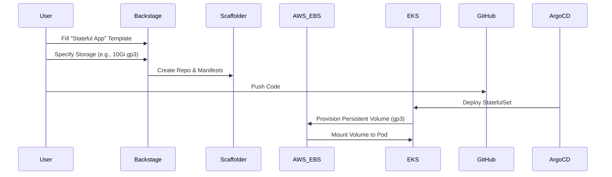

# How It Works: Stateful App Request Flow

This document explains the "Golden Path" for provisioning a new **Stateful Application** using `StatefulSet` and Persistent Volumes.

## ⚠️ Important: Choosing the Right State
*   **Use this for**: Caches (Redis), Message Queues (RabbitMQ), Search Indices (Elasticsearch), CMS uploads (MinIO).
*   **Do NOT use this for**: Relational Databases (Postgres/MySQL) holding critical business data. **Use the "Request RDS Database" template instead.**

## The Workflow



## Parameters

| Field | Description | Example |
| :--- | :--- | :--- |
| **Storage Size** | Size of the persistent volume. | `10Gi` |
| **Mount Path** | Where to mount the volume in the container. | `/data` |
| **Replicas** | Number of pods. | `1` |

## Output Repository Structure

```bash
my-redis/
├── deploy/
│   ├── base/
│   │   ├── statefulset.yaml      # Defines volumeClaimTemplates
│   │   ├── service-headless.yaml # Stable network identity
│   └── overlays/
│       └── dev/
│           ├── service.yaml      # LoadBalancer for external access (optional)
│           └── ingress.yaml      # Ingress route
```
