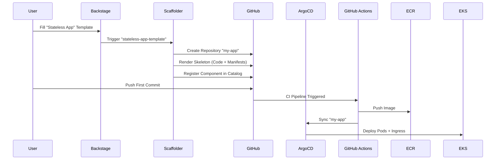

# How It Works: Stateless App Request Flow

This document explains the "Golden Path" for provisioning a new **Stateless Application**. This path is designed for standard web services, APIs, and microservices that do not require valid persistent storage.

## The Goal
*   **Input**: A developer requests a new app via Backstage (Name, Description, Owner).
*   **Output**: A fully provisioned GitHub repository containing:
    *   **Application Code**: Python/FastAPI skeleton (extensible).
    *   **CI/CD**: `delivery.yml` linked to the platform's canonical `_build-and-release.yml`.
    *   **Manifests**: Kustomize-based Deployment, Service, and Ingress (Kong).
    *   **Governance**: `catalog-info.yaml` and `metadata.yaml` for Day 0 compliance.
    *   **Live URL**: An automatically configured ingress endpoint (e.g., `my-app.dev.goldenpathidp.io`).

## The Workflow



## Parameters

| Field | Description | Example |
| :--- | :--- | :--- |
| **Name** (`component_id`) | Unique identifier for your service. | `user-service` |
| **Description** | Human-readable purpose. | "Handles user authentication" |
| **Owner** | The team responsible for this service. | `platform-team` |
| **Environment** | Initial target environment. | `dev` |
| **Replicas** | Initial pod count. | `2` |
| **Ingress** | Expose via Kong Gateway? | `true` |

## Output Repository Structure

Your new repository will look like this (based on `hello-goldenpath-idp`):

```bash
my-app/
├── .github/
│   └── workflows/
│       └── delivery.yml          # The "Thin Caller" CI/CD pipeline
├── deploy/
│   ├── base/
│   │   ├── deployment.yaml       # K8s Deployment
│   │   ├── service.yaml          # K8s Service
│   │   └── kustomization.yaml    # Base Kustomize
│   └── overlays/
│       └── dev/
│           ├── ingress.yaml      # Kong Ingress Route
│           └── kustomization.yaml
├── app.py                        # Application source code
├── Dockerfile                    # Container definition
├── catalog-info.yaml             # Backstage metadata
└── README.md                     # Generated documentation
```

## Troubleshooting

### "My app isn't deploying!"
1.  Check **GitHub Actions**: Did the `delivery.yml` contract pass?
2.  Check **ArgoCD**: Is the application synced?
3.  Check **ExternalDNS**: Is the DNS record created in Route53?

### "I need to add a database."
This is a **Stateless** path. If you need persistence, consider the **Stateful App** path or request an **RDS Database** separately via the `rds-request` template.
