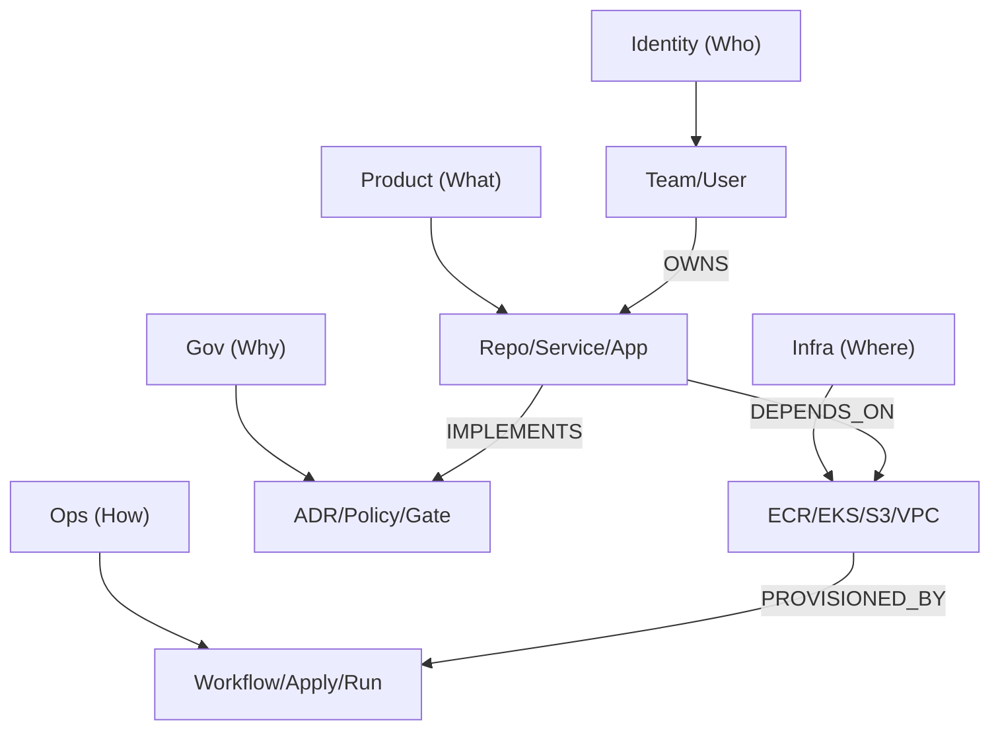

# ADR-0110: IDP Knowledge Graph Node Architecture

## Context
The GoldenPath IDP currently uses disconnected YAML sidecars (`metadata.yaml`) to track component attributes. While metadata compliance is high (98.7%), we lacks a structured way to understand **relationships** between these components. This makes impact analysis and autonomous reasoning difficult.

## Decision
We will adopt a **Node-based Knowledge Graph Architecture**. Every component tracked by the platform will be treated as an **Entity Node**, and every connection (dependencies, ownership, compliance) will be treated as a **Relationship Edge**.

### 1. The Five Pillars of Nodes
We will categorize all nodes into five primary domains:

### 3. The Autonomous Agent Layer
To leverage this graph, we define the **"Graph Reasoner"** agent persona. This agent doesn't just "see" files; it "understands" the topology of the platform.

### Agent Actions
*   **Knowledge Synthesis**: Answering natural language questions about the platform state.
*   **Proactive Healing**: Automatically opening PRs when the graph reveals a compliance gap (e.g., a service without an owner).
*   **Impact Prediction**: Simulation of changes before they are applied by traversing the graph edges.

## Status: Proposed
This ADR is currently in the **Planning** phase. We will begin implementation by upgrading `extract_relationships.py`.

## Consequences

### Positive
*   **Autonomous Reasoning**: Agents can navigate the graph to identify orphaned resources or security gaps.
*   **Impact Analysis**: Instant visibility into the blast radius of infrastructure changes.
*   **Born-Governed Integrity**: Every node is explicitly linked to a policy or ADR.

### Negative
*   **Complexity**: Increased complexity in the extraction and validation scripts.
*   **Schema Rigidity**: Nodes must follow a strict schema to be queryable by agents.
