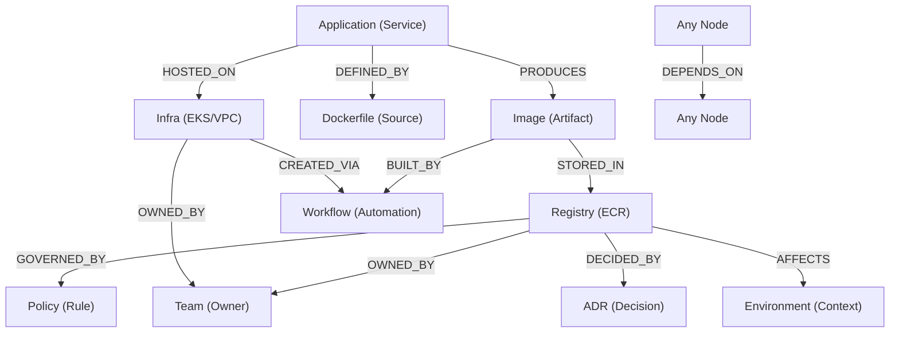

# ADR-0110: IDP Knowledge Graph Node Architecture

## Context
The GoldenPath IDP currently uses disconnected YAML sidecars (`metadata.yaml`) to track component attributes. While metadata compliance is high (98.7%), we lacks a structured way to understand **relationships** between these components. This makes impact analysis and autonomous reasoning difficult.

## Decision
We will adopt a **Node-based Knowledge Graph Architecture**. Every component tracked by the platform will be treated as an **Entity Node**, and every connection (dependencies, ownership, compliance) will be treated as a **Relationship Edge**.

### 1. The Practical Node Schema
We will focus on essential node types that represent the living state of our platform:

### 2. Schema Evolution & Versioning
The graph is designed to be **extensible**.

- **Versioning**: Edges can be versioned or renamed. If we move from `USED_BY` to `CONSUMES`, we run a migration script across the Knowledge Graph without altering the underlying metadata.
- **Domain Extension**: We will start with the "Supply Chain" domain (Registry/App/Image) and later extend to "Networking" (VPC/Security Groups) or "Compute" (EKS/Nodes) as we build new automation healers.
- **Soft Schema**: We use a "Flexible Schema" approach where nodes can have arbitrary properties, but core identity fields are strictly enforced.

### 3. Advanced Evolutionary Patterns (Improvements)
To reach the full potential of the IDP, we will incorporate:
- **Telemetry Integration**: Linking nodes to live cloud state (e.g., storage metrics, scan results).
- **Temporal Dimensions**: Tracking graph state changes over time to provide historical context.
- **Human-in-the-Loop Verification**: Allowing manual sign-offs (e.g., security approval) to be represented as explicit edges in the graph.

## Status: Accepted (Evolving ADR-0097)
This ADR is currently in the **Planning** phase. We will begin implementation by upgrading `extract_relationships.py`.

## Consequences

### Positive
-   **Autonomous Reasoning**: Agents can navigate the graph to identify orphaned resources or security gaps.
-   **Impact Analysis**: Instant visibility into the blast radius of infrastructure changes.
-   **Born-Governed Integrity**: Every node is explicitly linked to a policy or ADR.

### Negative
-   **Complexity**: Increased complexity in the extraction and validation scripts.
-   **Schema Rigidity**: Nodes must follow a strict schema to be queryable by agents.
