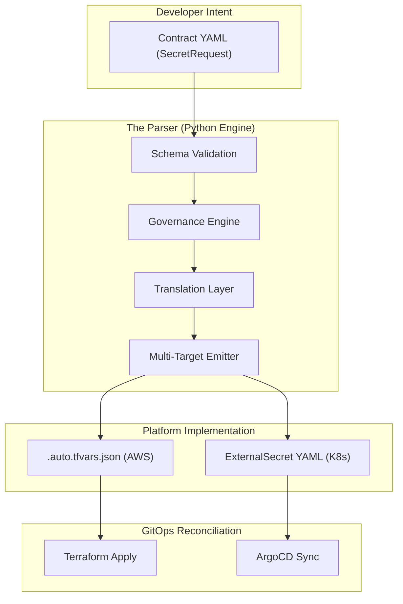

<!-- AGENT_CONTEXT: Read .agent/README.md for rules -->
---
id: ADR-0144
title: Architecture of the Intent-to-Projection Parser (The Golden Path Core)
type: adr
domain: platform-core
value_quantification:
  vq_class: ⚫ LV/LQ
  impact_tier: low
  potential_savings_hours: 0.0
owner: platform-team
lifecycle: active
exempt: false
reliability:
  rollback_strategy: git-revert
  observability_tier: bronze
  maturity: 2
schema_version: 1
relates_to:
  - 01_adr_index
  - ADR-0142
  - ADR-0143
  - ADR-0144
  - ADR-0168
  - ADR-0169
  - ADR-0170
  - CL-0105
  - CL-0106-workflow-driven-secret-provisioning
  - EKS_REQUEST_FLOW
  - RB-0026
  - SECRET_REQUEST_FLOW
supersedes: []
superseded_by: []
tags: []
inheritance: {}
supported_until: '2028-01-01'
---

## ADR-0144: Architecture of the Intent-to-Projection Parser

## Status

Accepted

## Context

As the Golden Path IDP matures, we face a fundamental challenge: **How do we allow developers to request complex infrastructure without requiring them to become cloud engineers?**

Authoring low-level Infrastructure-as-Code (Terraform/HCL) or Kubernetes manifests creates:

1. **Cognitive Overload**: Developers must understand ARNs, security policies, and resource dependencies.
2. **Governance Debt**: Rules (like "High-risk secrets must rotate") are manually enforced via PR comments, which is error-prone.
3. **Vendor / Tooling Coupling**: If we move from AWS to Azure, every developer's PR would need to change.

## Decision

We will centralize platform intelligence into a standalone **Intent-to-Projection Parser**. This component acts as the "Brain" of the Software Delivery Life Cycle (SDLC).

The Parser is responsible for translating human-readable **Intent** (YAML) into machine-efficient **Implementation** (IaC/GitOps).

### The Engine: `secret_request_parser.py`

The architectural core is the `secret_request_parser.py` script. It handles the validation of developer intent against the `SecretRequest` schema, enforces secondary governance policies (like mandatory rotation), and emits the project-specific implementations.

### Architecture Diagram

## Internal Mechanisms

### 1. The Contract Layer (Input)

The Parser consumes YAML files from `catalogs/secrets/<service>/<env>/<id>.yaml`.

### 2. The Governance Engine (Shift-Left)

The core logic validates the intent against organizational policies:

- **Semantic Validation**: Ensures that `risk: high` is paired with `rotationClass: standard`.
- **Naming Enforcement**: Generates deterministic paths (e.g., `goldenpath/<env>/<service>/<name>`) to prevent collisions and ensure observability.
- **Least Privilege**: Calculates the minimum required IAM permissions based on the declared access list.

### 3. The Multi-Target Emitter (Output)

A single input results in multiple synchronized outputs:

- **Cloud Projection**: Emits JSON/HCL into the environment's `generated/` directory for Terraform to provision the physical resource.
- **Cluster Projection**: Emits Kubernetes manifests (e.g., ExternalSecrets) into the cluster's GitOps overlay. **These manifests are placed in directories explicitly tracked and synced by ArgoCD**, ensuring the cluster state is automatically reconciled with the generated blueprints.

## Rationale

- **Decoupling**: We can update the Terraform module or swap AWS for Vault entirely within the Parser's `Translation Layer` without the developer ever changing their YAML file.
- **Security by Default**: Policy enforcement is moved from "Manual Review" to "Automated Build Gate."
- **Velocity**: Developers can self-serve infrastructure in minutes using templates that they already understand (simple YAML).
- **Parity**: Ensures that the resource in AWS is *exactly* what is projected into Kubernetes, eliminating "Ghost Secrets" or naming mismatches.

## Compliance

- All new platform resources (S3, RDS, ECR, etc.) must implement a dedicated Parser module.
- The Parser must be executed as a mandatory CI gate on every Infrastructure PR.
- Core governance logic (rotation, encryption) must reside in the Parser, not solely in the Terraform modules.
