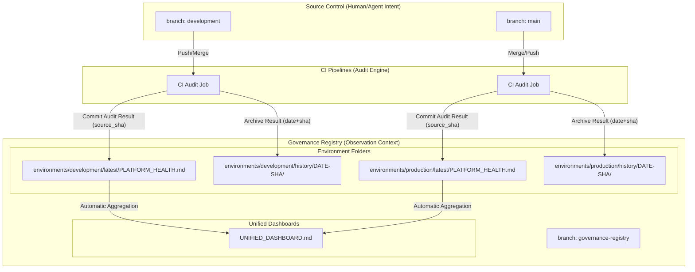

```
id: ADR-0145
title: 'ADR-0145: Governance Registry Mirror Pattern'
type: adr
status: accepted
domain: platform-governance
owner: platform-team
lifecycle: active
reliability:
  rollback_strategy: git-revert
  observability_tier: gold
  maturity: 3
schema_version: 1
relates_to: [RB-0027, ADR-0136, ADR-0026]
value_quantification:
  vq_class: 🔵 MV/HQ
  impact_tier: high
  potential_savings_hours: 5.0
---

# ADR-0145: Governance Registry Mirror Pattern

## Context
High-velocity interaction between humans and machine agents creates a “Commit Tug-of-War” when automated scripts attempt to mutate active development branches. Specifically, scripts updating `PLATFORM_HEALTH.md`, documentation indices, and catalog syncs frequently cause `[rejected] fetch first` errors for human contributors and generate branch drift across open PRs.

We require a mechanism that:
- Preserves high-integrity audit trails.
- Avoids branch mutation during active development.
- Scales across multiple environments without state collision.
- Remains reproducible from a specific source commit.

## Decision
We will implement the **Governance Registry Mirror Pattern**. All machine-generated outputs (metadata reports, platform health reports, documentation indices, audit logs) will be written to a dedicated branch named: `governance-registry`.

This branch is CI-owned, and acts as an **observation context (derived state)**, decoupled from human/agent intent branches (`development`, `main`).

## Source of Truth Contract
To prevent ambiguity and future drift:
1. **Canonical intent (source of truth)** lives in: `development` and `main` (code, configs, contracts, schemas, workflows).
2. **Canonical observation (derived outputs)** lives in: `governance-registry` (health reports, indices, audit artifacts).
3. **Registry content is derived-only**:
   - Every registry commit MUST reference a `source_sha` from `development` or `main`.
   - The registry outputs MUST be reproducible by rerunning the audit pipeline at that `source_sha`.
4. **No manual fixes in registry**: Humans do not “patch” dashboards in the registry branch; fixes happen in source branches and re-generate.

## Visual Architecture



## Architecture: Unified Registry Layout
The `governance-registry` branch uses environment-specific nesting:
- `environments/<env>/latest/...` (Always current view).
- `environments/<env>/history/<date>-<sha>/...` (Append-only forensic audit trail).

Every report is bound to: `source_branch`, `source_sha`, `generation timestamp (UTC)`, and `audit job ID`.

## Operational Rules

### 1. Write Boundary (Integrity Control)
Only a **CI identity** may push to `governance-registry`. Human contributors do not commit directly to the registry branch. Branch protections should enforce "CI bot is the only writer."

### 2. Concurrency / Race Safety
To avoid “last writer wins” collisions when multiple merges happen quickly:
- CI audit job must use GitHub Actions concurrency control (single writer per env).
- Registry updates must be **atomic**: update `latest/` and append to `history/` in the single commit.

### 3. Visibility & UX
- **README Mitigation**: Root `README.md` links to `governance-registry/UNIFIED_DASHBOARD.md` and `latest/` health reports.
- **PR Delta Comments**: Every PR merge posts a comment containing registry links, `source_sha`, and a pass/fail summary with key deltas.

## Consequences

### Positive
- **Frictionless Development**: Eliminates rejections caused by background mutation.
- **Audit Integrity**: Derived outputs have a linear, append-only history independent of code churn.
- **Clear separation of concerns**: Intent branches stay clean; observation stays authoritative.

### Negative
- **Split visibility**: Mitigated via README pinning + PR comments.
- **Repo growth**: Mitigated via future retention policy or periodic squashing.

## Alternatives Considered
- **GitHub Action Summaries**: Rejected as ephemeral.
- **Post-merge commits to dev**: Rejected as noisy and causes PR sync issues.
```
