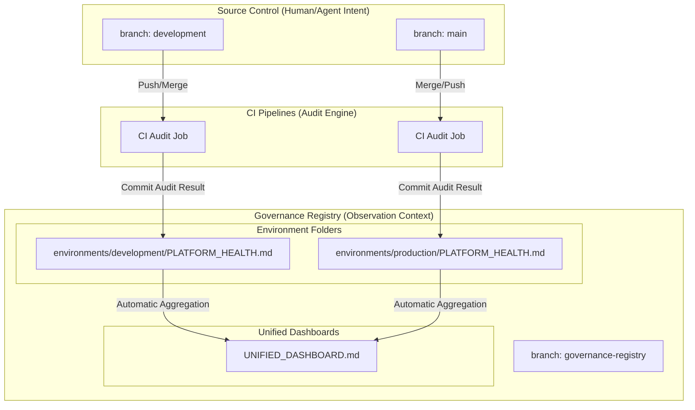

# ADR-0145: Governance Registry Mirror Pattern

## Context
High-velocity interaction between humans and machine agents creates a "Commit Tug-of-War" when automated scripts attempt to mutate the active development branch. Specifically, scripts updating `PLATFORM_HEALTH.md`, documentation indices, and catalog syncs frequently cause `[rejected] fetch first` errors for human contributors. We require a mechanism that preserves high-integrity audit trails while maintaining a frictionless developer environment.

## Decision
We will implement the **Governance Registry Mirror Pattern**. All machine-generated metadata, health reports, and documentation indices will be decoupled from the primary code branches and housed in a dedicated, orphan branch named `governance-registry`.

## Visual Architecture

## Architecture: Unified Registry
To support scalability and multi-environment visibility, the registry branch utilizes environment-specific folder nesting (`environments/<env>/`). This configuration ensures:
1. **Multi-env Support**: Environments like `test`, `staging`, and `production` can be added without state collision.
2. **Promotion Heatmap**: The unified dashboard can track the "Compliance Delta" between different environment lifecycle stages.
3. **Chain of Custody**: Every report is tagged with its source branch and commit SHA for forensic auditability.

## Consequences

### Positive
- **Frictionless Development**: Developers and agents are no longer rejected due to automated background audit updates.
- **Infinite Scalability**: The platform can scale to hundreds of environments by simply adding folders to the registry mirror.
- **Permanent Audit Trail**: A linear history of platform readiness and value quantification is preserved independently of code churn.

### Negative
- **Visibility**: The definitive health report and catalog indices move to a separate branch. This is mitigated by pinning a "Single Pane of Glass" link in the root README.md and using PR comments to notify users of state-sync events.

## Alternatives Considered
- **Option 2: GitHub Action Summaries**: Rejected because results were ephemeral and lacked a long-term git-based audit trail.
- **Option 3: Post-Merge Commits to Dev**: Rejected because it doubles commit noise and still creates sync issues for other open PRs.
