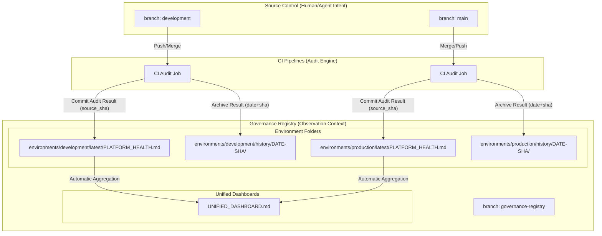

## ADR-0145: Governance Registry Mirror Pattern

## Context

High-velocity interaction between humans and machine agents creates a "Commit Tug-of-War" when automated scripts attempt to mutate active development branches. Specifically, scripts updating `PLATFORM_HEALTH.md`, documentation indices, and catalog syncs frequently cause `[rejected] fetch first` errors for human contributors and generate branch drift across open PRs.

We require a mechanism that:

- Preserves high-integrity audit trails.
- Avoids branch mutation during active development.
- Scales across multiple environments without state collision.
- Remains reproducible from a specific source commit.

## Decision

We will implement the **Governance Registry Mirror Pattern**. All machine-generated outputs (metadata reports, platform health reports, documentation indices, audit logs) will be written to a dedicated branch named: `governance-registry`.

This branch is CI-owned, and acts as an **observation context (derived state)**, decoupled from human/agent intent branches (`development`, `main`).

## Source of Truth Contract

To prevent ambiguity and future drift:

1. **Canonical intent (source of truth)** lives in: `development` and `main` (code, configs, contracts, schemas, workflows).
2. **Canonical observation (derived outputs)** lives in: `governance-registry` (health reports, indices, audit artifacts).
3. **Registry content is derived-only**:
   - Every registry commit MUST reference a `source_sha` from `development` or `main`.
   - The registry outputs MUST be reproducible by rerunning the audit pipeline at that `source_sha`.
4. **No manual fixes in registry**: Humans do not "patch" dashboards in the registry branch; fixes happen in source branches and re-generate.

## Visual Architecture



## Architecture: Unified Registry Layout

The `governance-registry` branch uses environment-specific nesting:

- `environments/<env>/latest/...` (Always current view).
- `environments/<env>/history/<date>-<sha>/...` (Append-only forensic audit trail).

Every report is bound to: `source_branch`, `source_sha`, `generation timestamp (UTC)`, and `audit job ID`.

## Implementation Contract

### 1. Canonical Metadata Schema

Every artifact written to the `governance-registry` branch MUST include the following YAML frontmatter:

```yaml
---

type: governance-report
env: <ENVIRONMENT_NAME>
generated_at: <TIMESTAMP_UTC>
source:
  branch: <SOURCE_BRANCH>
  sha: <GIT_SHA>
pipeline:
  workflow: <WORKFLOW_NAME>
  run_id: <RUN_ID>
integrity:
  derived_only: true
---
```

### Required Fields (Non-Negotiable)

- `env` - Environment name (development, main, test, staging, production)
- `generated_at` - UTC timestamp in ISO 8601 format
- `source.branch` - Source branch name
- `source.sha` - Source commit SHA
- `pipeline.workflow` - GitHub Actions workflow name
- `pipeline.run_id` - GitHub Actions run ID
- `integrity.derived_only` - Must be `true`

### 2. CI Writer Identity

The registry is written exclusively by:

- **Identity**: GitHub Actions service account using `GITHUB_TOKEN`
- **Permissions**: `contents: write`
- **Branch Protection**:
  - Restrict who can push:  Enabled
  - Allow GitHub Actions to bypass:  Enabled
  - Block force-push:  Enabled
  - Require linear history:  Enabled

### 3. Concurrency Control

To prevent race conditions during high-velocity merges:

```yaml
concurrency:
  group: govreg-${{ github.ref_name }}
  cancel-in-progress: false
```

This ensures updates are queued and processed in chronological order per source branch.

### 4. Atomic Write Strategy

Every registry update MUST perform the following in a single commit:

1. Update `environments/<env>/latest/*`
2. Create `environments/<env>/history/<timestamp>-<sha>/*`
3. Regenerate `UNIFIED_DASHBOARD.md`

## Operational Rules

### 1. Write Boundary (Integrity Control)

Only the **CI identity** may push to `governance-registry`. Human contributors do not commit directly to the registry branch.

### 2. Visibility & UX

- **README Mitigation**: Root `README.md` links to `governance-registry/UNIFIED_DASHBOARD.md` and `latest/` health reports.
- **PR Delta Comments**: Every PR merge posts a comment containing registry links, `source_sha`, and a pass/fail summary with key deltas.

## Consequences

### Positive

- **Frictionless Development**: Eliminates rejections caused by background mutation.
- **Audit Integrity**: Derived outputs have a linear, append-only history independent of code churn.
- **Clear separation of concerns**: Intent branches stay clean; observation stays authoritative.
- **Reproducibility**: Every report can be regenerated from its source SHA.

### Negative

- **Split visibility**: Mitigated via README pinning + PR comments.
- **Repo growth**: Mitigated via future retention policy or periodic squashing.

## Alternatives Considered

- **GitHub Action Summaries**: Rejected as ephemeral.
- **Post-merge commits to dev**: Rejected as noisy and causes PR sync issues.
- **External object store (S3)**: Deferred; may complement git if repo growth exceeds 500MB.

## Implementation Reference

- **Runbook**: [RB-0028: Governance Registry Operations](/docs/70-operations/runbooks/RB-0028-governance-registry-operations.md)
- **Workflow**: [governance-registry-writer.yml](/.github/workflows/governance-registry-writer.yml)
- **Validator**: `validate_govreg.py`: Ensures the registry branch structure is sound.
- **Architecture**: [How it Works - Governance Registry Mirror](/85-how-it-works/governance/GOVERNANCE_REGISTRY_MIRROR.md)
