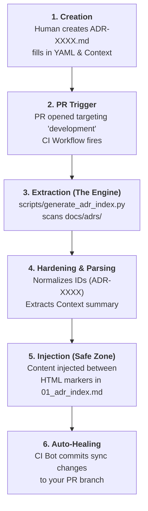

# Technical Spec: ADR Index Automation System (Living Doc)

## Overview
The ADR Index Automation System ensures the integrity of the architecture record by programmatically generating the master index from source file metadata. This eliminates manual reconciliation and ensures that the Knowledge Graph remains accurate.

## ADR Metadata Schema (The Contract)
Every ADR file (`docs/adrs/ADR-*.md`) MUST contain the following YAML frontmatter to be correctly indexed and processed by the healer. Failure to comply will trigger a CI validation failure.

```yaml
id: ADR-XXXX          # Mandatory: Primary key for linking (e.g., ADR-0001)
title: "..."          # Mandatory: Human-readable title
type: decision        # Mandatory: Validates node type (usually 'decision')
category: ...         # Mandatory: architecture | security | ops | governance
version: '1.0'        # Mandatory: Schema version
owner: platform-team  # Mandatory: Responsible team
status: accepted      # Mandatory: proposed | accepted | superseded | deprecated
date: YYYY-MM-DD      # Mandatory: Chronological ordering date
relates_to: []        # Optional: Semantic edges for Knowledge Graph
```

## System Components

### 1. Generator Core (`scripts/generate_adr_index.py`)
- **Scanner**: Recursively discovers all `ADR-*.md` files in the `docs/adrs/` directory.
- **Parser**: 
    - Extracts YAML frontmatter using `PyYAML`.
    - Sanitizes titles and IDs.
    - Extracts the summary by taking the first non-empty paragraph under the `## Context` header.
- **Renderer**: 
    - Sorts records chronologically and by ID.
    - Formats the results into the standard Markdown table.
    - Updates the `relates_to` manifest in the index header.

### 2. Target File (`docs/adrs/01_adr_index.md`)
The index file employs HTML comments as injection markers to allow the generator to safely update the dynamic content without overwriting manual sections (Conventions, How-to, etc.).

- `<!-- ADR_TABLE_START -->` / `<!-- ADR_TABLE_END -->`
- `<!-- ADR_RELATE_START -->` / `<!-- ADR_RELATE_END -->`

### 3. Guardrail Workflow (`ci-index-auto-heal.yml`)
Integrated into the **Documentation Auto-Healing** pipeline. Every PR that modifies an ADR is checked for index drift. If drift is detected, the healer regenerates the index and commits it to the PR branch (requiring human HITL approval).

## Automation Lifecycle



### Execution Steps
1. **Extraction**: The script parses `docs/adrs/ADR-*.md` for YAML metadata and the first paragraph under `## Context`.
2. **Normalization**: IDs are strictly enforced to the `ADR-XXXX` format.
3. **Summarization**: Context text is truncated to 200 characters for optimal table readability.
4. **Injection**: Validated strings are injected into the markers in `01_adr_index.md`.
5. **Auto-Remediation**: GitHub Actions committed the rectified index if drift is found.

## Roadmap
- **Iteration 1**: Git-native file-to-file automation (Current).
- **Iteration 2**: Transition to **Backstage Portal** as the primary discovery layer, using the Knowledge Graph nodes generated from these ADRs.
