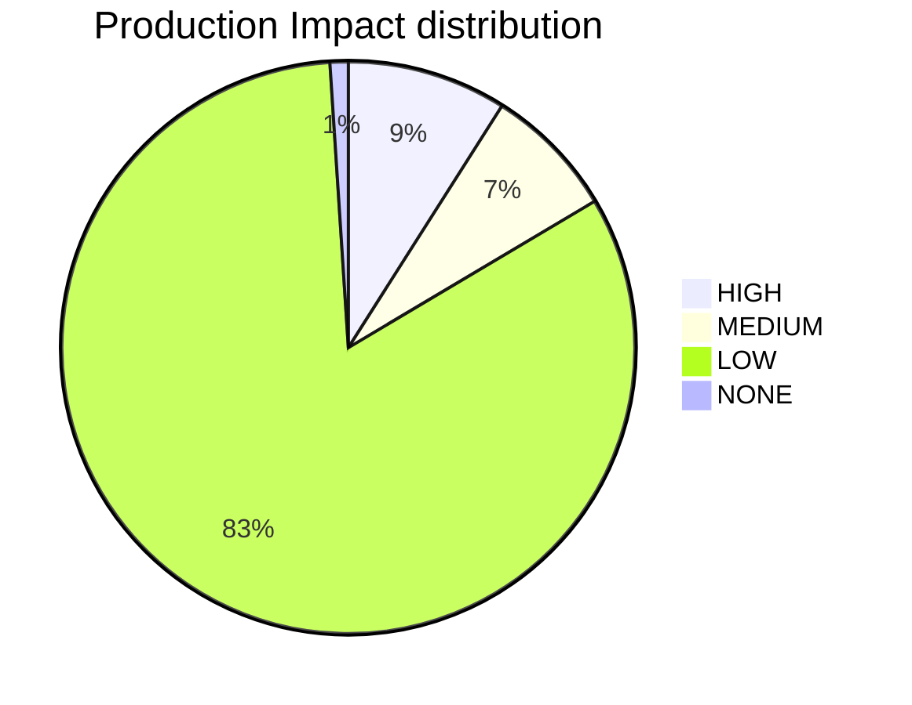
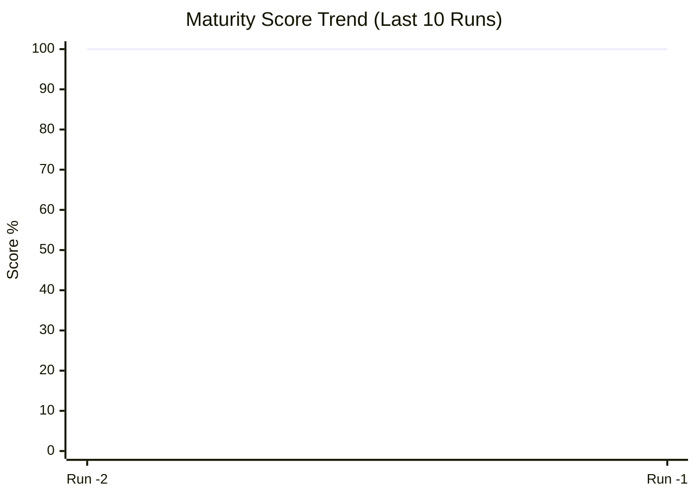
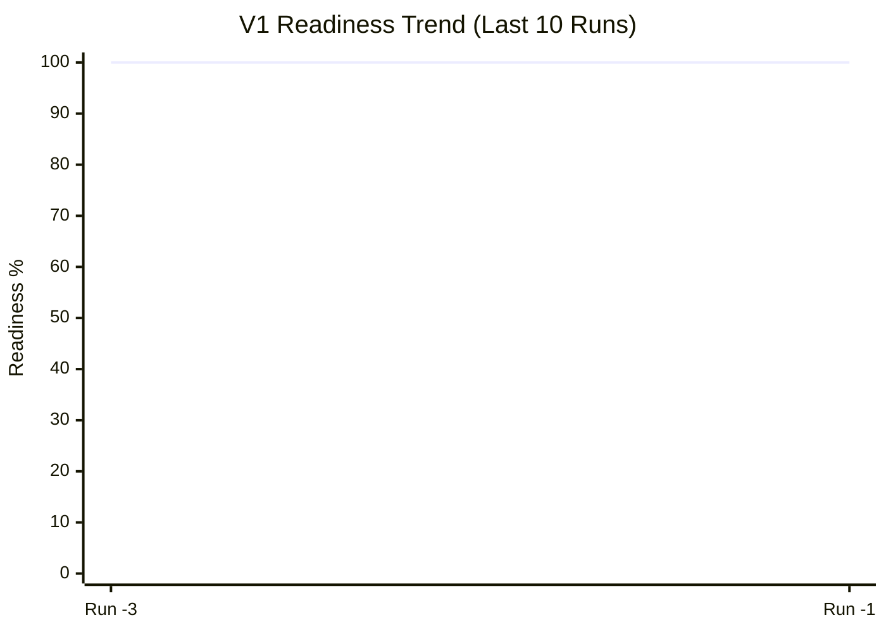

---
## Audit Record: 2026-01-06 00:27:33
---
id: PLATFORM_HEALTH
title: Platform Health & Compliance Report
type: documentation
category: governance
status: active
owner: platform-team
version: '2026-01-06'
dependencies: []
risk_profile:
  production_impact: low
  security_risk: none
  coupling_risk: low
reliability:
  rollback_strategy: git-revert
  observability_tier: gold
lifecycle:
  supported_until: '2028-01-01'
  breaking_change: false
relates_to:
  - platform_health.py
---

# 🏥 Platform Health Report
**Date Generated**: 2026-01-06 00:27:33
**Total Tracked Resources**: 374
**Metadata Compliance**: 99.2%

## 📊 Lifecycle Distribution
- **Active**: 362
- **Released**: 1
- **Planned**: 1
- **Draft**: 4
- **Deprecated**: 2
- **Accepted**: 4

## 🛡️ Risk Summary (Production Impact)
- **High**: 35
- **Medium**: 28
- **Low**: 308
- **None**: 1

## 📂 Top Categories
- **unknown**: 241
- **gitops**: 20
- **governance**: 16
- **modules**: 16
- **apps**: 11

## 🚨 Operational Risks
- **Orphaned Files (No Owner)**: 0
- **Stale Files (Past Lifecycle)**: 0

## 💉 Closed-Loop Injection Coverage
> [!NOTE]
> **How it works**: This metric measures the percentage of 'Governance Sidecars' that have been successfully propagated into live deployment configurations (Helm values, ArgoCD manifests).
- **Coverage**: 100.0% (29/29)

---
## Audit Record: 2026-01-06 11:24:44
---
id: PLATFORM_HEALTH
title: Platform Health & Compliance Report
type: documentation
category: governance
status: active
owner: platform-team
version: '2026-01-06'
dependencies: []
risk_profile:
  production_impact: low
  security_risk: none
  coupling_risk: low
reliability:
  rollback_strategy: git-revert
  observability_tier: gold
lifecycle:
  supported_until: '2028-01-01'
  breaking_change: false
relates_to:
  - platform_health.py
---

# 🏥 Platform Health Report
**Date Generated**: 2026-01-06 11:24:44
**Total Tracked Resources**: 383
**Metadata Compliance**: 98.7%

## 📊 Lifecycle Distribution
- **Active**: 366
- **Released**: 1
- **Planned**: 1
- **Draft**: 4
- **Deprecated**: 2
- **Accepted**: 7
- **Proposed**: 1
- **Approved**: 1

## 🛡️ Risk Summary (Production Impact)
- **High**: 35
- **Medium**: 28
- **Low**: 308
- **None**: 4

## 📂 Top Categories
- **unknown**: 244
- **gitops**: 20
- **modules**: 16
- **governance**: 15
- **apps**: 11

## 🚨 Operational Risks
- **Orphaned Files (No Owner)**: 0
- **Stale Files (Past Lifecycle)**: 0

## 💉 Closed-Loop Injection Coverage
> [!NOTE]
> **How it works**: This metric measures the percentage of 'Governance Sidecars' that have been successfully propagated into live deployment configurations (Helm values, ArgoCD manifests).
- **Coverage**: 100.0% (29/29)

---
### Audit: 2026-01-06 15:53:57
---
id: PLATFORM_HEALTH
title: Platform Health & Compliance Report
type: documentation
category: governance
status: active
owner: platform-team
version: '2026-01-06'
relates_to:
  - platform_health.py
---

# 🏥 Platform Health Command Center
**Generated**: `2026-01-06 15:53:57` | **Unified Maturity**: `100.0%`

## 📈 Knowledge Graph Vitality
| Metric | Count | Source |
| :--- | :--- | :--- |
| **Architecture Decisions** | 106 | [ADR Index](file:///Users/mikesablaze/goldenpath-idp-infra/docs/adrs/01_adr_index.md) |
| **Automation Scripts** | 25 | [Script Index](file:///Users/mikesablaze/goldenpath-idp-infra/scripts/index.md) |
| **CI Workflows** | 34 | [Workflow Index](file:///Users/mikesablaze/goldenpath-idp-infra/ci-workflows/CI_WORKFLOWS.md) |
| **Tracked Resources** | 391 | Repository Scan |

## 🗂️ Catalog Inventory
| Catalog | Entity Count |
| :--- | :--- |
| Ecr Catalog | 10 |

## 🛡️ Risk & Maturity Visualization

## ⚖️ Governance Maturity
- **Metadata Compliance**: `98.2%`
- **Risk-Weighted Score**: `100.0%`
- **Infrastructure Drift**: `100.0%` (via `compliance-report.json`)

## 💉 Injection Coverage
- **Sidecar Coverage**: `100.0%` (29/29)

## 🚨 Operational Risks
- **Orphaned (No Owner)**: 0
- **Stale (Past Lifecycle)**: 0

---
### Audit: 2026-01-06 15:55:44
---
id: PLATFORM_HEALTH
title: Platform Health & Compliance Report
type: documentation
category: governance
status: active
owner: platform-team
version: '2026-01-06'
relates_to:
  - platform_health.py
---

# 🏥 Platform Health Command Center
**Generated**: `2026-01-06 15:55:44` | **Unified Maturity**: `100.0%`

## 🏹 Knowledge Graph Vitality
| Metric | Count | Source |
| :--- | :--- | :--- |
| **Architecture Decisions** | 106 | [ADR Index](file:///Users/mikesablaze/goldenpath-idp-infra/docs/adrs/01_adr_index.md) |
| **Automation Scripts** | 25 | [Script Index](file:///Users/mikesablaze/goldenpath-idp-infra/scripts/index.md) |
| **CI Workflows** | 34 | [Workflow Index](file:///Users/mikesablaze/goldenpath-idp-infra/ci-workflows/CI_WORKFLOWS.md) |
| **Tracked Resources** | 391 | Repository Scan |

## 🗂️ Catalog Inventory
| Catalog | Entity Count |
| :--- | :--- |
| Ecr | 10 |

## 🛡️ Risk & Maturity Visualization

## ⚖️ Governance Maturity
- **Metadata Compliance**: `98.2%`
- **Risk-Weighted Score**: `100.0%`
- **Infrastructure Drift**: `100.0%` (via `compliance-report.json`)

## 💉 Injection Coverage
- **Sidecar Coverage**: `100.0%` (29/29)

## 🚨 Operational Risks
- **Orphaned (No Owner)**: 0
- **Stale (Past Lifecycle)**: 0

---
### Audit: 2026-01-06 15:58:02
---
id: PLATFORM_HEALTH
title: Platform Health & Compliance Report
type: documentation
category: governance
status: active
owner: platform-team
version: '2026-01-06'
relates_to:
  - platform_health.py
---

# 🏥 Platform Health Command Center
**Generated**: `2026-01-06 15:58:02` | **Unified Maturity**: `100.0%`

## 📈 Governance Velocity (Historical Trend)

## 🏹 Knowledge Graph Vitality
| Metric | Count | Source |
| :--- | :--- | :--- |
| **Architecture Decisions** | 106 | [ADR Index](file:///Users/mikesablaze/goldenpath-idp-infra/docs/adrs/01_adr_index.md) |
| **Automation Scripts** | 25 | [Script Index](file:///Users/mikesablaze/goldenpath-idp-infra/scripts/index.md) |
| **CI Workflows** | 34 | [Workflow Index](file:///Users/mikesablaze/goldenpath-idp-infra/ci-workflows/CI_WORKFLOWS.md) |
| **Tracked Resources** | 391 | Repository Scan |

## 🗂️ Catalog Inventory
| Catalog | Entity Count |
| :--- | :--- |
| Ecr | 10 |

## 🛡️ Risk & Maturity Visualization

## ⚖️ Governance Maturity
- **Metadata Compliance**: `98.2%`
- **Risk-Weighted Score**: `100.0%`
- **Infrastructure Drift**: `100.0%` (via `compliance-report.json`)

## 💉 Injection Coverage
- **Sidecar Coverage**: `100.0%` (29/29)

## 🚨 Operational Risks
- **Orphaned (No Owner)**: 0
- **Stale (Past Lifecycle)**: 0

---
### Audit: 2026-01-06 16:09:37
---
id: PLATFORM_HEALTH
title: Platform Health & Compliance Report
type: documentation
category: governance
status: active
owner: platform-team
version: '2026-01-06'
relates_to:
  - platform_health.py
---

# 🏥 Platform Health Command Center
**Generated**: `2026-01-06 16:09:37` | **V1 Readiness**: `79.6%` | **Overall Maturity**: `100.0%`

## 🏁 V1 Platform Readiness Gate
> [!IMPORTANT]
> The platform is currently **79.6%** ready for V1 production rollout.

| Milestone | Status | Readiness |
| :--- | :--- | :--- |
| **Metadata Integrity** | ✅ | 98.2% |
| **Injection Integrity** | ✅ | 100.0% |
| **Architecture Maturity** | 🚧 | 0/106 Active |
| **Changelog Activity** | ✅ | 70 Entries |

## 📈 Governance Velocity (Historical Trend)

## 🏹 Knowledge Graph Vitality
| Metric | Count | Source |
| :--- | :--- | :--- |
| **Architecture Decisions** | 106 | [ADR Index](file:///Users/mikesablaze/goldenpath-idp-infra/docs/adrs/01_adr_index.md) |
| **Automation Scripts** | 25 | [Script Index](file:///Users/mikesablaze/goldenpath-idp-infra/scripts/index.md) |
| **CI Workflows** | 34 | [Workflow Index](file:///Users/mikesablaze/goldenpath-idp-infra/ci-workflows/CI_WORKFLOWS.md) |
| **Change Logs** | 70 | [Changelog Index](file:///Users/mikesablaze/goldenpath-idp-infra/docs/changelog/README.md) |
| **Tracked Resources** | 391 | Repository Scan |

## 🗂️ Catalog Inventory
| Catalog | Entity Count |
| :--- | :--- |
| Ecr | 10 |

## 🛡️ Risk & Maturity Visualization

## ⚖️ Governance Maturity
- **Metadata Compliance**: `98.2%`
- **Risk-Weighted Score**: `100.0%`
- **Infrastructure Drift**: `100.0%` (via `compliance-report.json`)

## 💉 Injection Coverage
- **Sidecar Coverage**: `100.0%` (29/29)

## 🚨 Operational Risks
- **Orphaned (No Owner)**: 0
- **Stale (Past Lifecycle)**: 0

---
### Audit: 2026-01-06 16:10:08
---
id: PLATFORM_HEALTH
title: Platform Health & Compliance Report
type: documentation
category: governance
status: active
owner: platform-team
version: '2026-01-06'
relates_to:
  - platform_health.py
---

# 🏥 Platform Health Command Center
**Generated**: `2026-01-06 16:10:08` | **V1 Readiness**: `98.4%` | **Overall Maturity**: `100.0%`

## 🏁 V1 Platform Readiness Gate
> [!IMPORTANT]
> The platform is currently **98.4%** ready for V1 production rollout.

| Milestone | Status | Readiness |
| :--- | :--- | :--- |
| **Metadata Integrity** | ✅ | 98.2% |
| **Injection Integrity** | ✅ | 100.0% |
| **Architecture Maturity** | 🚧 | 100/106 Active |
| **Changelog Activity** | ✅ | 70 Entries |

## 📈 Governance Velocity (Historical Trend)

## 🏹 Knowledge Graph Vitality
| Metric | Count | Source |
| :--- | :--- | :--- |
| **Architecture Decisions** | 106 | [ADR Index](file:///Users/mikesablaze/goldenpath-idp-infra/docs/adrs/01_adr_index.md) |
| **Automation Scripts** | 25 | [Script Index](file:///Users/mikesablaze/goldenpath-idp-infra/scripts/index.md) |
| **CI Workflows** | 34 | [Workflow Index](file:///Users/mikesablaze/goldenpath-idp-infra/ci-workflows/CI_WORKFLOWS.md) |
| **Change Logs** | 70 | [Changelog Index](file:///Users/mikesablaze/goldenpath-idp-infra/docs/changelog/README.md) |
| **Tracked Resources** | 391 | Repository Scan |

## 🗂️ Catalog Inventory
| Catalog | Entity Count |
| :--- | :--- |
| Ecr | 10 |

## 🛡️ Risk & Maturity Visualization

## ⚖️ Governance Maturity
- **Metadata Compliance**: `98.2%`
- **Risk-Weighted Score**: `100.0%`
- **Infrastructure Drift**: `100.0%` (via `compliance-report.json`)

## 💉 Injection Coverage
- **Sidecar Coverage**: `100.0%` (29/29)

## 🚨 Operational Risks
- **Orphaned (No Owner)**: 0
- **Stale (Past Lifecycle)**: 0

---
### Audit: 2026-01-06 16:13:13
---
id: PLATFORM_HEALTH
title: Platform Health & Compliance Report
type: documentation
category: governance
status: active
owner: platform-team
version: '2026-01-06'
relates_to:
  - platform_health.py
---

# 🏥 Platform Health Command Center
**Generated**: `2026-01-06 16:13:13` | **V1 Readiness**: `98.4%` | **Overall Maturity**: `100.0%`

## 🏁 V1 Platform Readiness Gate
> [!IMPORTANT]
> The platform is currently **98.4%** ready for V1 production rollout.

| Milestone | Status | Readiness |
| :--- | :--- | :--- |
| **Metadata Integrity** | ✅ | 98.2% |
| **Injection Integrity** | ✅ | 100.0% |
| **Architecture Maturity** | 🚧 | 100/106 Active |
| **Changelog Activity** | ✅ | 70 Entries |

## 📈 Governance Velocity (Historical Trend)

## 🏹 Knowledge Graph Vitality
| Metric | Count | Source |
| :--- | :--- | :--- |
| **Architecture Decisions** | 106 | [ADR Index](file:///Users/mikesablaze/goldenpath-idp-infra/docs/adrs/01_adr_index.md) |
| **Automation Scripts** | 25 | [Script Index](file:///Users/mikesablaze/goldenpath-idp-infra/scripts/index.md) |
| **CI Workflows** | 34 | [Workflow Index](file:///Users/mikesablaze/goldenpath-idp-infra/ci-workflows/CI_WORKFLOWS.md) |
| **Change Logs** | 70 | [Changelog Index](file:///Users/mikesablaze/goldenpath-idp-infra/docs/changelog/README.md) |
| **Tracked Resources** | 391 | Repository Scan |

## 🗂️ Catalog Inventory
| Catalog | Entity Count |
| :--- | :--- |
| Ecr | 10 |

## 🛡️ Risk & Maturity Visualization

## ⚖️ Governance Maturity
- **Metadata Compliance**: `98.2%`
- **Risk-Weighted Score**: `100.0%`
- **Infrastructure Drift**: `100.0%` (via `compliance-report.json`)

## 💉 Injection Coverage
- **Sidecar Coverage**: `100.0%` (29/29)

## 🚨 Operational Risks
- **Orphaned (No Owner)**: 0
- **Stale (Past Lifecycle)**: 0

---
### 📬 Strategic Guidance
- **V1 Readiness Indicator**: A composite metric tracking Architecture (ADRs), Governance (Metadata/Injection), and Delivery (Changelogs). Target: 100%.
- **Visualizing Trends**: The `xychart-beta` is best viewed in GitHub/GitLab or VS Code with updated Mermaid support (v10.x+). It tracks our 'Readiness Velocity' across audit cycles.
