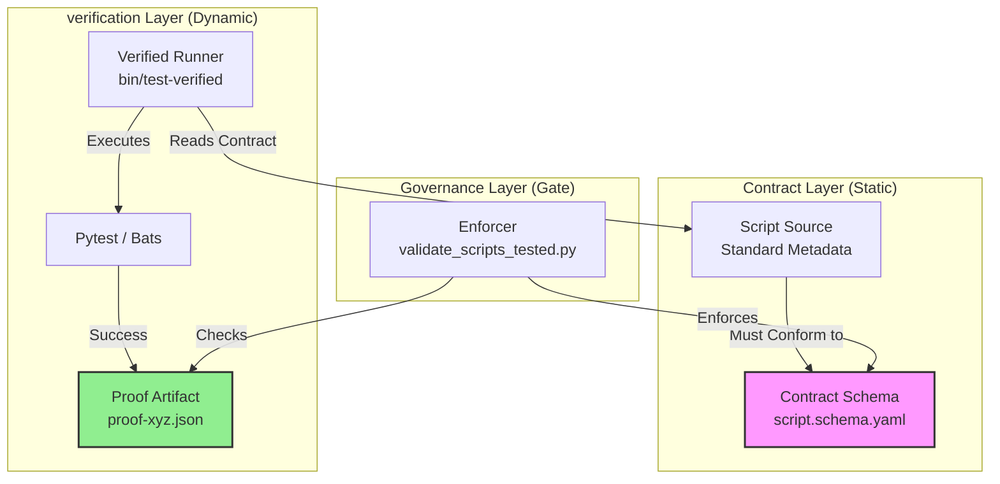

# How It Works: Born Governed Lifecycle

This guide details the **Schema-Driven Script Testing** architecture. It moves beyond simple "testing" to a model of **provenance and contract enforcement**.

## The Core Philosophy: "Trust but Verify"

In a standard repo, testing is often implicit ("I ran it locally"). In the Golden Path, testing is explicit and evidence-based.

1.  **Trust (The Contract)**: The developer declares *how* the script should be tested in the metadata header.
2.  **Verify (The Proof)**: The CI system executes that contract and mints a cryptographic proof artifact (`proof-*.json`).
3.  **Certify (The Gate)**: The release process checks for the *existence* and *freshness* of that proof.

## The Architecture

The system consists of four key components working in a closed loop:



---

## Nuance: The Lifecycle Stages

A script is not simply "tested" or "untested". It moves through defined maturity stages.

### Stage 1: "Born" (Static Definition)
The developer writes the code and adds the YAML header.
- **Action**: `git commit`
- **Check**: `pre-commit` runs `validate_scripts_tested.py`
- **Nuance**: At this stage, we only check *syntax* and *completeness*. We do not run the test yet. We ensure the *promise* of a test exists.
- **Outcome**: **Maturity Level 1 (Tracked)**

### Stage 2: "Verified" (Local Execution)
The developer runs the test suite locally or in CI.
- **Action**: `bin/test-verified scripts/my_script.py`
- **Nuance**: The wrapper doesn't just run `pytest`. It:
    1. Parses the header to find the *exact* command the author intended.
    2. Captures the exit code.
    3. If (and only if) successful, writes `test-results/proofs/proof-my_script.json`.
- **Outcome**: **Maturity Level 2 (Validated)**

### Stage 3: "Certified" (CI Proof)
The release pipeline runs.
- **Action**: `validate_scripts_tested.py --verify-proofs`
- **Nuance**: The validator looks for the `proof-*.json` file. It checks:
    - **Freshness**: Does `proof.git_sha` match the current commit? (Prevents "stale proof" loopholes).
    - **Outcome**: Is `status: passed`?
- **Policy**: High-Risk scripts (P0) *must* have valid proofs. Low-risk scripts can stay at Level 2.
- **Outcome**: **Maturity Level 3 (Certified)**

---

## Detailed Component Roles

### 1. The Contract (Schema)
**File:** `schemas/automation/script.schema.yaml`
- **Role**: The Constitution.
- **Key Fields**:
    - `dry_run.supported`: Mandatory for mutator scripts.
    - `test.evidence`:
        - `declared`: "I promise I tested this manually." (Limit: Maturity 1-2)
        - `ci`: "The machine must verify this." (Required for Maturity 3)

### 2. The Standard (Source)
**File:** `scripts/*.py`
- **Role**: The Citizen.
- **Design Principle**: Metadata is embedded in the native comment format (Python docstrings, Bash comments) to keep the file self-contained.

```python
"""
---
id: SCRIPT-001
test:
  command: "pytest tests/my_test.py"
  evidence: ci
---
"""
```

### 3. The Executor (Wrapper)
**File:** `bin/test-verified`
- **Role**: The Notary Public.
- **Why use a wrapper?**
    - It abstracts the difference between Python (`pytest`), Bash (`bats`), and Go testing.
    - It ensures proofs are uniform JSON structure regardless of the tool used.
    - It prevents developers from generating fake proofs manually (complicated enough to discourage, easy enough to automate).

### 4. The Enforcer (Validator)
**File:** `scripts/validate_scripts_tested.py`
- **Role**: The Auditor.
- **Nuance**: It is stateless. It only looks at the artifacts on disk (Source + Proof). This makes it fast and cache-friendly.
