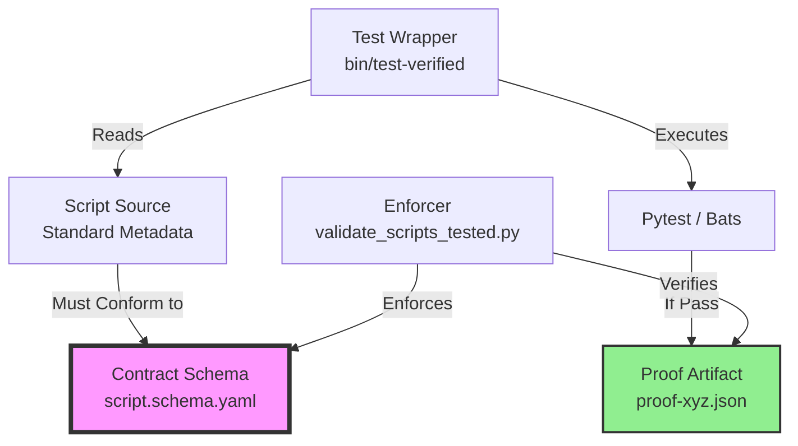
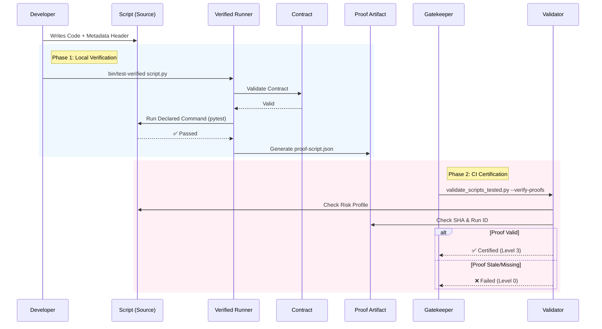

# How It Works: Born Governed Lifecycle

This guide visualizes the **Schema-Driven Script Testing** architecture (ADR-0146).
It explains how a script moves from "Code" to "Certified Asset" using contracts.

## The Architecture

The system consists of four key components working in a closed loop:



---

## The Certification Flow

How verification happens during a standard CI pipeline run:



---

## Component Roles

### 1. The Contract (Schema)
**File:** `schemas/automation/script.schema.yaml`
- Defines the "Law".
- Specifies required fields (`id`, `owner`, `test.runner`).
- Defines Maturity Levels (0-3).

### 2. The Standard (Source)
**File:** `scripts/*.py`
- Embeds the contract directly in the header.
- Self-describes its testing needs.

```python
"""
---
id: SCRIPT-001
maturity: 3
test:
  command: "pytest tests/my_test.py"
  evidence: ci
---
"""
```

### 3. The Executor (Wrapper)
**File:** `bin/test-verified`
- The "honest broker".
- Runs the test exactly as declared.
- Mints the `proof.json` artifact (the "Certificate").

### 4. The Enforcer (Validator)
**File:** `scripts/validate_scripts_tested.py`
- The "Auditor".
- Runs in CI/Pre-commit.
- Checks that High Risk scripts actually HAVE a valid proof.

---

## Workflow Integration

| Stage | Action | Tool | Outcome |
| :--- | :--- | :--- | :--- |
| **Development** | Write Code | Editor | Header added |
| **Commit** | Pre-commit | `validate_scripts_tested.py` | Schema compliant? |
| **Test** | Run Tests | `bin/test-verified` | Proof generated |
| **Gate** | CI Validation | `validate_scripts_tested.py --verify-proofs` | **Certified** |
