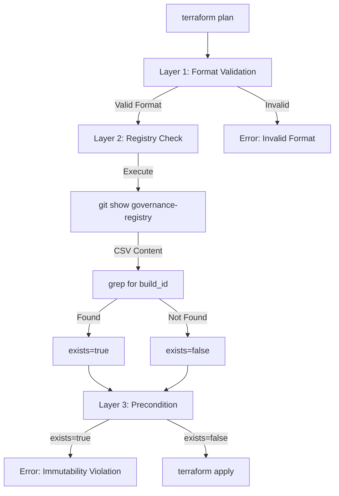

# How It Works: Build ID Immutability Enforcement

This guide details the **three-layer validation architecture** that prevents accidental reuse of ephemeral cluster `build_id` values by validating against the governance-registry branch.

## Overview

Ephemeral EKS clusters use `build_id` (format: `DD-MM-YY-NN`) to uniquely suffix resources and Terraform state keys. The immutability enforcement prevents operators from accidentally reusing a build_id, which would cause state corruption, resource conflicts, and audit trail loss.

## The Three-Layer Architecture



### Layer 1: Format Validation

**When**: During `terraform validate` and `terraform plan`
**Where**: `envs/dev/variables.tf:50-53`

```hcl
validation {
  condition     = can(regex("^[0-9]{2}-[0-9]{2}-[0-9]{2}-[0-9]{2}$", var.build_id)) || var.build_id == ""
  error_message = "build_id must match format: DD-MM-YY-NN (e.g., 13-01-26-01)"
}
```

**Purpose**: Ensures format compliance before any external checks
**Failure Mode**: Immediate error with clear format requirements

**Example Error**:
```
Error: Invalid value for variable
│ build_id must match format: DD-MM-YY-NN (e.g., 13-01-26-01)
```

### Layer 2: Registry Duplicate Check

**When**: During `terraform plan` (external data sources execute in plan phase)
**Where**: `envs/dev/main.tf:25-50`

```hcl
data "external" "build_id_check" {
  count   = var.cluster_lifecycle == "ephemeral" && var.build_id != "" ? 1 : 0
  program = ["bash", "-c", <<-EOT
    BUILD_ID="${var.build_id}"
    ENV="${var.environment}"
    REGISTRY_BRANCH="${var.governance_registry_branch}"
    CSV_PATH="environments/development/latest/build_timings.csv"

    # Fetch CSV from governance-registry branch
    CSV_CONTENT=$(git show "origin/$REGISTRY_BRANCH:$CSV_PATH" 2>/dev/null || echo "")

    if [ -z "$CSV_CONTENT" ]; then
      echo '{"exists":"false","error":"Registry CSV not found"}'
      exit 0
    fi

    # Search for pattern: ,$ENV,$BUILD_ID,
    if echo "$CSV_CONTENT" | grep -q ",$ENV,$BUILD_ID," ; then
      echo '{"exists":"true","build_id":"'"$BUILD_ID"'","environment":"'"$ENV"'"}'
    else
      echo '{"exists":"false","build_id":"'"$BUILD_ID"'","environment":"'"$ENV"'"}'
    fi
  EOT
  ]
}
```

**Purpose**: Query authoritative registry for existing build_id
**Failure Mode**: Returns JSON indicating duplicate status (fail-open if git unavailable)

### Layer 3: Lifecycle Precondition

**When**: During `terraform plan` (preconditions evaluated in plan phase)
**Where**: `envs/dev/main.tf:53-74`

```hcl
resource "null_resource" "enforce_build_id_immutability" {
  count = var.cluster_lifecycle == "ephemeral" && var.build_id != "" && !var.allow_build_id_reuse ? 1 : 0

  lifecycle {
    precondition {
      condition     = try(data.external.build_id_check[0].result.exists, "false") == "false"
      error_message = <<-EOT
        BUILD_ID IMMUTABILITY VIOLATION!

        Build ID "${var.build_id}" already exists for environment "${var.environment}".
        Build IDs are immutable and cannot be reused.

        Options:
        1. Use a new build ID (recommended): increment the sequence number
        2. Set allow_build_id_reuse=true to override (NOT recommended for production)

        Existing build record found in: governance-registry branch
        Path: environments/development/latest/build_timings.csv
      EOT
    }
  }
}
```

**Purpose**: Enforce immutability with clear error message
**Failure Mode**: Halt terraform with violation message and remediation steps

**Example Error**:
```
Error: Resource precondition failed
│
│ BUILD_ID IMMUTABILITY VIOLATION!
│
│ Build ID "31-12-25-04" already exists for environment "dev".
│ Build IDs are immutable and cannot be reused.
│
│ Options:
│ 1. Use a new build ID (recommended): increment the sequence number
│ 2. Set allow_build_id_reuse=true to override (NOT recommended for production)
```

## Execution Flow

### Complete Validation Pipeline

```
┌─────────────────────────────────────────────────────────────────┐
│  terraform plan -var="build_id=13-01-26-01"                     │
└───────────────────┬─────────────────────────────────────────────┘
                    │
                    ▼
┌─────────────────────────────────────────────────────────────────┐
│  Layer 1: Variable Validation                                    │
│  ✓ Validates: build_id matches DD-MM-YY-NN regex                │
│  ✗ Fails: "build_id must match format: DD-MM-YY-NN"             │
└───────────────────┬─────────────────────────────────────────────┘
                    │ format valid
                    ▼
┌─────────────────────────────────────────────────────────────────┐
│  Layer 2: External Data Source Execution                        │
│  1. Bash script executes: git show origin/governance-registry   │
│  2. Fetches: environments/development/latest/build_timings.csv  │
│  3. Searches: grep -q ",dev,13-01-26-01,"                       │
│  4. Returns: {"exists":"false","build_id":"13-01-26-01"}        │
└───────────────────┬─────────────────────────────────────────────┘
                    │
                    ▼
┌─────────────────────────────────────────────────────────────────┐
│  Layer 3: Precondition Evaluation                               │
│  • Reads: data.external.build_id_check[0].result.exists          │
│  • Condition: "false" == "false" → PASS                          │
│  ✓ Pass: Continue with terraform plan                           │
│  ✗ Fail: IMMUTABILITY VIOLATION error with remediation options  │
└───────────────────┬─────────────────────────────────────────────┘
                    │ all validations passed
                    ▼
┌─────────────────────────────────────────────────────────────────┐
│  Infrastructure Planning/Provisioning                            │
│  • VPC, Subnets, EKS Cluster, Node Groups, IAM, etc.            │
└─────────────────────────────────────────────────────────────────┘
```

## Data Flow: Git → Terraform → Validation

```
┌──────────────────────────────────────────────────────────────────┐
│  governance-registry branch (remote)                             │
│  └─ environments/development/latest/build_timings.csv            │
│     └─ Contains all historical build_id records                 │
│        start_time,end_time,phase,env,build_id,duration...        │
│        2026-01-01T04:01:57Z,...,teardown,dev,31-12-25-04,700,0  │
└──────────────────────┬───────────────────────────────────────────┘
                       │
                       │ git show origin/governance-registry:...
                       ▼
┌──────────────────────────────────────────────────────────────────┐
│  External Data Source (Bash Script)                              │
│  • Input: BUILD_ID="13-01-26-01", ENV="dev"                      │
│  • Action: Fetch CSV from git object database                   │
│  • Search: grep for pattern ",dev,13-01-26-01,"                 │
│  • Output: JSON {"exists":"false"|"true",...}                   │
└──────────────────────┬───────────────────────────────────────────┘
                       │ stdout → Terraform
                       ▼
┌──────────────────────────────────────────────────────────────────┐
│  Terraform Data Resource                                         │
│  data.external.build_id_check[0].result = {                      │
│    "exists": "false",                                            │
│    "build_id": "13-01-26-01",                                    │
│    "environment": "dev"                                          │
│  }                                                               │
└──────────────────────┬───────────────────────────────────────────┘
                       │
                       ▼
┌──────────────────────────────────────────────────────────────────┐
│  Lifecycle Precondition                                          │
│  • Evaluates: exists == "false"                                  │
│  • True → Proceed with apply                                     │
│  • False → Halt with immutability violation error                │
└──────────────────────────────────────────────────────────────────┘
```

## Timing: When Checks Execute

| Phase | Layer 1<br/>Format | Layer 2<br/>Registry | Layer 3<br/>Precondition | Infrastructure |
|-------|-------------------|---------------------|-------------------------|----------------|
| `terraform init` | ❌ | ❌ | ❌ | ❌ |
| `terraform validate` | ✅ | ❌ | ❌ | ❌ |
| `terraform plan` | ✅ | ✅ | ✅ | ❌ |
| `terraform apply` | ✅ | ✅ | ✅ | ✅ (if passed) |

**Key Insight**: All validation completes during the plan phase, **before any AWS API calls** or resource provisioning.

## Error Scenarios

### Scenario 1: Duplicate build_id Detected

```bash
$ terraform plan -var="build_id=31-12-25-04"

Error: Resource precondition failed
│
│   on main.tf line 57, in resource "null_resource" "enforce_build_id_immutability":
│   57:       condition     = try(data.external.build_id_check[0].result.exists, "false") == "false"
│     ├────────────────
│     │ data.external.build_id_check[0].result.exists is "true"
│
│ BUILD_ID IMMUTABILITY VIOLATION!
│
│ Build ID "31-12-25-04" already exists for environment "dev".
│ Build IDs are immutable and cannot be reused.
│
│ Options:
│ 1. Use a new build ID (recommended): increment the sequence number
│ 2. Set allow_build_id_reuse=true to override (NOT recommended for production)
│
│ Existing build record found in: governance-registry branch
│ Path: environments/development/latest/build_timings.csv
```

### Scenario 2: Invalid Format

```bash
$ terraform plan -var="build_id=2025-01-13-01"

Error: Invalid value for variable
│
│   on variables.tf line 51:
│   51: variable "build_id" {
│     ├────────────────
│     │ var.build_id is "2025-01-13-01"
│
│ build_id must match format: DD-MM-YY-NN (e.g., 13-01-26-01)
```

### Scenario 3: Registry Not Fetched (Fail-Open)

```bash
# If user hasn't run git fetch recently
$ terraform plan -var="build_id=13-01-26-99"

# External data source returns:
{"exists":"false","error":"Registry CSV not found or git fetch needed"}

# Terraform proceeds (fail-open behavior)
# This prevents broken git from blocking emergency deployments
```

## Override Mechanism (Testing/Recovery Only)

For exceptional circumstances (local testing, disaster recovery), an override is available:

```bash
# Step 1: Plan with override
$ terraform plan -var="build_id=31-12-25-04" -var="allow_build_id_reuse=true"

# Validation bypassed (null_resource count = 0)
# Plan succeeds

# Step 2: Apply with override
$ terraform apply -var="build_id=31-12-25-04" -var="allow_build_id_reuse=true"

# WARNING: Only use for:
# - Local testing/development
# - Disaster recovery scenarios
# - Documented exceptions with team approval
```

**How It Works**:
```hcl
# When allow_build_id_reuse=true, count becomes 0
resource "null_resource" "enforce_build_id_immutability" {
  count = var.cluster_lifecycle == "ephemeral" && var.build_id != "" && !var.allow_build_id_reuse ? 1 : 0
  #                                                                      ^^^^^^^^^^^^^^^^^^^^^^^^
  #                                                                      When true, !true = false
  #                                                                      false && ... = false → count=0
}
```

## Configuration Variables

| Variable | Type | Default | Purpose |
|----------|------|---------|---------|
| `build_id` | string | "" | Ephemeral cluster identifier (DD-MM-YY-NN) |
| `allow_build_id_reuse` | bool | false | Override to allow duplicate build_id |
| `governance_registry_branch` | string | "governance-registry" | Git branch containing build_timings.csv |

## Integration with CI/CD

Automated workflows generate unique build_ids and append to registry:

```yaml
# Example: .github/workflows/ci-bootstrap.yml
- name: Generate Build ID
  run: |
    # Format: DD-MM-YY-NN
    DATE_PREFIX=$(date -u +"%d-%m-%y")

    # Query latest sequence from registry
    LAST_SEQ=$(git show origin/governance-registry:environments/development/latest/build_timings.csv | \
      grep ",dev,$DATE_PREFIX-" | \
      tail -1 | \
      awk -F'-' '{print $4}' | \
      awk -F',' '{print $1}')

    # Increment sequence
    NEXT_SEQ=$(printf "%02d" $((10#${LAST_SEQ:-0} + 1)))
    BUILD_ID="${DATE_PREFIX}-${NEXT_SEQ}"

    echo "BUILD_ID=$BUILD_ID" >> $GITHUB_ENV

- name: Terraform Apply
  run: terraform apply -var="build_id=$BUILD_ID" -auto-approve

- name: Record Build Timing
  run: |
    # Append to governance-registry
    echo "$START_TIME,$END_TIME,bootstrap,dev,$BUILD_ID,$DURATION,0" >> build_timings.csv
    git checkout governance-registry
    cp build_timings.csv environments/development/latest/
    git commit -m "govreg: development @ $(git rev-parse HEAD)"
    git push origin governance-registry
```

## Performance Characteristics

- **Plan Time Impact**: +1-2 seconds for external data source execution
- **Apply Time Impact**: None (validation completes in plan phase)
- **Network Impact**: None (git operates on local object database)
- **Memory Impact**: Minimal (CSV parsed by grep, not loaded into memory)

## Troubleshooting

### Issue: "Registry CSV not found"

**Cause**: Git fetch hasn't run or governance-registry branch doesn't exist

**Solution**:
```bash
git fetch origin governance-registry
terraform plan -var="build_id=13-01-26-01"
```

### Issue: False positive (claims duplicate but shouldn't)

**Cause**: CSV contains partial match (e.g., different environment)

**Diagnosis**:
```bash
# Check what the grep actually finds
git show origin/governance-registry:environments/development/latest/build_timings.csv | \
  grep ",dev,13-01-26-01,"
```

**Solution**: Pattern uses comma delimiters to ensure exact match

### Issue: Override not working

**Cause**: Variable not passed correctly

**Solution**:
```bash
# Ensure both vars are passed
terraform plan \
  -var="build_id=31-12-25-04" \
  -var="allow_build_id_reuse=true"
```

## Security Considerations

- **Registry Branch Protection**: governance-registry should have branch protection rules
- **Override Audit**: Log all uses of `allow_build_id_reuse=true` for compliance
- **CSV Integrity**: Consider signing commits to governance-registry branch
- **Access Control**: Limit who can push to governance-registry branch

## References

- **ADR**: [ADR-0153: Build ID Immutability Enforcement](../adrs/ADR-0153-build-id-immutability-enforcement.md)
- **Changelog**: [CL-0125: Build ID Immutability Enforcement](../changelog/entries/CL-0125-build-id-immutability-enforcement.md)
- **Implementation**:
  - [envs/dev/main.tf](../../envs/dev/main.tf) (lines 20-74)
  - [envs/dev/variables.tf](../../envs/dev/variables.tf) (lines 42-66)
- **Registry**: `origin/governance-registry:environments/development/latest/build_timings.csv`
