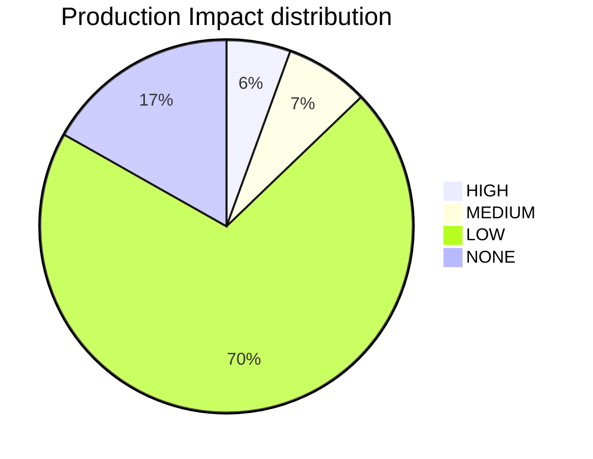

---
id: PLATFORM_HEALTH
title: Platform Health & Compliance Report
type: documentation
category: governance
status: active
owner: platform-team
version: '2026-01-22'
relates_to:
  - platform_health.py
---

## 🏥 Platform Health Command Center

**Generated**: `2026-01-22 17:27:17` | **V1 Readiness**: `91.0%` | **Mean Confidence**: `⭐ (1.4/5.0)`

**Realized Value**: `23.1 Hours` | **Infra Run Rate**: `$1,250.00 USD/mo`

## V1 Platform Readiness Gate

> [!IMPORTANT]
> The platform is currently **91.0%** ready for V1 production rollout.

| Milestone | Status | Readiness |
| :--- | :--- | :--- |
| **Metadata Integrity** | ✅ | 99.1% |
| **Injection Integrity** | ✅ | 97.3% |
| **Architecture Maturity** | 🚧 | 99/166 Active |
| **Changelog Activity** | ✅ | 162 Entries |

## Knowledge Graph Vitality

| Metric | Count | Source |
| :--- | :--- | :--- |
| **Architecture Decisions** | 166 | [ADR Index](docs/adrs/01_adr_index.md) |
| **Automation Scripts** | 54 | [Script Index](scripts/index.md) |
| **Certified Scripts (M3)** | 1/55 (2%) | [Certification Matrix](docs/10-governance/SCRIPT_CERTIFICATION_MATRIX.md) |
| **CI Workflows** | 65 | [Workflow Index](ci-workflows/CI_WORKFLOWS.md) |
| **Change Logs** | 162 | [Changelog Index](docs/changelog/README.md) |
| **Tracked Resources** | 704 | Repository Scan |

## Catalog Inventory

| Catalog | Entity Count |
| :--- | :--- |
| Ecr Registry | 1 |
| Ecr Repositories | 11 |
| Eks | 1 |
| IDP Apis | 9 |
| IDP Components | 18 |
| IDP Domains | 4 |
| IDP Resources | 14 |
| IDP Systems | 5 |
| Rds | 1 |

## AWS Inventory Snapshot

- **Last run**: `2026-01-10T00:44:01Z`
- **Accounts**: `REDACTED`
- **Regions**: `eu-west-2`
- **Total resources**: `31`
- **Tagged**: `29` | **Untagged**: `2` | **Tag violations**: `29`
- **Report**: [`reports/aws-inventory/aws-inventory-2026-01-10.md`](reports/aws-inventory/aws-inventory-2026-01-10.md)

## 🛡️ Risk & Maturity Visualization

## Governance Maturity

- **Metadata Compliance**: `99.1%`
- **Risk-Weighted Score**: `100.0%`

## Injection Coverage

- **Sidecar Coverage**: `97.3%` (36/37)

## Project Realized Value (Heartbeat)

> [!TIP]
> Total realized value reclaimed through automation heartbeats: **23.1 hours**.

- **ROI Ledger**: [.goldenpath/value_ledger.json](.goldenpath/value_ledger.json)

## Financial Governance (Cloud Cost)

> [!NOTE]
> Current monthly infrastructure run rate: **$1,250.00 USD**.

- **Estimated Annual**: `$15,000.00 USD`
- **Cost Ledger**: [.goldenpath/cost_ledger.json](.goldenpath/cost_ledger.json)
- **Tooling**: Infracost (CI-integrated)

## Operational Risks

- **Orphaned (No Owner)**: 0
- **Stale (Past Lifecycle)**: 0

---

### Strategic Guidance

- **V1 Readiness Indicator**: A composite metric tracking Architecture (ADRs), Governance (Metadata/Injection), and Delivery (Changelogs). Target: 100%.
- **Visualizing Trends**: The `xychart-beta` is best viewed in GitHub/GitLab or VS Code with updated Mermaid support (v10.x+). It tracks our 'Readiness Velocity' across audit cycles.

<!-- AUTOMATED REPORT - DO NOT EDIT MANUALLY -->
