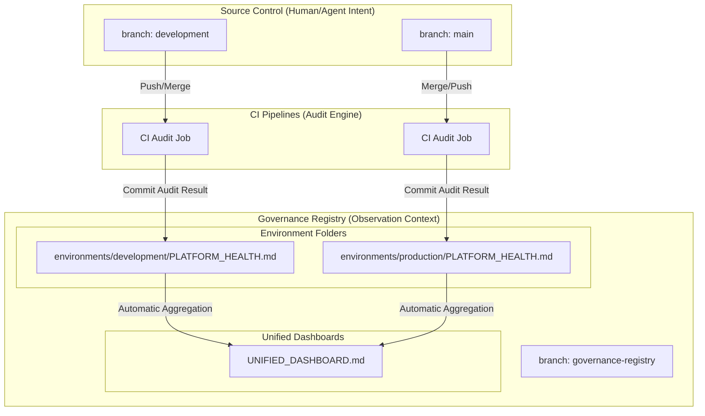

# How it Works – Governance Registry Mirror

The **Governance Registry Mirror** is the platform's mechanism for achieving **High-Integrity Auditability** without sacrificing **Developer Velocity**. 

## 1. The Core Problem: Change Collision
In a high-velocity environment, automated scripts that update documentation indices or health reports compete for the git lock on the active development branch. This leads to the "Commit Tug-of-War," where humans are rejected by machine commits.

## 2. The Solution: Decoupled State Mirroring
We separate the repository into two distinct domains:
1.  **Intent Domain (`development`/`main`)**: Where humans and agents express *what* should change.
2.  **Observation Domain (`governance-registry`)**: Where the platform records *how* the platform responded (Audit Pulse, Reports).

## 3. Architecture Overview



### ASCII Architecture

```text
    +-----------------------+      +-----------------------+
    |  Branch: development  |      |     Branch: main      |
    | (Code + Intent Only)  |      | (Production Stability)|
    +-----------+-----------+      +-----------+-----------+
                |                              |
                | Push/Merge                   | Push/Merge
                v                              v
    +-----------------------+      +-----------------------+
    |   CI Governance Job   |      |   CI Governance Job   |
    | (Run platform_health) |      | (Run platform_health) |
    +-----------+-----------+      +-----------+-----------+
                |                              |
                | Write Mirror                 | Write Mirror
                v                              v
    +------------------------------------------------------+
    |             Branch: governance-registry              |
    |                                                      |
    |  /environments/development/PLATFORM_HEALTH.md        |
    |  /environments/production/PLATFORM_HEALTH.md         |
    |                                                      |
    |             +--------------------------+             |
    |             |   UNIFIED_DASHBOARD.md   |             |
    |             |  (Single Pane of Glass)  |             |
    |             +--------------------------+             |
    +------------------------------------------------------+
```

## 4. Key Benefits

### 🏎️ Frictionless PRs
Because the `PLATFORM_HEALTH.md` is no longer committed to the PR branch, developers never experience an "out-of-sync" rejection caused by automated audit updates.

### 🛡️ Immutable Audit Trail
The `governance-registry` preserves a linear history of platform readiness. Even if a PR branch is deleted after merge, the specific health snapshot of the platform at that moment is permanently archived on the registry branch.

### 📊 Multi-Environment Visibility
The platform uses folder nesting (`environments/<env>/`) to allow a single unified dashboard to compare the health of `dev` vs `prod` in real-time.
