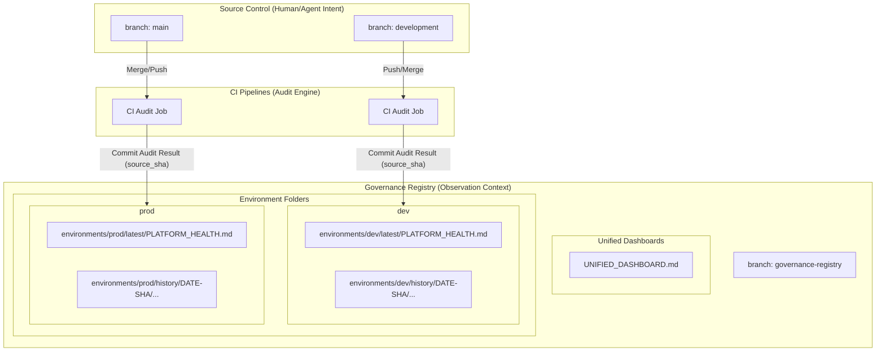

# How it Works – Governance Registry Mirror

The **Governance Registry Mirror** utilize a decoupled "Observer Pattern" for repository state. It ensures **High-Integrity Auditability** without the "Commit Tug-of-War" common in high-velocity agent repositories.

## 1. The Source of Truth Contract
The platform strictly distinguishes between **Intent** and **Observation**:
- **Intent (development/main)**: Humans and Agents change code here. This is the canonical source for what the platform *should be*.
- **Observation (governance-registry)**: The platform records its health results here. This is the canonical record of what the platform *is*.

**Contract Rule**: Registry content is derived-only and must be reproducible from a specific Git SHA in the source branches. Direct "fixing" of dashboards in the registry branch is prohibited.

## 2. High-Integrity Metadata Contract
Every artifact written to the registry includes a mandatory "Chain-of-Custody" header. This ensures every audit pulse is verifiable without an external database.

```yaml
---
id: GOVREG-PLATFORM-HEALTH
generated_at: <TIMESTAMP_UTC>
source:
  branch: development
  sha: <GIT_SHA>
pipeline:
  workflow: ci-audit.yml
  run_id: <RUN_ID>
integrity:
  derived_only: true
  reproducible: true
---
```

## 3. Forensic Folder Structure
The registry branch is structured to provide both an immediate "Live View" and a permanent "Forensic Audit Trail":

```text
governance-registry (branch)
├── environments/
│   ├── dev/
│   │   ├── latest/
│   │   │   └── PLATFORM_HEALTH.md  <-- Live reporting view (Backstage Target)
│   │   └── history/
│   │       └── 2026-01-12-0814Z-c420fca/
│   │           └── PLATFORM_HEALTH.md <-- Immutable forensic snapshot
│   └── prod/
│       └── ... (same structure)
└── UNIFIED_DASHBOARD.md              <-- Cross-environment heatmap
```

## 4. Architecture Overview



## 5. Key Operational Capabilities

### 🚫 CI-Only Write Boundary
To maintain the integrity of the audit log, only the **GitHub Actions Service Account** is permitted to write to the registry branch. Humans have Read-Only access, protecting the log from accidental or malicious tampering.

### Atomic Pulse Updates
When a "pulse" is recorded, the CI updates the `latest/` pointer, creates the `history/` entry, and regenerates the `UNIFIED_DASHBOARD.md` in a **single atomic commit**. This ensures the "Live" view and "History" are always perfectly synchronized.

### Concurrency & Ordering
To prevent "last-writer-wins" collisions during rapid merges, the registry employs **Ordered Queueing**. Using GitHub Actions concurrency groups (e.g., `govreg-dev`), the engine ensures that updates are processed in strict chronological order, even if multiple PRs are merged seconds apart.

### Visibility & UX (PR Feedback Loop)
The registry is "Hidden but Authoritative." To maintain developer visibility:
1. **README Integration**: The root README.md links directly to the `latest` reports.
2. **PR Comments**: On merge, the CI posts a comment with direct links to the new registry artifacts, the generation SHA, and a pass/fail summary.
3. **Backstage Sync**: Backstage TechDocs are redirected to read from the `latest/` folder in the registry branch, providing a stable URL for the platform dashboard.

### 🛡️ Ledger Integrity Validation
To prevent the registry from becoming polluted with manual commits or incorrectly formatted artifacts, the platform enforces a strict validation gate:
- **Automatic Enforcement**: The `govreg-validate.yml` workflow runs on every push to the `governance-registry` branch.
- **Structural Validation**: The `validate_govreg.py` script ensures only allowed top-level paths exist (`environments/`, `UNIFIED_DASHBOARD.md`).
- **Metadata Completeness**: Every markdown artifact is validated to contain all required chain-of-custody fields (`source.sha`, `pipeline.run_id`, `integrity.derived_only`).
- **Anti-Tampering**: The validator blocks commits that violate the ledger contract, protecting the registry from accidental or malicious manual patches.
