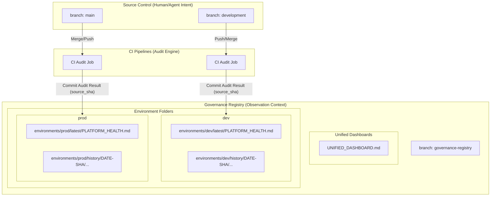

# How it Works – Governance Registry Mirror

The **Governance Registry Mirror** utilizes a decoupled "Observer Pattern" for repository state. It ensures **High-Integrity Auditability** without the "Commit Tug-of-War" common in high-velocity agent repositories.

## 1. The Source of Truth Contract
The platform strictly distinguishes between **Intent** and **Observation**:
- **Intent (development/main)**: Humans and Agents change code here. This is the canonical source for what the platform *should be*.
- **Observation (governance-registry)**: The platform records its health results here. This is the canonical record of what the platform *is*.

**Contract Rule**: Registry content is derived-only and must be reproducible from a specific Git SHA in the source branches. Direct "fixing" of dashboards in the registry branch is prohibited.

## 2. Forensic Folder Structure
The registry branch is structured to provide both an immediate "Live View" and a permanent "Forensic Audit Trail":

```text
governance-registry (branch)
├── environments/
│   ├── dev/
│   │   ├── latest/
│   │   │   └── PLATFORM_HEALTH.md  <-- Live reporting view
│   │   └── history/
│   │       └── 20260112-c420fca/
│   │           └── PLATFORM_HEALTH.md <-- Immutable forensic snapshot
│   └── prod/
│       └── ... (same structure)
└── UNIFIED_DASHBOARD.md              <-- Cross-environment heatmap
```

## 3. Architecture Overview



## 4. Key Operational Guardrails

### 🚫 CI-Only Write Boundary
To maintain the integrity of the audit log, only automated service accounts are permitted to write to the registry branch. Humans have Read-Only access.

### 🏎️ Atomic Pulse Updates
When a "pulse" is recorded, the CI updates the `latest/` pointer and creates the `history/` entry in a **single atomic commit**. This prevents races and ensures that "Live" and "History" always represent the same point in time.

### 🔗 SHA Binding
Every report in the registry contains a `SOURCE_COMMIT` field, allowing any auditor to verify provenance by checking the code state at that specific Git SHA.
