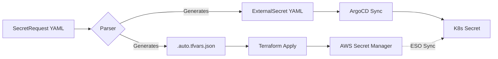

# How It Works: Platform Secret Lifecycle

This document explains the technical lifecycle of a platform secret, following the Golden Path "Intent vs. Projection" model. It emphasizes the philosophy that **Backstage is the front door for intent, while the platform owns creation, policy, and lifecycle.**

## 🧭 Core Philosophy

### The Golden Rule
> [!IMPORTANT]
> **Humans never touch AWS directly. Backstage never touches secret values. Automation enforces policy.**

### The "Front Door" Model
Backstage should **NOT** create secrets directly via AWS API.
- **Security**: Avoids giving Backstage broad IAM permissions (huge blast radius).
- **Auditability**: Ensures every secret request goes through a version-controlled, auditable PR.
- **Separation of Concerns**: Backstage captures *intent*; the Platform handles *implementation*.

---

## 🏛️ End-to-End Architecture

The following flow represents the clean separation between captured intent, Git-based governance, and cluster-side projection.

```text
[Backstage UI]
   |
   | (template: request secret)
   v
[Git PR in infra repo]  <-- approvals / policy gates
   |
   | (merge)
   v
[Workflow/Terraform]
   |
   | creates/updates
   v
[AWS Secrets Manager]  <-- source of truth
   |
   | (ESO reads via IRSA)
   v
[ESO in cluster]
   |
   | writes
   v
[K8s Secret]
   |
   | (mounted/env)
   v
[Pod Container]
```

---

## ⚡ The Lifecycle in Practice

### 1. Backstage Captures Intent
The developer selects the "Request app secret" template and provides:
- **Service Name**: The namespace of the consumer.
- **Environment**: dev/test/stage/prod.
- **Secret Class**: db-creds, api-key, etc.
- **Risk Tier / Rotation Policy**: Governance requirements.

**Result**: Backstage creates a PR (or dispatches a workflow) into the infrastructure repository.

### 2. Git as the Source of Truth
The PR contains the declarative intent in the platform contract format:
- **Location**: `catalogs/secrets/<service>/<env>/<id>.yaml`
- **Metadata**: Sidecar containing ownership and risk profiles.

This is where peer review, automated guardrails, and security approvals happen.

### 3. Platform Provisioning (AWS)
On merge to the protected branch, the platform automation:
1.  Creates/updates the secret in **AWS Secrets Manager**.
2.  Applies mandatory tags, ownership, and rotation configuration.
3.  Enforces security policies (e.g., encryption keys).
4.  **No secret values are ever stored in Git or handled by Backstage.**

### 4. Cluster Projection (ESO)
In the target EKS cluster, the **External Secrets Operator (ESO)**:
1.  Authenticates to AWS via **IRSA** (IAM Roles for Service Accounts).
2.  References the AWS Secret ARN generated in step 3.
3.  Writes a native Kubernetes `Secret` into the application's namespace.

### 5. Consumption (Pod)
The application Deployment references the K8s Secret via environment variables or volume mounts.
- **Portability**: The application code doesn't know it's using AWS; it just sees a K8s Secret.
- **Hydration**: The secret is hydrated just-in-time at the runtime boundary.

---

## 🛡️ Governance & Decommissioning

### Risk Tiers
- **High Risk**: Requires mandatory rotation and manual security approval.
- **Medium/Low Risk**: Can be auto-approved based on policy and standard rotation.

### Decommissioning Workflow
Secrets follow a controlled "Cool-down" sequence to prevent production outages:
`active → deprecated → decommission_requested → decommissioned`

1.  **Decommission Requested**: Automation removes the `ExternalSecret` manifest from the cluster.
2.  **Verification**: Confirm no metrics or logs show active usage.
3.  **Final Deletion**: The AWS secret is deleted after the verification grace period.

---

## 🛠️ Implementation: GitHub Actions Outline

The lifecycle is enforced by two distinct workflows ensuring a clean separation between **Validation** and **Execution**.

### A. `secret-request-pr.yml` (PR: Validate + Plan)
- **Trigger**: `pull_request` on `docs/catalogs/secrets/**`.
- **Steps**:
    1.  **Schema Validation**: Ensures the `SecretRequest` manifest is valid.
    2.  **Policy Gate**: Fails the build if `riskTier=high` but `rotationClass=none`.
    3.  **Terraform Plan**: Generates a plan showing the AWS Secrets Manager changes.
    4.  **Traceability**: Ensures the request is linked to an ADR and recorded in the audit log.

### B. `secret-request-apply.yml` (Merge: Apply + Sync)
- **Trigger**: `push` to `development/main` on `docs/catalogs/secrets/**`.
- **Steps**:
    1.  **Terraform Apply**: Provisions the secret in AWS and configures rotation.
    2.  **Manifest Generation**: Generates the `ExternalSecret` manifest for GitOps.
    3.  **ArgoCD Reconcile**: Triggers an ArgoCD refresh to pull the new secret into the cluster.

---

## 🏗️ Parser-Centric Architecture: The "Golden Path" Core

The core of our **"Golden Path"** architecture lies in the **Parser**. By sitting the Parser in the middle of the workflow, we decouple the *What* (Developer Intent) from the *How* (Infrastructure Implementation).

### 🏆 Three Massive Advantages:
1.  **Shift-Left Governance**: We drop policy gates directly into the Python parser (e.g., `risk: high` strictly requires `rotation: standard`). This allows us to catch security violations at the PR stage—before a single line of Terraform is ever calculated.
2.  **Contract-Driven Infrastructure**: Developers are shielded from the complexity of Terraform modules, security policies, and principal ARNs. They interact only with a simple, human-readable YAML schema.
3.  **The GitOps Bridge**: The parser is "multi-lingual"—it generates the `tfvars` for AWS provisioning and the `ExternalSecret` manifests for Kubernetes projection simultaneously. This ensures the AWS resource and the cluster projection are always in 100% sync.

### 📊 The Lifecycle Visualization


### 🛠️ Technical Depth: Under the Hood
*   **Schema Enforcement**: The parser validates incoming YAML against a strict internal schema (mapped to the `SecretRequest` dataclass), ensuring data integrity from the very first step.
*   **Out-of-Band Value Handling**: The YAML contract defines the *container* and *governance*, but **never** the secret value itself. Values are injected directly into AWS Secrets Manager via secure out-of-band channels, keeping sensitive data out of Git entirely.
*   **Deterministic Naming**: To prevent collisions in a multi-tenant environment, the parser enforces a standardized naming convention: `goldenpath/<env>/<service>/<name>`.
*   **Least-Privilege by Default**: Based on the `read_principals` and `write_principals` defined in the YAML, the parser automatically calculates and injects resource-level IAM policies, ensuring only authorized workloads can access the secret.
